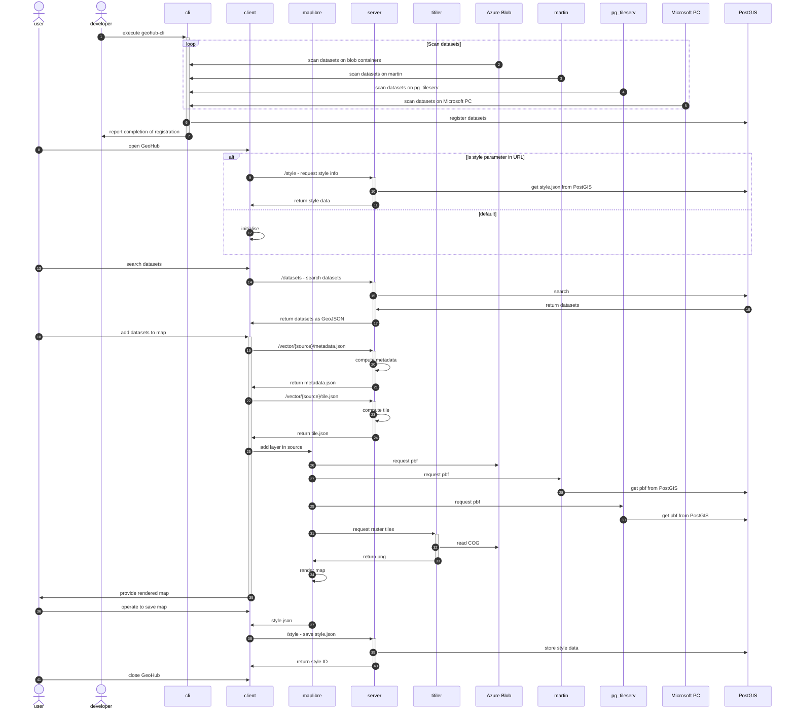

# UNDP GeoHub

GeoHub is a geospatial visualization data portal built by UNDP using [SvelteKit](https://kit.svelte.dev/).

## Repositories managed

| App                              | Language   | Library   | NPM                                                                            | Source code                                                   |
| -------------------------------- | ---------- | --------- | ------------------------------------------------------------------------------ | ------------------------------------------------------------- |
| GeoHub                           | TypeScript | sveltekit |                                                                                | [sites/geohub](./sites/geohub/)                               |
| @undp-data/electricity-dashboard | TypeScript | sveltekit |  | [apps/electricity-dashboard](./apps/electricity-dashboard/)   |
| @undp-data/current-location      | TypeScript | sveltekit |       | [packages/current-location](./packages/current-location/)     |
| @undp-data/style-switcher        | TypeScript | sveltekit |         | [packages/style-switcher](./packages/style-switcher/)         |
| @undp-data/style-viewer          | TypeScript | sveltekit |           | [packages/style-viewer](./packages/style-viewer/)             |
| @undp-data/svelte-undp-design    | TypeScript | sveltekit |     | [packages/svelte-undp-design](./packages/svelte-undp-design/) |
| @undp-data/geohub-cli            | TypeScript | -         |             | [packages/geohub-cli](./packages/geohub-cli/)                 |
| Documentation                    | Python     | mkdocs    |                                                                                | [documentation](./documentation/)                             |

## GeoHub Ecosystem

- Sequence diagram



the diagram was created by [mermaid online editor](https://mermaid.live/edit). Please read syntax of mermaid from the [documentation](https://mermaid.js.org/syntax/sequenceDiagram.htm)

- related repositories
  - [style](https://github.com/UNDP-Data/style): manage maplibre style.json for Geohub
  - [geohub-azure-functions](https://github.com/UNDP-Data/geohub-azure-functions): manage to deploy Azure Funcitons for Geohub
  - [kubexp](https://github.com/UNDP-Data/kubexp): manage configuration files to deploy titiler, martin and pg_tileserv to Azure Kubernetes

## Contributing

Please refer to [CONTRIBUTING.MD](./CONTRIBUTING.md) for more information about developing GeoHub.

## Release packages

- create release note by the following command

```
pnpm changeset
```

- create new PR to merge to develop branch
- changeset will create new PR to release packages
- changeset will release packages once the PR is merged to develop
