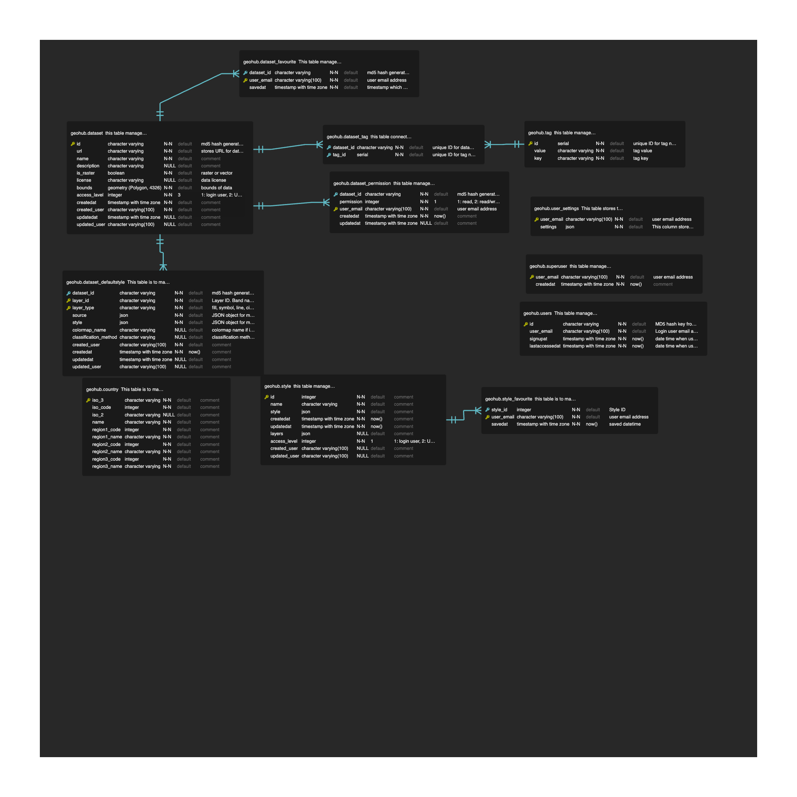

# UNDP GeoHub

GeoHub is a geospatial visualization data portal built by UNDP using [SvelteKit](https://kit.svelte.dev/).

## GeoHub Ecosystem

### Repositories managed in this monorepo

| App                           | Language   | Library   | Remarks                                                      | Source code                                                   |
| ----------------------------- | ---------- | --------- | ------------------------------------------------------------ | ------------------------------------------------------------- |
| GeoHub                        | TypeScript | sveltekit | Main frontend app                                            | [sites/geohub](./sites/geohub/)                               |
| @undp-data/cgaz-admin-tool    | TypeScript | sveltekit | Maplibre control to show admin information from CGAZ PMTiles | [packages/cgaz-admin-tool](./packages/cgaz-admin-tool/)       |
| @undp-data/current-location   | TypeScript | sveltekit | Maplibre control to show admin infomation                    | [packages/current-location](./packages/current-location/)     |
| @undp-data/style-switcher     | TypeScript | sveltekit | Maplibre control to switch base styles                       | [packages/style-switcher](./packages/style-switcher/)         |
| @undp-data/style-viewer       | TypeScript | sveltekit | Maplibre simple viewer for style.json                        | [packages/style-viewer](./packages/style-viewer/)             |
| @undp-data/undp-bulma         | CSS        | vanilla   | Customised Bulma style for UNDP GeoHub                       | [packages/undp-bulma](./packages/undp-bulma)                  |
| @undp-data/svelte-undp-design | TypeScript | sveltekit | Svelte components for UNDP design system                     | [packages/svelte-undp-design](./packages/svelte-undp-design/) |
| @undp-data/geohub-cli         | TypeScript | Nodejs    | CLI tools to maintain GeoHub datasets                        | [packages/geohub-cli](./packages/geohub-cli/)                 |
| Documentation                 | Python     | mkdocs    | GeoHub documentation                                         | [documentation](./documentation/)                             |

### Repositories developed for GeoHub

| Repository                                                                    | Description                                                                                  |
| ----------------------------------------------------------------------------- | -------------------------------------------------------------------------------------------- |
| [style](https://github.com/UNDP-Data/style)                                   | It manages and hosts maplibre style.json for Geohub                                          |
| [geohub-azure-functions](https://github.com/UNDP-Data/geohub-azure-functions) | It manages to deploy Azure Funcitons for Geohub                                              |
| [kubexp](https://github.com/UNDP-Data/kubexp)                                 | It manages configuration files to deploy titiler, martin and pg_tileserv to Azure Kubernetes |
| [pgsql](https://github.com/UNDP-Data/pgsql)                                   | It manages PostgreSQL funciton for pg_tileserv                                               |
| [geohub-data-pipeline](https://github.com/UNDP-Data/geohub-data-pipeline)     | It manages data upload pipelines for GeoHub                                                  |
| [fonts](https://github.com/UNDP-Data/fonts)                                   | The repository to manage font glyph files for maplibre-gl-js                                 |

### System diagrams

The following sequence diagram shows how GeoHub works with other softwares in frontend and backend.

In terms of Authentication with Azure Active Directory, the following figure shows how authentication works.

For the data upload pipeline which is managed by [geohub-data-pipeline](https://github.com/UNDP-Data/geohub-data-pipeline), the workflow is shown as the following diagram.

the diagram was created by [mermaid online editor](https://mermaid.live/edit). Please read syntax of mermaid from the [documentation](https://mermaid.js.org/syntax/sequenceDiagram.htm)

## ER diagram

The following ER diagram was generated by [ERD Editor](https://marketplace.visualstudio.com/items?itemName=dineug.vuerd-vscode) extension for VS code.

## Contributing

Please refer to [CONTRIBUTING.md](./CONTRIBUTING.md) for more information about developing GeoHub.

## License

[BSD-3-Clause license](./LICENSE)
