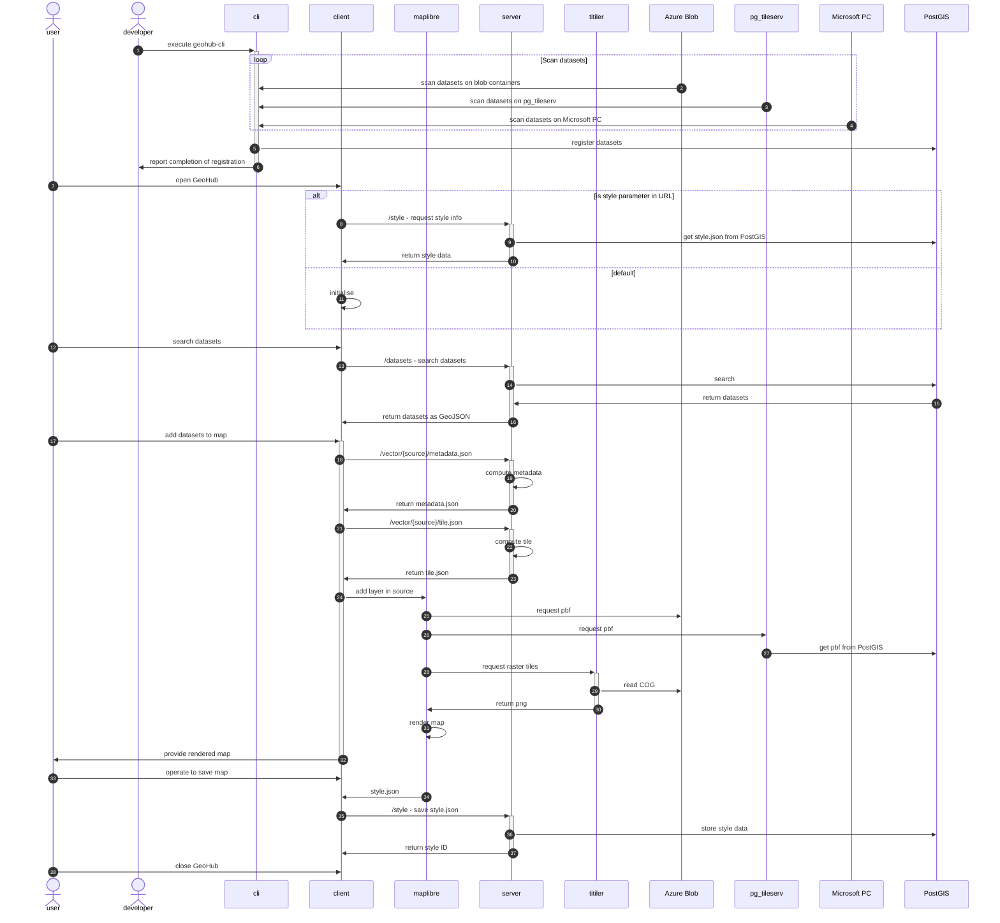
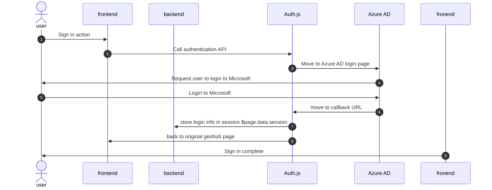
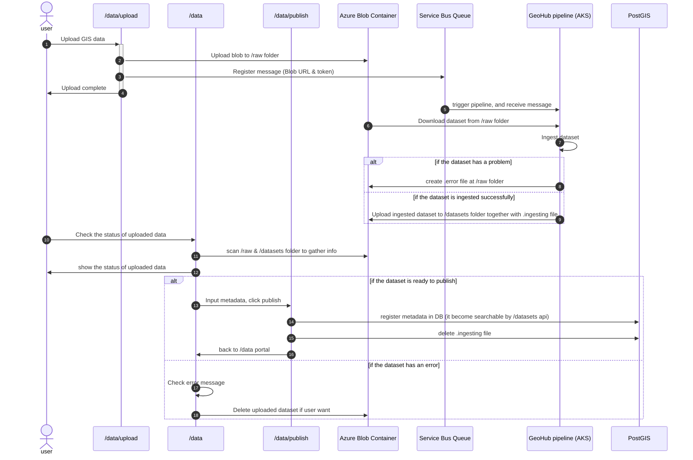
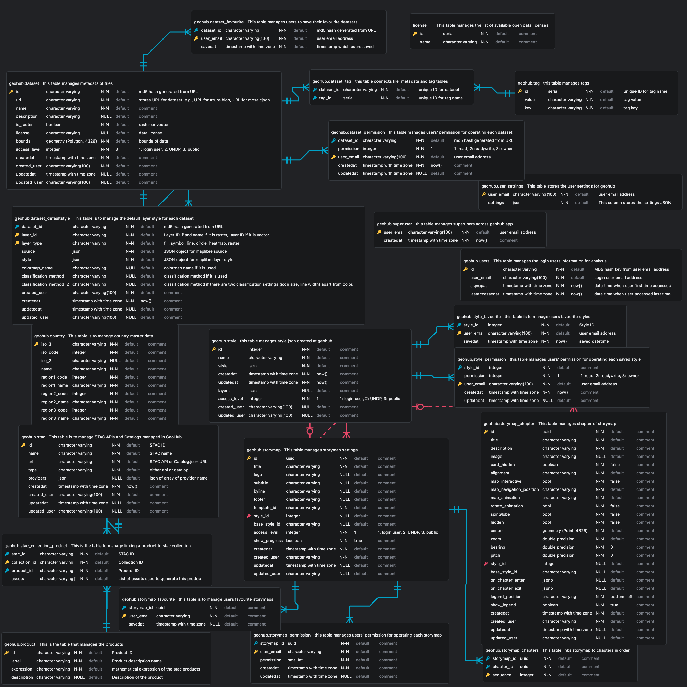

# Diagrams

The following diagrams can be helpful to understand the GeoHub structure

## GeoHub Ecosystem

## Sequence diagrams

The following sequence diagram shows how GeoHub works with other softwares in frontend and backend.

In terms of Authentication with Azure Active Directory, the following figure shows how authentication works.

For the data upload pipeline which is managed by [geohub-data-pipeline](https://github.com/UNDP-Data/geohub-data-pipeline), the workflow is shown as the following diagram.

the diagram was created by [mermaid online editor](https://mermaid.live/edit). Please read syntax of mermaid from the [documentation](https://mermaid.js.org/syntax/sequenceDiagram.htm)

## ER diagram

The following ER diagram was generated by [ERD Editor](https://marketplace.visualstudio.com/items?itemName=dineug.vuerd-vscode) extension for VS code.

