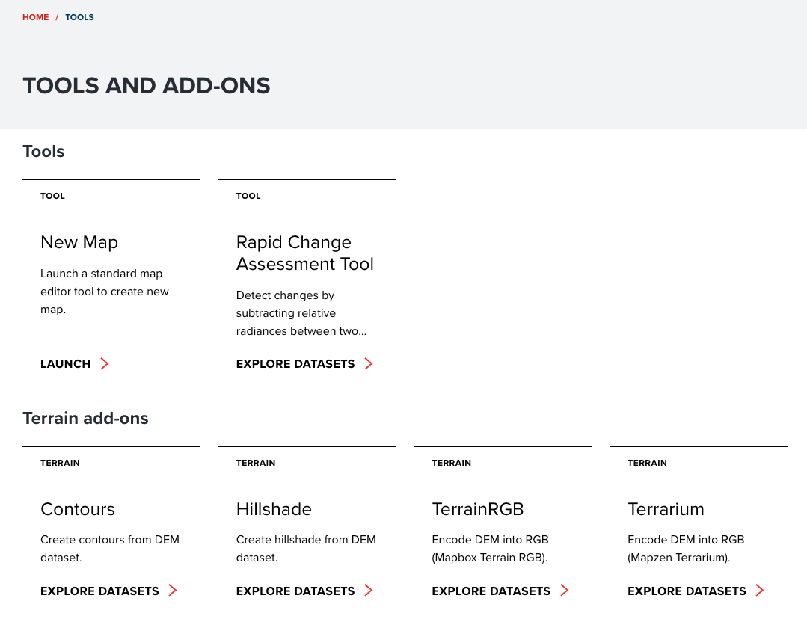
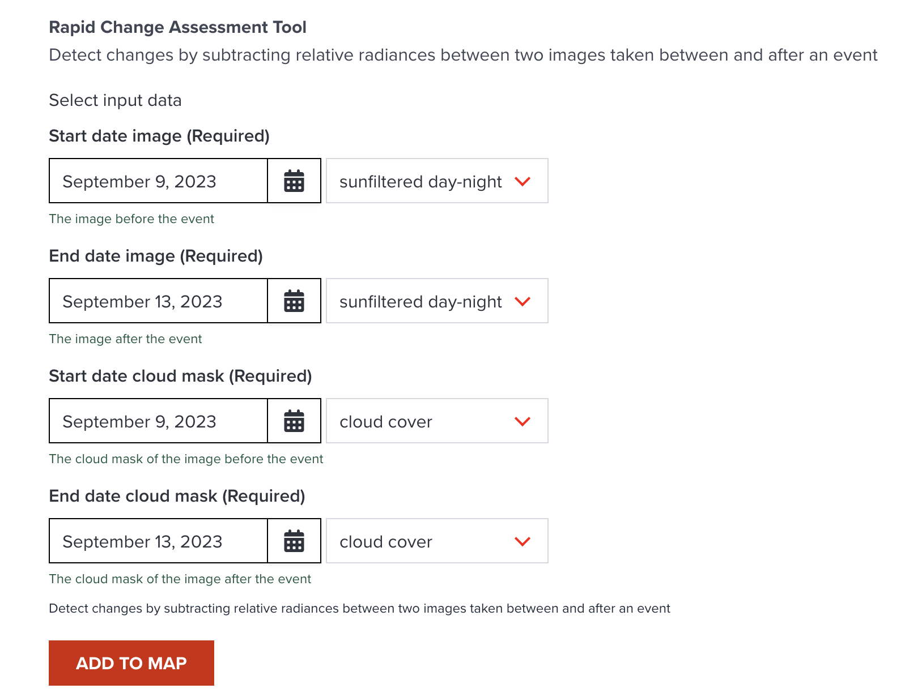

# Geospatial analytics for crisis assessment

Recent advances in state-of-the-art sensing technology have produced an explosion of data generated by Earth observation missions. Using the criterion of spatial resolution (smallest size an object or detail can be represented in an image), satellite images can be categorized in **large, intermediate, and high or extremely high-resolution**. Out of these three types only the very high-resolution satellite imagery is the best suited to perform context and situational assessments due to its ability to capture objects as small as half a square meter. The price paid for the increased details are the inflated costs associated with producing, storing, and processing it. A second important aspect is that high resolution imagery is usually covering much smaller areas and thus it might be difficult to get a coverage for any given specific area at a particular time instance. 

An alternative data source suitable for building situational awareness is nighttime lights imagery with resolution in hundreds of meters (500-1000). By comparing the nighttime lights at two consecutive time instances over a specific area, insights related to change in the intensity of human activities/presence can be derived with high confidence. A downside is that again, this imagery might not be available at a particular time instance or specific geographic areas. The solution in this case is to use monthly, seasonal, or even yearly mosaics (composition of several satellite images) if available. 

<figure markdown="span">
  
  <figcaption>Nighttime lights image mosaic covering East Africa</figcaption>
</figure>

## Rapid change assessment tool.

GeoHub features the **Rapid change assessment tool** specially designed for the purpose of quick change assesment on the ground using nighttime lighs imagery. Put in a simplistic manner, the nighttime lights based change detection algorithm entails evaluating the sign and magnitude of the difference between the reflectances at two distinct calendar dates for any given location/pixel in the area covered by the imagery. An important aspect is to consider also the cloudiness of the imagery because clouds can affect the precision of computations in a negative way.

#### Derna use case

To illustrate the potential of nighttime lights data we are going to use a real life use case, concretely the [Derna dam collapse](https://en.wikipedia.org/wiki/Derna_dam_collapses) that happened on 11 of September 2023. The dam collapses released an estimated 30 million cubic meters (39 million cubic yards) of water, causing flooding downstream as the Wadi Derna overflowed its banks.The floods partially destroyed the city of Derna. As of 18 September, estimates for the number of casualties range from 5,300 to 20,000 people according to Wikipedia.

<figure markdown="span">
  
  <figcaption>Derna, Libya </figcaption>
</figure>

<figure markdown="span">
  
  <figcaption>Identifying changes in human activity using nighttime lights data. This example shows the input data and the result of the RCA algorithm aplied to the floods that accured in Derna, Libya in September 2023  </figcaption>
</figure>

#### Data

 The main [source](https://eogdata.mines.edu/products/vnl/#daily) of [nightime lights](https://eogdata.mines.edu/nighttime_light/nightly/) imagery is the Payne Institute for Public Policy's Earth Observation Group(COLEOG) part of Colorado School of Mines, USA. The Suomi NPP VIIRS DNB imagery collect reflectance in 0.5-0.9 µm bandwidth and features a spatial resolution of 375m at the subsatellite point. The VIIRS DNB scans the Earth globe twice a day and the imagery is processed by the COLEOG into  multiple products, respectively, nightly/daily, monthly and yearly mosaics. The mosaics cover the globe between latitudes of 75N and 65S using later on top logic in overlapping areas. At the same time COLEOG produces a cloud mask that can be used to filter out pixels that are covered by clouds.

UNDP GeoHub's team has developed a [data processing pipeline](https://github.com/UNDP-Data/geo-undpstac-pipeline) to convert the COLEOG data to Cloud Optimized Geotiff format and host it as a static Spatio Temporal Asset Catalog in Azure. as a result the converted data is discoverable, standardized and can be easily consumed by various clients.

#### RCA tool in Geohub

The change assessments are performed through a [custom algorithm](https://github.com/UNDP-Data/geo-cogserver/blob/main/src/cogserver/algorithms/rca.py)
and GeoHub has been enhanced with UI components tahat allow users to run the tool and conduct analytics seamlesly in the all area covered by nighttime lighs mosaics.

The tool can be accessed using folowing  steps:

1. Load The GeoHub's tool page and click on RCA tile

    <figure markdown="span">
      
      
    </figure>

2. Select **Nightly nighttime lights mosaic** dataset

    <figure markdown="span">
      
      
    </figure>

3. Select RCA tool by clicking on PREVIEW -> TOOLS

    <figure markdown="span">
      
      
    </figure>

4. Fill in the start (09092023) and end(13092023) dates and press **Add to Map** button to load the layer

    <figure markdown="span">
      
      
    </figure>

5. Type **Derna** in the geolocator input, pres enter and select **Derna Libya** entry

    <figure markdown="span">
      
      
    </figure>

    <figure markdown="span">
      
      <figcaption>
The [Lybia floods](https://www.maxar.com/open-data/libya-floods-0923) dataset shows the overall level
of destruction </figcaption>
      
    </figure>

By overlaying this data with the RCA global layer before applying 50% transparency to it,  it is possible to observe the RCA has succesfully
detected  the affected areas.

<figure markdown="span">
  

</figure>

<figure markdown="span">
  
  <figcaption>Demonstrating the ability of RCA tool to detect changes and variations in nighttime lights intensity as a proxy to
  identification of areas affected by disasters</figcaption>
</figure>

!!! success ""

    This example showcases the efectivenes and viability of developing and applying  geospatial analytics to support the decision making processes.