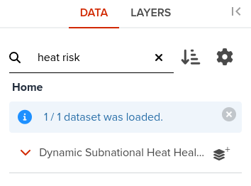
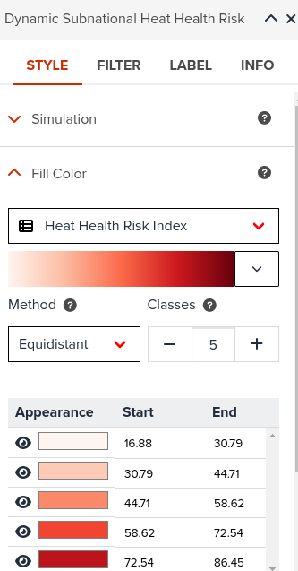
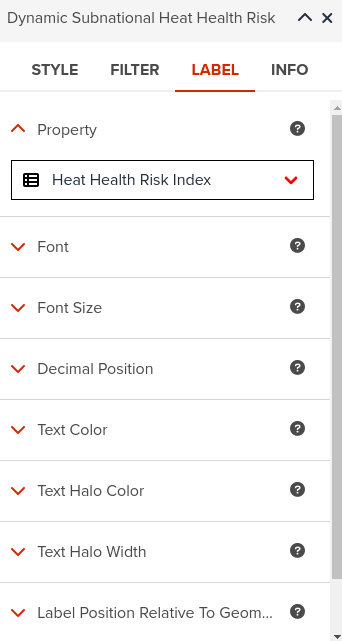

# Dynamic vector layers

The concept of _geospatial analytics_ is central to Geographic Information Systems(GIS) and is assimilated with **generating** new data/information and usually results in new data layers. While traditional GIS are well equipped to handle these types of operations, conducting spatial analytics in a web environment is much more complicated due to limitations in terms of bandwidth, memory, network connecticity, etc.
It is common practive to represent a spatial analytics model or operation using graphs. This has the advantage to increase the clarity and better communicate the core of the analytical model or concept by clearly identifying the inputs, outputs and the internal operations inside the model.

GeoHub goes a step further and allows users to interact with such models in a simple straightforward way just by loading them as layers. Simply said, the models become layers that accept inputs through web interfaces like sliders, text input, etc, and associate this inputs with specific internal parameters of the exposed model.

!!! note "A dynamic vector layer"
is a type of analytical functionality that encasulates a specific conceptual spatial model implemented through spatial geometrical primitives like polygons, lines and points. It was designed to simplify the user interaction and allow conducting simulations by altering some of its parameters.

## Heat Risk Index

To illustrate the advantage of dynamic layers or **analytics as a layer** we developed a dynamic Heat Health Risk Index (HHR).
Risk indicators are a type of layer that is particulary well suited to be imlemented as a dynamic layer. This is because a risk layer is a composite indicator, with fixed inputs, output and a limited set of control paramerets than control the internal computation.
HHR is composed of six variables and each one of the inputs can be controled/adjusted using slider controls. Setting a value for a given parameter results in computing the index for all entities in the layer (admin units) with the input variable adjusted for each end every unit. For example increasing the temperature by 3 degrees Celsius shows the potential risk the population would be exposed if the global temperature would raise by three degrees.

1.  Open GeoHub and create a new map

    

2.  Find and load **Dynamic Subnational Heat Health Risk**

    

3.  Open layer Properties

    

4.  Create a choropleth map by chnaging the visualization STYLE->Fill Color

    

5.  Open and set the parameters of the layer bu clicking on **Simulation**

    

6.  Adjust one or more parameters and observe the changes in colors or various administrative units

    

    !!! abstract

         By moving the sliders allocated to parameters you are passing those values to the server side where the new values of the risk are recomputed in real time. Note that in the picture above the *Human Development Index* and *Vegetation Health Index* parameters have been changed as they are maked with blue color.

    !!! tip

         It is a good idea to label the features. This helps observing the effect of a given parameter on the layer/model.

    

As a result, the HHR dynamic layer can be used to identify the risks to the population and develop specific climate adaption strategies to reduce heat-related health risks.
