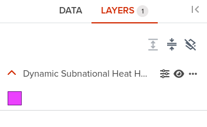
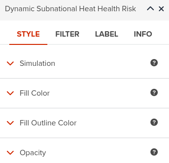

# Dynamic vector layers

---

It is common practive to represent a spatial analytics model or operation using graphs. <hidden> This has the advantage to increase the clarity and better communicate the core of the analytical model or concept by clearly identifying the inputs, outputs and the internal operations inside the model.</hidden>

---

GeoHub goes a step further and allows users to interact with such models in a simple straightforward way just by loading them as layers. Simply said, **the models become layers that accept inputs through web interfaces** like sliders, text input, etc, and associate this inputs with specific internal parameters of the exposed model.

<hidden>

??? tip "Dynamic vector layer..."
  
    A dynamic vector layeris a type of analytical functionality that encasulates a specific conceptual spatial model implemented through spatial geometrical primitives like polygons, lines and points. It was designed to simplify the user interaction and allow conducting simulations by altering some of its parameters.

</hidden>

---

## Heat Risk Index

<hidden>To illustrate the advantage of dynamic layers or **analytics as a layer** we developed a dynamic Heat Health Risk Index (HHR).</hidden>
Risk indicators are a type of layer that is particulary well suited to be imlemented as a dynamic layer. This is because a risk layer is a composite indicator, with fixed inputs, output and a limited set of control paramerets than control the internal computation.
<hidden>HHR is composed of six variables and each one of the inputs can be controled/adjusted using slider controls. Setting a value for a given parameter results in computing the index for all entities in the layer (admin units) with the input variable adjusted for each end every unit. For example increasing the temperature by 3 degrees Celsius shows the potential risk the population would be exposed if the global temperature would raise by three degrees.</hidden>

---

### 1. Create a new  map

--

### 2. Load dynamic layer

--

### 3. Open layer properties

--

### 4. Alter layer symbology

--

### 5. Open simulation parameteres

--

### 6. Adjust simulation parameteres

<!-- .element style="border: 1px solid black;  height: 500px" -->

<hidden>

!!! tip

    By moving the sliders allocated to parameters you are passing those values to the server side where the new values of the risk are recomputed in real time. Note that in the picture above the *Human Development Index* and *Vegetation Health Index* parameters have been changed as they are maked with blue color.

</hidden>

--

### 7. Label the layer

<hidden>

!!! tip inline end

    It is a good idea to label the features. This helps observing the effect of a given parameter on the layer/model.
    In Layer Properties go to LABEL tab and select the attribute **Heat Health Risk Index**. Optionally increase the number of
    digits or precision by clicking on **Decimal position**

</hidden>

---

As a result, the HHR dynamic layer can be used to identify the risks to the population and develop specific climate adaption strategies to reduce heat-related health risks.

---

