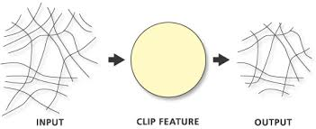
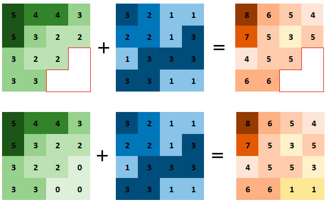
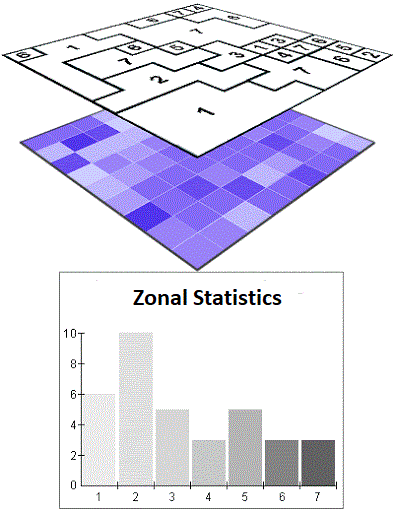
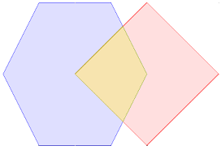
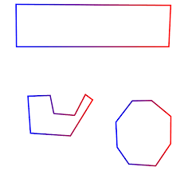

# Analytics

---
The concept of _geospatial analytics_ is central to Geographic Information Systems(GIS) and is assimilated with **generating** new data/information and usually results in new data layers.<hidden> While traditional GIS are well equipped to handle these types of operations, conducting spatial analytics in a web environment is much more complicated due to limitations in terms of bandwidth, memory, network connecticity, etc.</hidden>

---

<!-- .element style="border: 1px solid black;  height: 500px" -->

---

The geospatial domain features ***three*** main types or categories of analytics that build on the main geospatial data types. 

---

The **first category** consists of analytics  performed exclusively on vector layers. <hidden> The results of such operations are usually new vector layers or tables. These types of operations employ very often computatinal geometry methods and can be demanding in terms of resources.</hidden>

--

 The **second category or type** operates on raster or imagery data, tend to be simpler and employ concepts defined in mathematical algebra.<hidden> However, is is possible to build complex operations representing specific geospatial models/concepts by chaining simple map algebra expressions. </hidden>

--

 The third category is represented by **mixed raster-vector** analytics where computational logic is applied to a raster and a vector layer. <hidden>These types of operations are complex and require supplementary operations like converting the vector layer to raster format or reprojection to a comon coordinate system.</hidden>

<!-- .element style="border: 0px solid black;  height: 400px" -->

---

We have to outline that, in general any type of spatial operations between two distinct layers **require** the layers to share the same space in terms of coodinates and **at least partially overlap** like in the graphic below.

---

In the case the layers spatial coverages **do not overlap**  no spatial operations are possible except merging them into one layer or checking if they overlap. 

