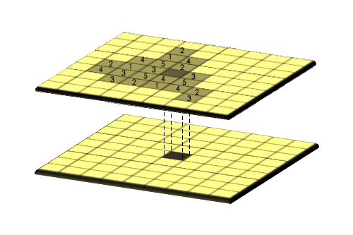
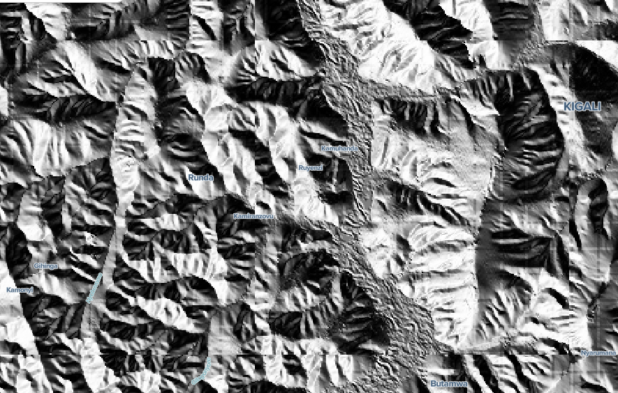
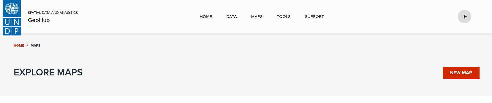
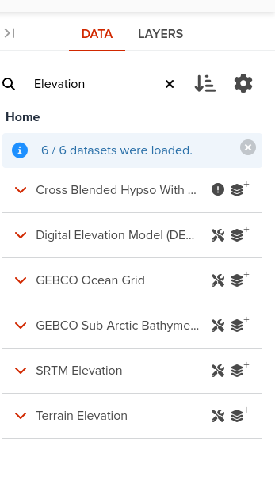
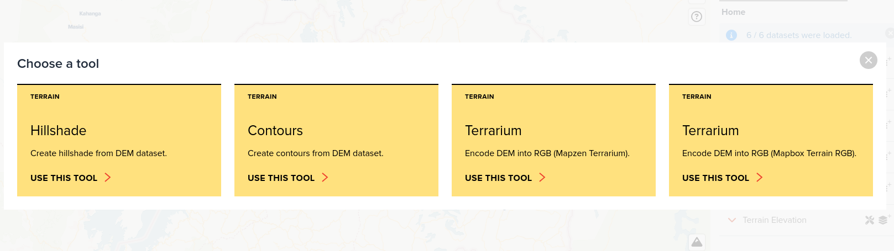
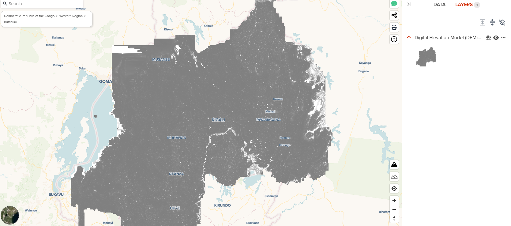
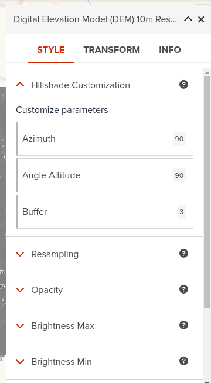
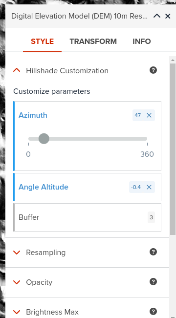

# Imagery based analytics

---

Raster analysis is the process of analyzing spatial information contained in grid datasets. Each cell in a grid contains a value or class, which could be related to soils, land cover, elevation, or another type of data.

 <!-- .element style="height: 200px" -->

<hidden>
GeoHub is powered by [titiler](https://developmentseed.org/titiler/) a custom Cloud Optimized Geotiff([COG](https://www.cogeo.org/)) server that converts on the fly COGs to map tiles in graphic formats. Titiler features sophisticated mechanisms that can be employed to transform the input COG files on the server side. This forms the backbone of raster based analytics.
In practice, all these details are hidden under the concepts of [algorithms](https://developmentseed.org/titiler/advanced/Algorithms/) and
[expressions](https://cogeotiff.github.io/rio-tiler/api/rio_tiler/expression/) through the UI/UX components.
</hidden>

---

Much like dynamic vector layers, specific algorithms can be applied transparently to raster layers represented by individual COGs, MosaicJSON documents or Spatio Temporal Assets Catalogs(STAC) assets.

---

<hidden>
We shall illustrate in the lines below how can one apply simple analytics to specific raster layers.</hidden>  We are going to create a hillshade layer
from elevation data. <hidden>[Hillshade or shaded relief](https://docs.qgis.org/3.34/en/docs/training_manual/rasters/terrain_analysis.html) shows the shape of the terrain in a realistic fashion by showing how the three-dimensional surface would be illuminated from a point light source.

</hidden>

<!-- .element style="height: 200px" -->

---

### 1. Open GeoHub and create a new map

--

### 2. Search elevation 

<!-- .element style="height: 500px" -->

--

### 3. Select the hillshade algorithm

--

--

### 4. Open layer Properties dialog

<!-- .element style="height: 500px" -->

--

### 5. Adjust hillshade Azimuth partameter to 45 and Angle Altitude to 0

<!-- .element style="height: 400px" -->

--

---

This example aimed to demonstrate how GeoHub employes and presents the concept of **raster based** analytics. The code idea
is to:

 - [x] create algorithms
 - [x] tag targeted datasets with the algorithm name
 - [x] execute and interact with the algorithm