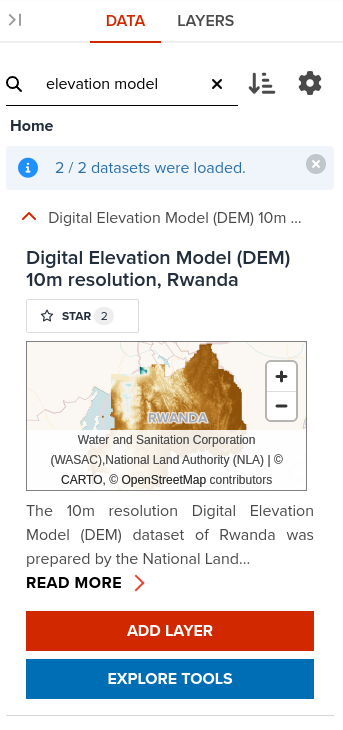

# Imagery based analytics
GeoHub's backend is powered by [titiler](https://developmentseed.org/titiler/) a custom Cloud Optimized Geotiff([COG](https://www.cogeo.org/)) server that converts on the fly  COGs to map tiles in graphic formats. Titiler features sophisticated mechanisms that can be employed to transform the input COG files on the server side. This forms the backbone  of raster based analytics. 
In practice, all these details are hidden  under the concepts of [algorithms](https://developmentseed.org/titiler/advanced/Algorithms/) and
[expressions](https://cogeotiff.github.io/rio-tiler/api/rio_tiler/expression/) through the  UI/UX components.

Much like dynamic vector layers, specific algorithms can be applied transparently to raster layers represented by individual COGs, MosaicJSON documents or Spatio Temporal Assets Catalogs(STAC) assets.

We shall illustrate in the lines below how can one apply simple analytics to specific raster layers. We are going to create a hillshade layer
from elevation data. [Hillshade or shaded relief](https://docs.qgis.org/3.34/en/docs/training_manual/rasters/terrain_analysis.html)  shows the shape of the terrain in a realistic fashion by showing how the three-dimensional surface would be illuminated from a point light source.

1. Open GeoHub and create a new map 

    <figure markdown="span">
      
      <figcaption>Open new map</figcaption>
    </figure>

2. Search elevation data and load the available algorithms by clicking on the tools icon

    <figure markdown="span">
      
    </figure>

3. Select the hillshade algorithm

    <figure markdown="span">
      
    </figure>

    <figure markdown="span">
      
      <figcaption>Load elevation data  with hillshade algorithm applied</figcaption>
    </figure>

4. Open layer Properties dialog

    <figure markdown="span">
      
    </figure>

5. Adjust hillshade Azimuth partameter to 45 and Angle Altitude to 0

    <figure markdown="span">
      
    </figure>
     
    <figure markdown="span">
      
    </figure>

