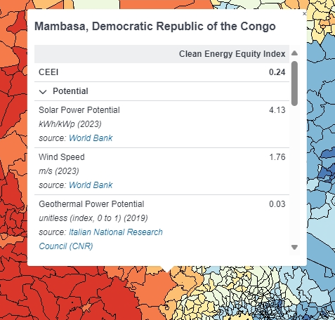

# CEEI Dashboard

---

## Getting started

Currently the GeoHub hosts the Clean Energy Equity Index (CEEI) Dashboard. This allows users to compute for the CEEI of various countries.

---

1.Open [this direct link](https://geohub.data.undp.org/dashboards/ceei) to start exploring electricity access data.

2.Or, on the landing page of Dashboards, you can see an overview of the CEEI Dashboard.

---

## Map Usage

This dashboard maps the Clean Energy Equity Index (CEEI) for the area. The dashboard allows the user to adjust the data computation to simulate various scenarios for the CEEI value.

The sidebar shows the initial layer controls along with the scale used for the map data.

Click on a given country to access the properties of the area.

You can also manage the individual layer controls through the respective layer’s card.

- Click the eye to toggle layer visibility.

- Click the "Edit layer name" button to change the name of the layer

- Click the "Duplicate layer" button to duplicate the layer. This layer’s data can be customized and simulated with its own separate data, changing the map visualization accordingly.

- Click the "Edit color scale" button to customize the color map used in showing the weights.

- Click the "Delete layer" button to permanently remove the layer. The initial layer cannot be deleted.

---

## Layer Customization

The CEEI dashboard allows the user to customize the data of a layer by changing the indicator data used for computing the CEEI.

Click on the customize data button on a layer’s card to bring up a modal prompt.

You can download the CEEI data of a layer as a CSV file to make changes to the data as you see fit.

You can then upload the edited CSV back to update the map visualization.

---

## Simulate

Clicking the "Simulate" button on a layer card allows the user to change the weights used in computing the CEEI.

Change the weights given to features by moving the slide to the desired percentage.

Changing the weights will also shift the other features’ weights accordingly, ensuring they add up to 100%.

To prevent this, click the lock button next to a feature to prevent the value from being changed.

Finalize your changes with the "Apply" button.
