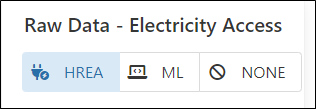
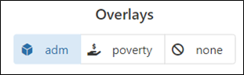
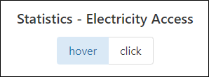

# Electricity Dashboard

---

## Getting started

Currently the GeoHub hosts the UNDP Electricity Dashboard which display the likelihood of full electrification for a given area. The Dashboard uses the High-Resolution Electricity Access layer (HREA).

--

1.Open [this page](https://dev.undpgeohub.org/dashboards/electricity) to start exploring electricity access data.

2.On the landing page of Dashboards, you can see an overview of the UNDP Electriciy Dashboard.

3.Click on the "Open Dashboards" button on the landing page which will let you to visit the Dashboard.

4.Here you can click on the "Explore Data" button to view statistics, adjust visual enhancements and download the layer of interest.

---

## What are the different functions within the Dashboard?

The user can select what they would like to visualize by selecting it under the “Raw Data Tab” featured on the upper left of the Dashboard.
Here there is the ability to switch between HREA raw data layer, Machine Learning Layer or display None.

<!-- .element style="height: 200px" -->

--

The user has the capability to Overlay the (ADM) Administrative layer, Poverty layer or display None as needed.

<!-- .element style="height: 200px" -->

--

Thirdly, the Dashboard also offers the ability to view statistics of each point on the map for the Population electrified according to the year of need ranging from 2012-2020.The user has the ability to interchange between “HOVER” or “CLICK” options to view these statistics.

<!-- .element style="height: 200px" -->

--

Finally, the option of Statistics Download allows the user to download the statistics of the Dashboard on display with the format of liking at different Administrative levels.
