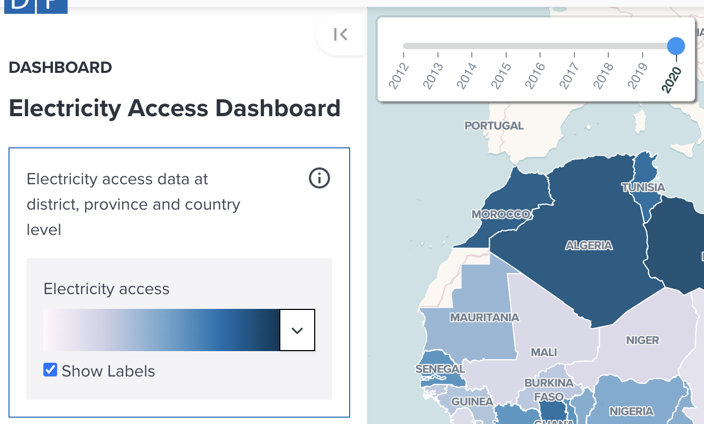
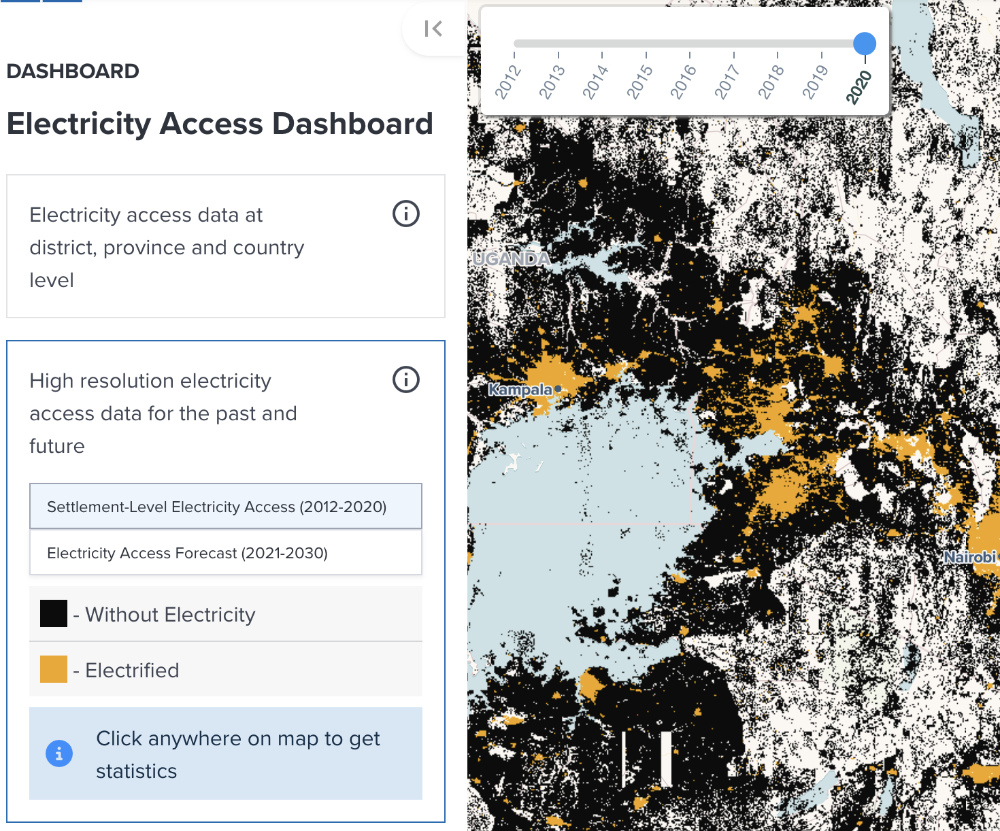
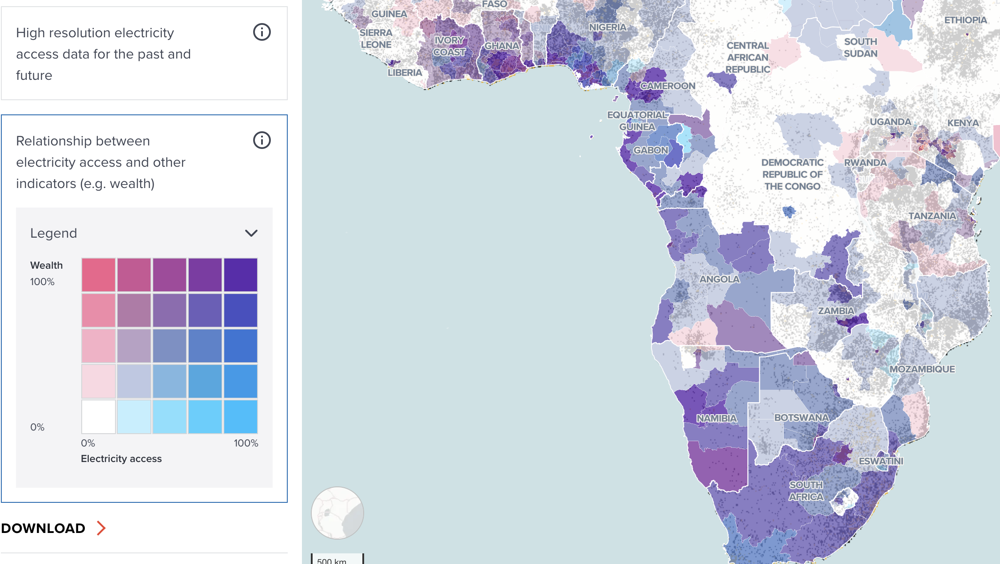

# Electricity Dashboard

---

## Getting started

Currently the GeoHub hosts the UNDP Electricity Dashboard which display the likelihood of full electrification for a given area. The Dashboard uses the High-Resolution Electricity Access layer (HREA).

--

1.Open [this direct link](https://geohub.data.undp.org/dashboards/electricity) to start exploring electricity access data.

2.Or, on the landing page of Dashboards, you can see an overview of the UNDP Electriciy Dashboard.

3.Click on the "Open Dashboards" button on the landing page which will let you to visit the Dashboard.

4.Here you can click on the "Explore Data" button to view statistics, adjust visual enhancements and download the layer of interest.

---

## What are the different functions within the Dashboard?

There are three ways to explore electricity access after clicking **START EXPLORING** in the dashboard:

- Explore the evolution of electricity access at administrative level;
- View electricity access data;
- Analayse bivariate data for wealth and access to electricity.

--

<!-- .element style="height: 300px" -->

---

## Explore the evolution of electricity access at administrative level

A selected year data can be overlaid on the map. The layer is a summary of HREA electrification by administrative areas and using a custom population raster to calculate the percentage of population with electricity access in each area.

--

You can change a year of displaying the data by moving on the slider, or change a colormap applied to the layer to visualize.

<!-- .element style="height: 400px" -->

---

## View electricity access data

Two types of data can be selelected to allow you to compare electricity access rate for your interested area across multiple years:

- Settlement-level Electricity Access (2012-2020);
- Or Electricity Access Forecast (2021-2030).

--

After selecting a data type, you get layer statistics for a single pixel (1km x 1km) by clicking anywhere on the map.

<!-- .element style="height: 400px" -->

--

The following figure is an example of how statistics is visualized on the chart after clicking on the map. The chart will be updated immediately after you click on the map.

<!-- .element style="height: 400px" -->

---

## Analayse bivariate data for wealth and access to electricity

This provide a slightly different way for you to explore data by using bivariate data matrix table for wealth index and electricity access. By clicking any cell that you are interested in, the tool automatically filter data on the map to find which administrative area is related.

--

<!-- .element style="height: 400px" -->

--

The following example shows which countries are identified for low electricity access (20-40%) and low wealth index (20-40%). You can explore the relationship between wealth and electricity access by clicking any cell on the table. It will be reset to show all countries if you click the cell again.

--

<!-- .element style="height: 400px" -->

---

Finally, the option of Statistics Download allows the user to download the statistics of the Dashboard on display with the format of liking at different Administrative levels.
