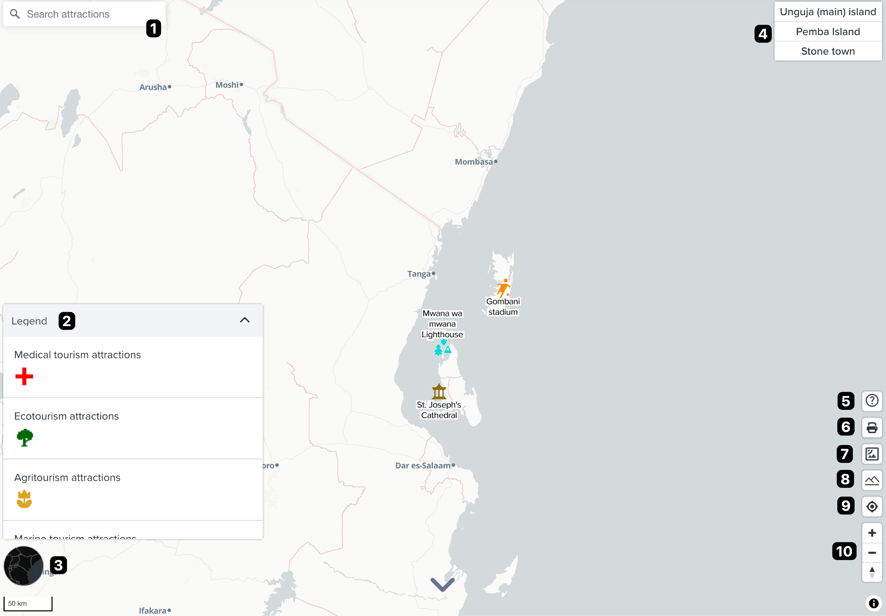
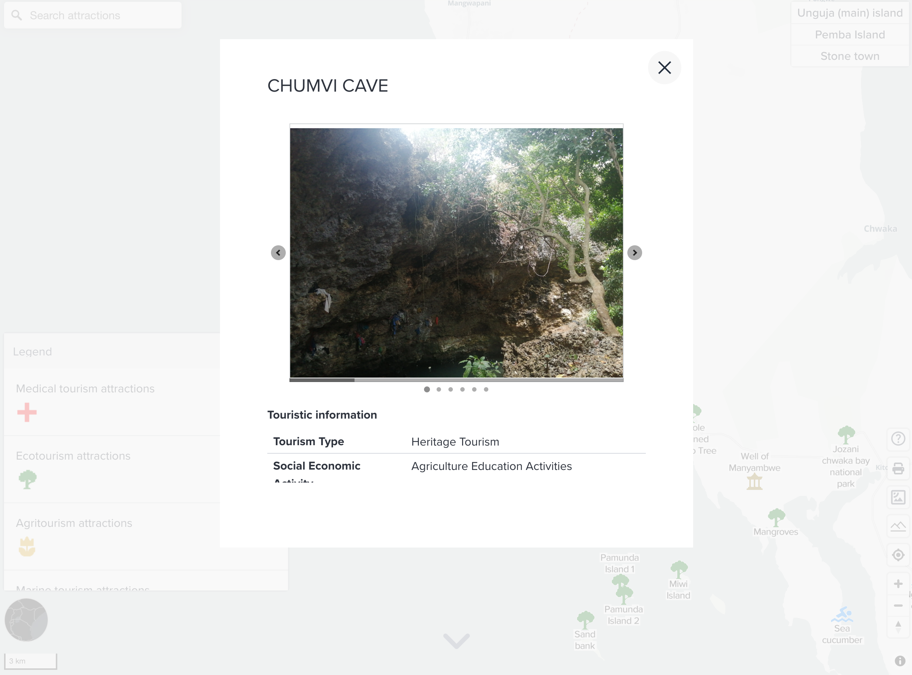

# Zanzibar Dashboard

---

## Getting started

Currently the GeoHub hosts the Zanzibar Dashboard which can explore the beauty of Zanzibar islands, Tanzania.

--

The Dashboard uses the data that the UNDP Accelerator Lab collaborated with OpenMap Development Tanzania and the State University of Zanzibar's youth mappers chapter to map unpopular tourist attractions with the goal of assessing the existing situation through crowd mapping and mobile surveys prior to creating this web map.

--

1.Open [this direct link](https://geohub.data.undp.org/dashboards/zanzibar) to start exploring Zanzibar tourism information.

2.Or, on the landing page of Dashboards, you can see an overview of the Zanzibar Dashboard.

3.Click on the "Open Dashboards" button on the landing page which will let you to visit the Dashboard.

---

<!-- .element style="height: 300px" -->

Continue scrolling down or click **Explore Zanzibar** button to start viewing the map application.

---

## Main functionalities of the dashboard

<!-- .element style="height: 400px" -->

--

1.Searching box: You can type any keywords to search Zanzibar tourism attractions.

2.Legend: The attraction spots are visualized by several icons. You can check the legend here.

3.Change basemap: There are couples of different base maps available in the dashboard. You can change it from default base map as you want.

4.Location switcher: You can simply click a locatio name to zoom to it either main island or Pemba island or Stone town.

--

5.Tour guide feature: If you click this help button, you can explore major funcitonaities in tourguide function.

6.Print: You can export current map as a image.

7.High resolution aerial images: 7cm's high resolution aerial images can be shown if you click the button.

8.Terrain mode: You can turn on 3D mode here. You can tilt the map to see it as 3D.

--

9.GPS button: If you are in Zanzibar island, you can use this button in your smartphone. You can see your location on the map.

10.Map navigation button: You can click plus / minus button to zoom in / out on the map.

---

## Showing details on popup

<!-- .element style="height: 400px" -->

--

Click a feature on the map, you can view the details of a tourism attraction point.

Each attraction has several photos and detailed information.

---

## Crowd mapping project

If you are interested in the crowd mapping project that mapped all of these tourism attractions in Zanzibar islands, please have a look at [this article](https://www.undp.org/tanzania/blog/using-crowd-mapping-and-mobile-survey-unravel-unfrequented-tourist-attractions).
