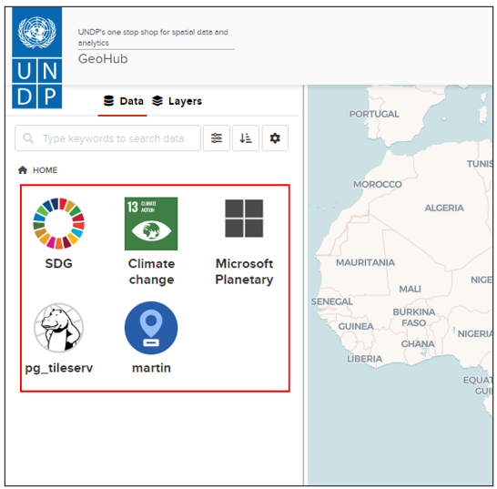

# How is the data arranged in the GeoHub?
## Data structure 
Data is found as Raster and Vector files

We follow a unique way to arrange our data sets! All the data sets within the UNDP GeoHub are arranged under three main “Buckets” and found under the Home page.

<justify>The first bucket is the “SDG” bucket which entails all data related to Sustainable Development Goals. This includes raster and vector data.

<justify>The second bucket is the “Microsoft Planetary” which connects to all the satellite data sets of the Microsoft Planetary Computer where the user can get engage in further analysis.

<justify>The third bucket includes the “Martin” server which contains vector data.
On the left most corner of the page, you can view the icons representing each SDG! Hovering over each of the icons will allow the user to get an overview of what each bucket represents.

  

  
