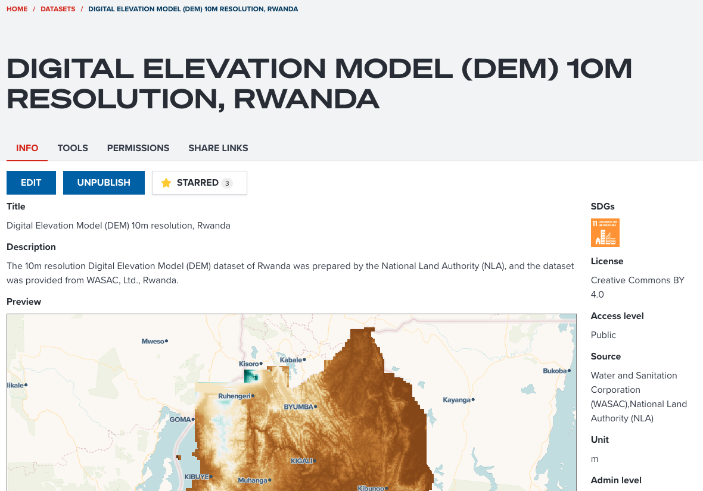
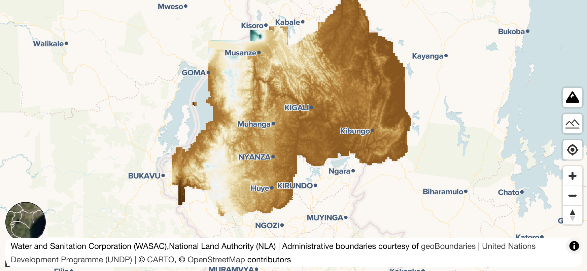
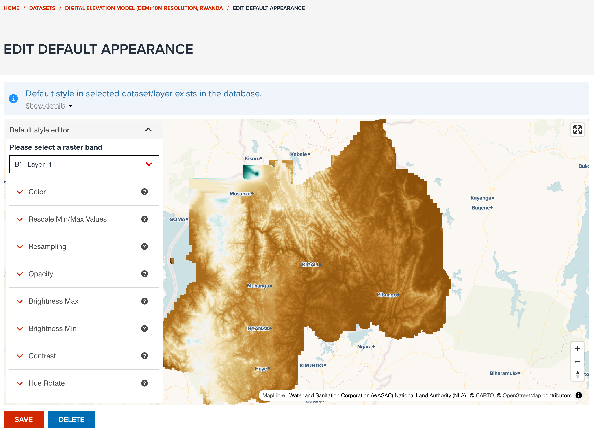

# Best practices on data storage

In this section, we can take a dataset as an example to show you what can be the best practice to manage a dataset in GeoHub.

We use [Digital Elevation Model (DEM) 10m resolution, Rwanda](https://geohub.data.undp.org/data/00d5add9be37e465398b081683c3ec03) dataset as an example. The example should looks like the below screenshot.

--

<!-- .element style="height: 500px" -->

---

### Does the dataset have enough metadata information?

Proving enough information about your dataset is important for other users to find and assess your dataset. The following points for each property of metadata can be considered when you publish a dataset in GeoHub.

---

#### Title

Does the title give you brief idea of your dataset? In this example, the title contains _Digital Elevation Model_ (type of data), _10m_ (resolution) and _Rwanda_ (coverage of dataset). These information allows other users to know what this data is exactly.

<hidden>

!!! note

    Title is used for searching dataset by keywords, and it is shown as primary information in the dataset table. It is the most important aspect for other users to find your data.

</hidden>

---

#### Description

Any information can be described at description property for your dataset. In this example, data provider and data creator's names are added in addition to the title information. If you have any useful link for this dataset, the URL can also be pasted here.

<hidden>

!!! note

    Description is also used for dataset searching by keywords. If you wish more users to use your dataset, try to fill information as details as possible. Description property accepts you to write text in markdown.

</hidden>

---

#### License

In GeoHub, you must select a data license before publishing. You can select a proprietary license or no license in this property. If you select these non-opendata license, users still can see your dataset, but users cannot use your data for their purposes.

In this example, _Creative Commons BY 4.0_ is selected. This is a kind of open data license that allows other users to reuse the data if they mention attribution (copyright information) correctly.

---

#### Source

This source is for data providers information. These names saved in this property will be shown as an attribution on a map. Most of open data license requires mentioning attribution correctly. Adding any relevant person's names or company's names in this property is very critical as an open data.

--

<!-- .element style="height: 500px" -->

---

#### SDGs (Optional)

**Sustainable Development Goals (SDGs)** is an optional property, but is an important indicator in development sector at international organizations and UN agencies. If your dataset can be linked to any SDGs, you should associate it to SDG tags. So, users can search your data from their interested SDG.

--

In this example, SDG 11 `Department of Economic and Social Affairs` is selected. Elevation tends to be a critical information for making infrastructure in cities. SDG 11 can be a related goal for this dataset.

---

#### Unit (Optional)

**Unit** is an optional property. If a dataset is a raster data, a unit value can be added. This is also helpful for users to understand what this dataset's values reprent.

In this example of Rwanda DEM, the unit is `m`. This clearly shows that each pixel value of DEM is stored in meters.

<hidden>

!!! note

    it is tricky if a data is a vector data because a vector data can have multiple layers and each layer can have multiple fields. In such case, you don't have to select an unit value.

</hidden>

---

#### Admin Level (Optional)

**Admin level** is an optional property. If your data covers national level or subnational level, you can set a value for this property. It can also give an idea of level of data coverage for other users. In this example, _National_ is selected since this DEM data covers the entire Rwanda.

---

#### Resolution (Optional)

**Resolution** is an optional property and it is decribed at [here](./publish_datasets.md#resolution). If your dataset is a raster data, you may find the resolution information in the document which come with the dataset. It is quite complicated to get a resolution from actual dataset. Finding the information from the data documents can be easier and more precise way.

<hidden>

!!! note

    Again, it is also tricky to set resolution for a vector dataset. If you struggle to find an appropriate value for resolution, you can skip it.

</hidden>

---

#### Year (Optional)

**Year** is an optional property, and it tends to be very critical information for decision making when users use your dataset. Although it is an optional property, it is highly recommended to set **Year** for your dataset.

--

However, this example of Rwanda elevation data does not have **Year** information. Sometimes, it might be difficult to find year information for your dataset. In such case, you don't have to set year, you can skip it.

---

### Does the dataset have default layer appearance setting?

Setting a default appearance is optional. GeoHub will assign a colormap randomly and try to optimize your data visualization as much as possible. But creating an appropriate layer appearance is quite complicated task.

--

If possible, it is recommended for you to create a default layer appearance for your dataset because you can be the best person who knows how to visualize your dataset in an apealing way. If default appearance is saved for the dataset, GeoHub will add your data with preconfigured style as default. Other users can always see your dataset with the most beautiful visualization.

--

<!-- .element style="height: 500px" -->

--

In order to set default layer appearance, click **CHANGE DEFAULT APPEARANCE** button under **PREVIEW** tab. This button is only available for **Editor** and **Owner** of the dataset. Once the button is clicked, default layer appearance setting page is shown like the below screenshot.

--

<!-- .element style="height: 500px" -->

--

In default appearance edit page, the same property controls under **STYLE** tab of map editor page are shown to allow you to edit default layer style. Follow [Visualization](../visualization/visualize_overview.md) section's guidelines to set an appealing layer style for your dataset.

---

## Next step

In next section, you will be learning how to search and visualize datasets, and share a map with your colleagues.
