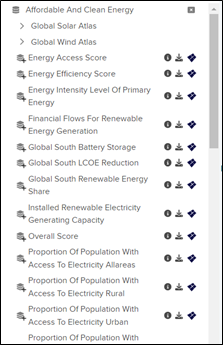

# How is the data arranged in the GeoHub?
## Data structure 
We follow a unique way to arrange our data sets! All the data sets within the UNDP GeoHub are arranged in “Buckets” organized according to Sustainable Development Goals. On the left most corner of the page, you can view the icons representing each SDG! Hovering over each of the icons will allow the user to get an overview of what each bucket represents.
        
