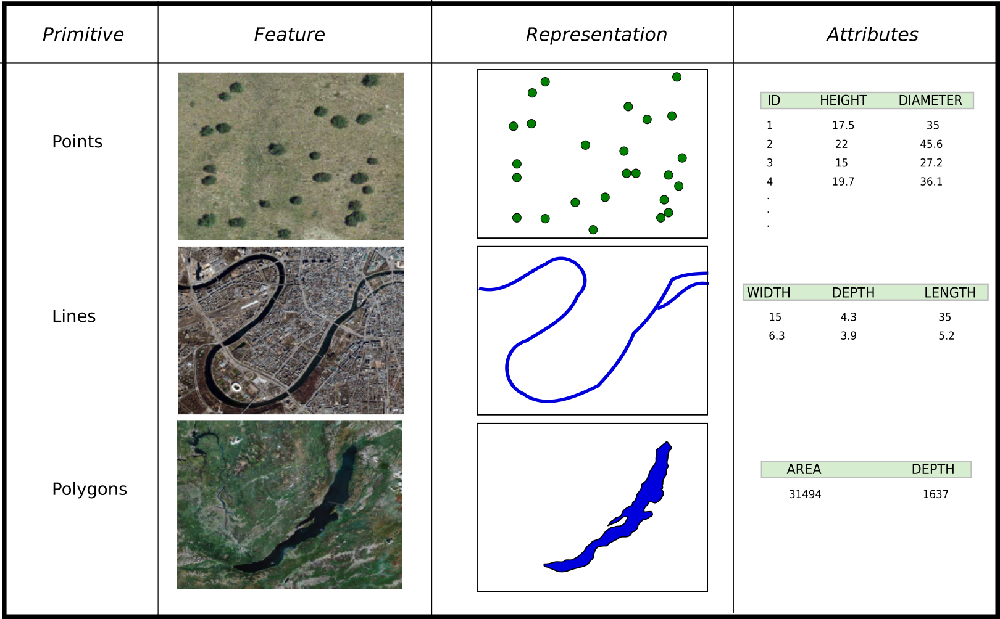

# GIS data types and GIS data formats

The GeoHub hosts raster and vector data which is preprocessed.

Vector data comprises of point, lines and polygon layers in which is converted cloud optimized verctor tile - **PMTiles**. Raster data acquired from different sources have been converted to **Cloud Optimized GeoTiffs (COG)** which allows users to stream just the portion of data that it needs, improving processing times and creating real-time workflows previously not possible.

GeoHub uses an amazing geospatial libarary **GDAL** to convert various formats of geospatial datasets to either **COG** or **PMTiles**. Most of major GIS formats are supported by GeoHub. You can read more about supported format [here](https://geohub.data.undp.org/data/supported-formats)
