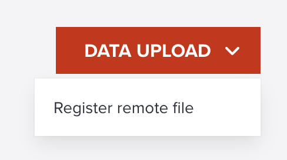
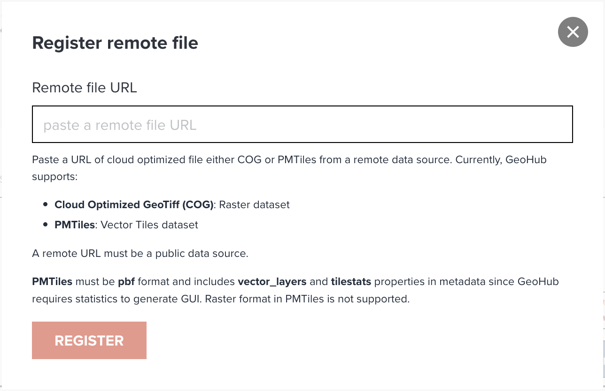

# Registering a remote source

GeoHub also offers you to register a remote file source into GeoHub database.

---

## Remote file registration menu

To register a remote file, click a menu _Register remote file_ on the dropdown menu of **DATA UPLOAD** button.

<!-- .element style="height: 100px" -->

---

## Paste remote file URL

Copy and paste a remote file URL to the textbox on the dialog, then click **REGISTER** button.

<!-- .element style="height: 300px" -->

---

## Supporting formats for remote files

Currently, GeoHub supports:

- **Cloud Optimized GeoTiff (COG)**: Raster dataset
- **PMTiles**: Vector Tiles dataset

--

A remote URL must be a public data source.

Furthermore, PMTiles must be _pbf_ format and includes _vector_layers_ and _tilestats_ properties in metadata since GeoHub requires statistics to generate GUI. Raster format in PMTiles is not supported.

---

## Metadata registration

After clicking **REGISTER** button, you will be redirected to data registration page as described in the last section of **Uploading your own data**.

---

## Next step

In next section, you are going to publish the first dataset in GeoHub.
