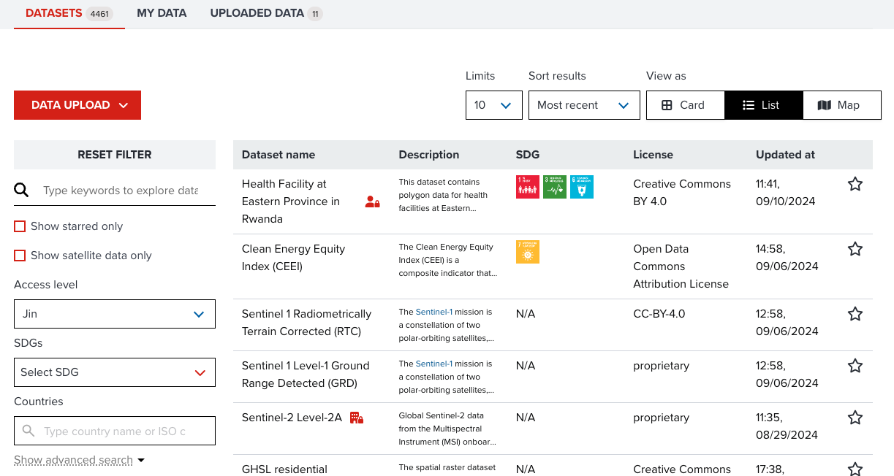

# GeoHub as a data store

---

## Importance of centralized database

Geospatial datasets tend to be playing a critical role on policy making, and we are putting a lot of efforts on maintain them at each department and country office. 

--

However, these datasets have not been shared and reused effectively accross organizations. 

--

Establishing GeoHub as a centralized database to manage all geospatial datasets into a location is one of the important purposes in UNDP.

---

## How does GeoHub manage datasets?

GeoHub uses Azure - a cloud platform powered by Microsoft to manage geospatial datasets. 

--

Your datasets will be uploaded into UNDP's Azure blob storage account through our data pipeline, and then the metadata will be registered into geopatial database (PostgreSQL/PostGIS).

--

<hidden>

The following diagram shows a sample workflow to upload and publish a dataset. Your data will be ingested to cloud optimized formats and stored in Azure securely.

</hidden>

sequenceDiagram
    actor u as User
    box transparent Azure
        participant g as GeoHub
        participant queue as ServiceBus queue
        participant pipeline as Pipeline
        participant blob as BlobStorage
        participant db as PostGIS
    end
    u->>g: Upload a dataset
    g->>queue: Put a task into a queue
    queue->>pipeline: launch pipeline on demand
    pipeline->>queue: Fetch a task from queue
    pipeline->>pipeline: Ingest a dataset
    pipeline->>blob: Upload a dataset
    pipeline-->>g: notify completion via websocket
    u->>+g: publish dataset
    g->>db: register metadata to database to publish
    g->>-u: publish done

<hidden>

if you are interested in seeing our database structure, please go to [here](https://github.com/UNDP-Data/geohub/blob/develop/backends/database/geohub-database-erd.png).

In terms of the data pipeline, source code is managed at [geohub-data-pipeline](https://github.com/UNDP-Data/geohub-data-pipeline) repository.

</hidden>

---

## Datasets page at GeoHub

The datasets managed in GeoHub can be explored at datasets page ([/data](https://geohub.data.undp.org/data?viewType=card)).

--

{:style="width: 600px;"}

--

As of 21 March 2024, 

- **4401 public datasets** are currently managed at GeoHub.
- **4167** are global datasets,
- and **101** datasets are specifically related to countries.
- 4339 datasets are connected to **SDGs (Sustainable Development Goals)**. 

--

GeoHub also manages some of satellite imagery for earth observation from the third party providers. 

Currently **16** satellite imagery collections (**STAC (Spatio Temporal Asset Catalog)**) are available in GeoHub.

--

The more GIS data uploaded, the more useful it becomes as a data store and analysis tool for decision making and all UN staff's works. Any user can upload data and enrich the GeoHub database.

---

## Next step

From next section, we will show you how to upload and share your own datasets at GeoHub.
