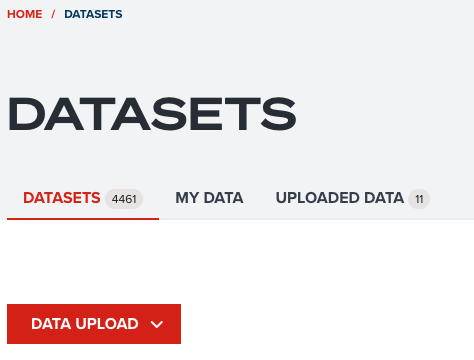
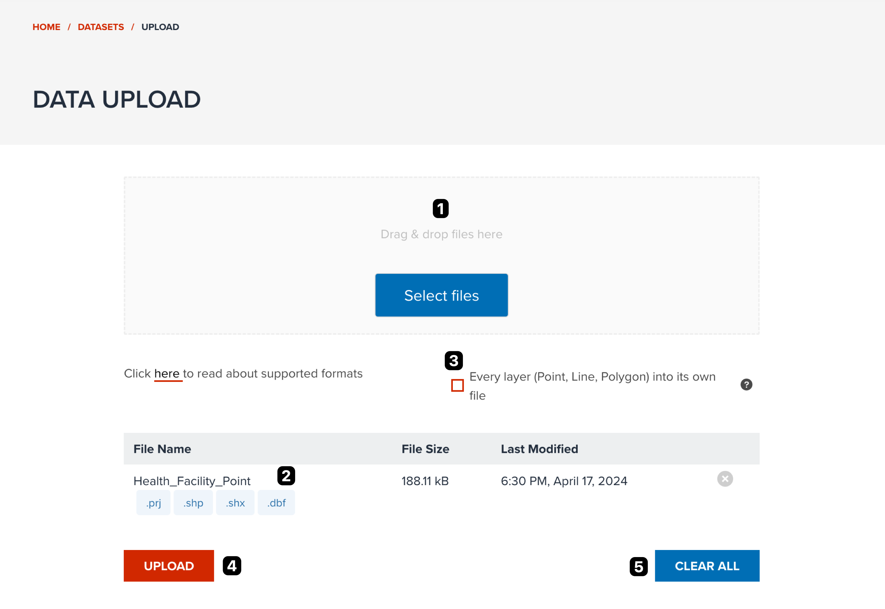
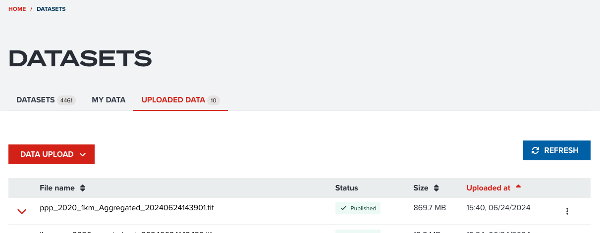
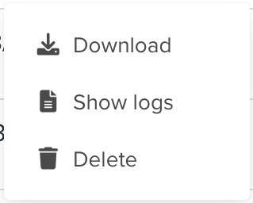
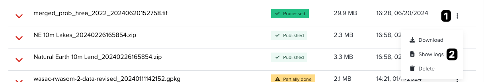

# Uploading your own data

Uploading your datasets to GeoHub is quite straightforward. You can follow the steps descibed in this section to upload them easily.

---

## Data upload

Firstly, please open **datasets** page from this [link](https://geohub.data.undp.org/data).

You can first **DATA UPLOAD** button at the header of datasets page. If you cannot see **upload** button, that means you have not signed in. Please follow this [steps](../getting-started/signin.md) to login first.

<!-- .element style="height: 300px" -->

--

You will be redirected to data upload page. The basic operation flow is shown in the following figure.

<!-- .element style="height: 500px" -->

--

The key elements on data upload page are as follows. Each number is corresponded to the number on the above figure.

1. Drag and drop files to a box or select files from **select files** button.
2. Check all selected files appears in the table.
3. As default, GeoHub will split all datasets into each file. If you want to convert multiple datasets into a file, please tick the checkbox.
4. Once everything is ready, you can click **UPLOAD** button to proceed.
5. Click **Clear All** button if you want to reset all selected files.

--

Please stay in this page until all uploads will be completed, you will be automatically redirected to **datasets** page once all uploads are done.

<hidden>

!!! note

    Most of geospatial data formats are a single file. However, if you want to upload some specific formats like **ESRI Shapefile**, please make sure you have selected all essential files (`.shp`, `.prj`, `.dbf`, `.shx`, etc) or make a **zip** file.

    ArcGIS FileGeoDatabase (`.fgb`) also needs to be archived as a **zip** file to upload.

!!! warning

    GeoHub does not limit the maximum file size to upload. But you maybe encounter some error when you upload extremely large geospatial dataset (generaly more than 1GB file size might have issues of uploading). This may occur due to our data pipeline spec (CPU and RAM) is limited. Please try to avoid uploading such large files. If you want to upload a large dataset and encounter some errors, please contact to our team through email or GitHub.

</hidden>

---

## Check your data at My data

--

Once your file is uploaded, you will be able to see it in **My Data** tab at datasets page.

--

<!-- .element style="height: 300px" -->

If status becomes **Processed**, your file is ready to publish.

--

The following status maybe appears.

- **Downloaded**: Pipeline received a task and downloaded your file.
- **Processing**: Pipeline started ingesting your file
- **Processed**: Pipeline finished ingesting, but not published yet. The table will be automatically refreshed.
- **Partially done**: Some files completed ingesting, but some files are failure.
- **Error**: Failed to ingest all files.
- **Published**: all datasets associated to this uploaded dataset were published

---

### Uploaded dataset menu

You can open the operation menu for uploaded dataset.

<!-- .element style="height: 300px" -->

--

- **Download**: You can download original dataset from here
- **Show logs**: See [this section](#check-data-pipeline-logs)
- **Cancel**: You only can see this before ingesting is completed. You can cancel ingesting by the pipeline.
- **Delete**: You can delete this data. but you cannot delete it if one of ingested datasets are published.

---

### Check data pipeline logs

Sometimes you might want to see logs from data pipeline.

--

The following screenshot shows how you can show logs for your dataset.

<!-- .element style="height: 400px" -->

1. Click three dotted button at the end of row of a dataset.
2. Click **Show logs** menu.

<hidden>

Note. Each number of instruction is corresponded to the number on the above figure.

!!! note

    All logs from data pipeline can be seen as a popup dialog. If your data failed to be ingested by the data pipeline, please send all logs to GeoHub team by sending email or opening an issue at [GitHub](https://github.com/UNDP-Data/geohub/issues/new/choose).

</hidden>

---

## Next step

In next section, you are going to publish the first dataset in GeoHub.
