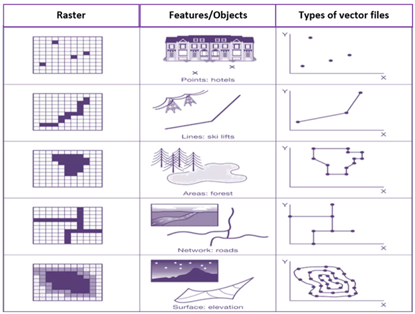

# What forms of data is available within the GeoHub?

The GeoHub hosts raster and vector data which is preprocessed.

Vector data comprises of point, lines and polygon layers. Raster data acquired from different sources have been converted to Cloud Optimized GeoTiffs (COG) which allows users to stream just the portion of data that it needs, improving processing times and creating real-time workflows previously not possible.

  
