# Publish your dataset as open data

---

## Publish a dataset

In this section, we are going to learn how to publish an ingested dataset as an open data.

--

Firstly, please go to [datasets page](https://geohub.data.undp.org/data) and open `My Data` tab. In `My Data` tab, you will be able to manage all your uploaded datasets and ingested datasets at one place. The following figure shows how you can go to publish an ingested dataset. The procedures are:

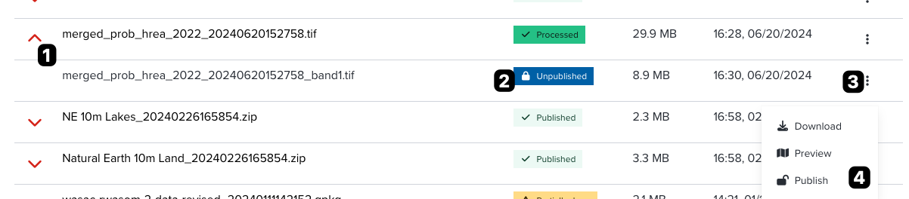

<!-- .element style="height: 400px" -->

--

1. Click `chevron` icon to expand an uploaded item
2. Check the status of ingested item. If status shows `Unpublished`, it is ready to publish!
3. Click three dotted button at the end of row of a dataset.
4. Open menu for an ingested item, then click `Publish` menu.

Note. Each number of instruction is corresponded to the number on the above figure.

--

After clicking `Publish` menu, you will be redirected to a publish page as shown in the below figure.

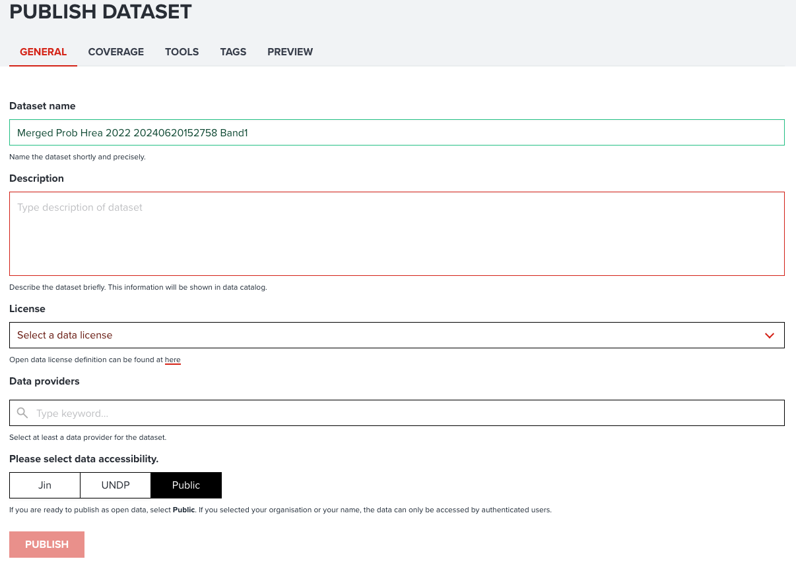{:style="width: 600px;"}

<!-- .element style="height: 500px" -->

--

In publish page, it consists of four to five tabs depending on dataset type either `raster` or `vector`. You may find tabs as follows:

- **GENERAL** tab: You can input general information for a dataset.
- **COVERAGE** tab: You can select data coverage either global or regional.
- **TOOLS** tab: If it is raster dataset, you maybe can register analytical tools to this dataset.
- **TAGS** tab: You can associate SDGs tags or any other additional tags to this dataset.
- **PREVIEW** tab: This tab provides you a simple preview of this dataset.

---

## Register metadata

Now, we are going to explain each item which you need to input for publishing. Let's begin.

--

### Input general information

Basic information can be inputted under `GENERAL` tab.

--

The below figure shows an example inputs of general tab information.

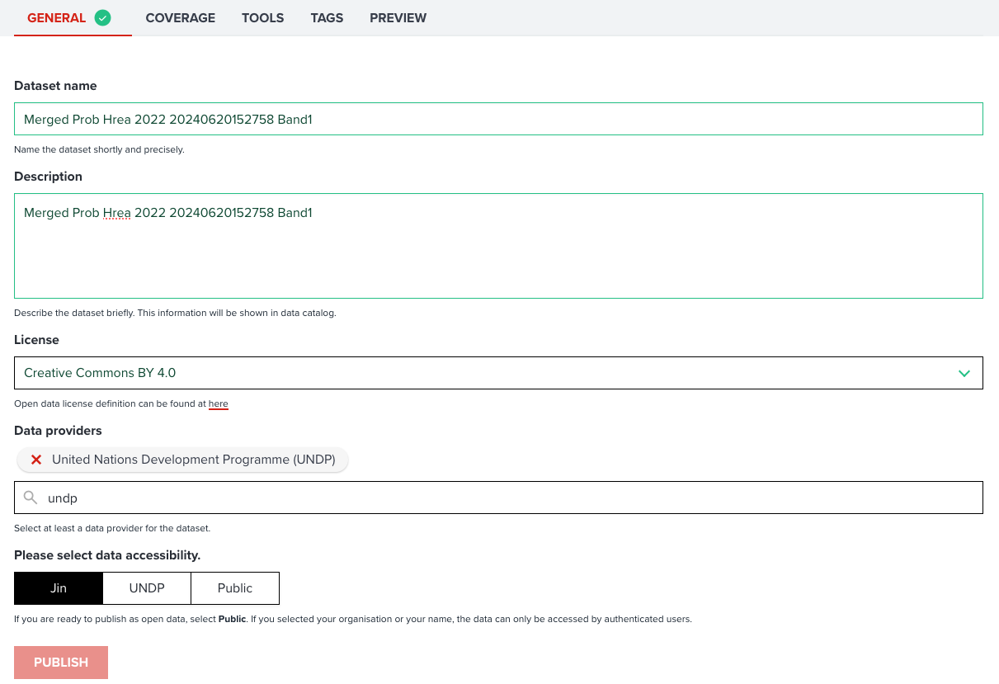{:style="width: 100%;"}

<!-- .element style="height: 500px" -->

<hidden>

| Property              | Required | Description                                                                                                                                                                                                                                                                                                          |
| --------------------- | -------- | -------------------------------------------------------------------------------------------------------------------------------------------------------------------------------------------------------------------------------------------------------------------------------------------------------------------- |
| **Dataset name**      | Y        | Please write a concise title for this dataset. This title will be used for searching datasets.                                                                                                                                                                                                                       |
| **Description**       | Y        | Please write description of this dataset in detail as much as possible. So, other users will read and understand what this dataset is. This field is also used for searching datasets.                                                                                                                               |
| **License**           | Y        | Please select a data license. This is important whether you allow other users to use your data. About license, we will explain in [the next section](#what-license-is-appropriate).                                                                                                                                  |
| **Data providers**    | Y        | Please select at least a data provider. Providers selected here will be shown as attribution on maps. As default, _United Nations Development Programme_ is entered. However, you can delete default value and search or create an organisation name from the dialog. You can select multiple providers as you wish. |
| **Data accesibility** | Y        | You can set accessibility for this dataset. Read more about data accessibility in [next section](#what-data-accesibility-is).                                                                                                                                                                                        |

</hidden>

--

#### What data accesibility is?

You can set the following accessibility for this dataset.

- **Public** is selected as default, this means the dataset will be opened to everybody anonymously. Any unsigned users also can access to your data.
- **Your organization name**, like `UNDP` depending on which UN agency you are from, you maybe can see your organization name here. If you select organizational accessibilty, your data will only be accessible by signed users within your organization.
- **Your first name** is that you or specific users whom you gave permission can access to your dataset.

<hidden>

!!! note

    If you feel like this dataset is not yet ready to publish, you can select organizational or private accessibility. When you want to make it open to everybody, you can change accessibility to **Public** any time.

</hidden>

---

#### What license is appropriate?

Selecting an open data license for your data is critical because the license is an only way for you to show other users whether your data is reused and redistributed freely or in some circumstances.

--

The following table show the major open data licenses. There are specific terms you need to be aware of:

- **Domain**: What type of material this license can be applied to. This normally can be either `Content` or `Data`.
- **BY**: Attribution (copyright) is required for using this data.
- **SA**: share-alike is required to redistribute this data. Share-alike is that other users have to use the same license of original one when they change and redistribute the data again,

--

| License       |    Domain    |  By |  SA |
| ------------ |:------------:|:----:|:--:|
| Creative Commons Attribution 4.0 (CC-BY-4.0)      | Content, Data |   Y |   N |
| Creative Commons Attribution Share-Alike 4.0 (CC-BY-SA-4.0)   |Content, Data  |   Y |   Y |
| Open Data Commons Open Database License (ODbL) |     Data     |   Y | Y |

There are many open data licenses available, please refer to [here](https://opendefinition.org/licenses/) for more information.

<hidden>

!!! note

    You can also select `license no specified` for your data. But this may limit other users to use your data. Basically other users cannot reuse it for any other purposes.
    Furtheremore, some of open data license may not be listed in the select box in editing page. In such case, you can select `Others` from select box, then please specify your license details in `description` property of your dataset.

</hidden>

---

### Select data coverage

It is important to select what coverage is supported by your data. So other users can find your data easily by using global or a country tag. The folloiwng screenshot shows an example of coverage selection. You can simplely follow questions to select them appropriately.

--

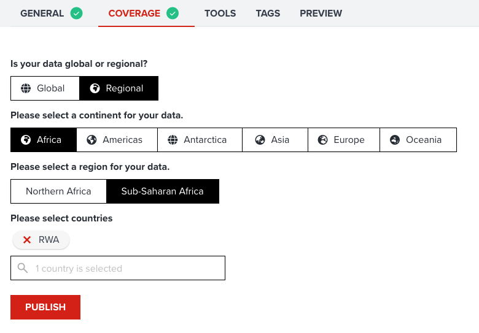{:style="width: 100%;"}

<!-- .element style="height: 300px" -->

Firstly, you have to select either `Global` or `Regional`. If your data cover for the entire world, please select `Global`.

Secondary, the selection of continents will be asked if you select `Regional`. Please select single/multiple continents for your datasets. If your data supports a country from Africa, please select `Africa`.

--

Thirdly, you will be asked to select sub regions for selected continents. For instance, if your data is for `Rwanda`, please select `Sub-Saharan Africa`. You can select multiple sub regions as much as you want.

--

Lastly, this is the most important selection. Please select counties from search button to associate your data to specific country tags. You can type a country name to filter counties on the dialog, and just click a country flag to select/deselect. If a country is selected, yo uwill be able to see selected countries under search button.

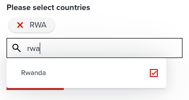{:style="width: 200px;"}

<!-- .element style="height: 300px" -->

---

### Selecting optional tags

As shown in the below figure, there are couple of tags can be selected additionally for your dataset. These tag information will be shown at `INFO` tab of your data page and will be used by searching datasets. Furthermore, these tags might be very useful for other users to evaluate your dataset.

--

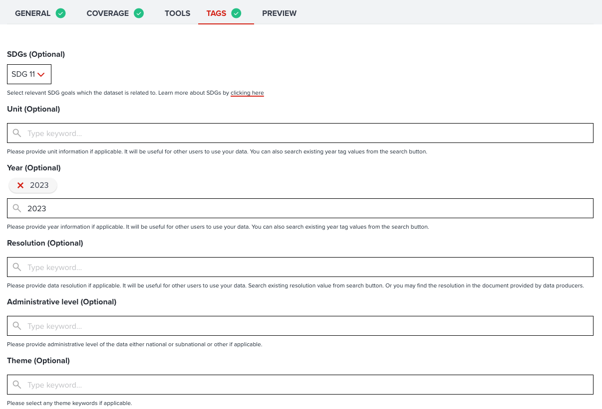{:style="width: 100%;"}

<!-- .element style="height: 500px" -->

---

#### SDGs

If your dataset is related to any SDGs, you can select a single / multiple SDGs from the button. You can select goals as much as you want. You can see selected SDG icons under the button.

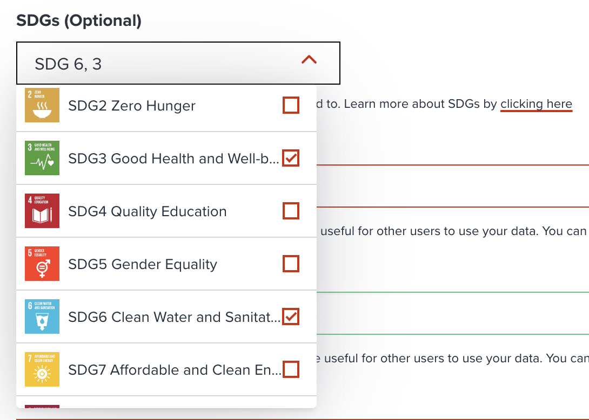{:style="width: 300px;"}

<!-- .element style="height: 300px" -->

<hidden>

!!! note

    Your selected SDGs tags will be used to search datasets by other users. It is important to select related SDG tags for your dataset. So, it will be easier for other people to find your valuable dataset.

</hidden>

---

#### Unit

If your data is a **raster** dataset, **unit** can be very useful information when other users want to use your data. You may find this information on the document which come with your geospatial data.

<hidden>

!!! note

    Firstly, you can explore any existing values from **search** button which positions next to textbox. If you could not find existing unit value, you can type any value on the textbox.

</hidden>

---

#### Year

**Year** tends to be very critical information when other users want to use your data. You may find this information on the document which come with your geospatial data.

---

#### Resolution

**Resolution** of the data is also an useful information for other users. You may find this information on the document which come with your geospatial data.

<hidden>

!!! note

    If your data is a **raster** dataset, resolution is normally refered to a single pixel size. Higher resolution value contains more pixels per unit area. Read more about raster resolution [here](https://pro.arcgis.com/en/pro-app/3.1/help/data/imagery/pixel-size-of-image-and-raster-data-pro-.htm).

    You may find difficulty to select a resolution if your data is a **vector** data, you maybe can skip this property, or type administrative level (admin 1, admin 2, national, subnatinal, etc) in this property.

</hidden>

---

#### Other optional tags

There are several categories available for you to select for your data. These additional tags may also be used for searching by other users.

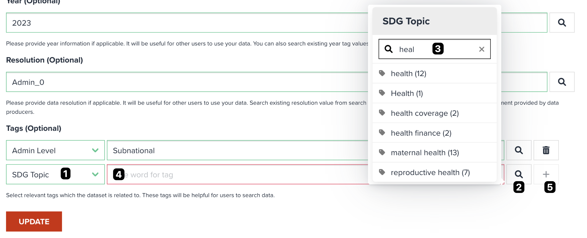{:style="width: 100%;"}

<!-- .element style="height: 400px" -->

--

The steps to select other tag is shown at the above figure.

1. Select a category from select box
2. Click **search** button to open a dialog.
3. Try to search an existing tag from search window by clicking search button. You can filter by free keyword, then double-click to add it.
4. You can also enter any keyword directly on textbox if you could not find an appropriate tag from existing ones.
5. Lastly, don't forget to click `+ (add)` button to add selected tag on the list.

---

### Tools (Optional)

For some raster dataset, you maybe can select tools for your dataset. As shown in the below figure, you can see available tools for the dataset.

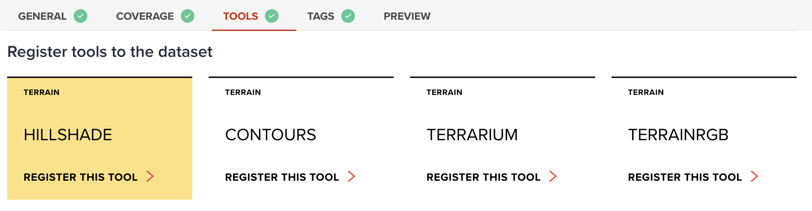{:style="width: 100%;"}

<!-- .element style="height: 300px" -->

---

### Preview

Preview tab can help you check how your data looks like on a map. The style will be selected randomly in this stage, so the visualization might not look the best.

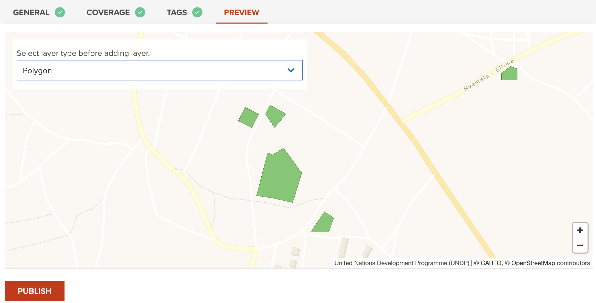{:style="width: 100%;"}

<!-- .element style="height: 400px" -->

---

#### Tools for Elevation data

--

If your data is elevation data, you may associate following tools to your data.

- Hillshade: Create hillshade from DEM dataset.
- Contours: Create contours from DEM dataset.
- Terrarium: Encode DEM into RGB (Mapzen Terrarium).
- TerrainRGB: Encode DEM into RGB (Mapbox Terrain RGB).

<hidden>

!!! note

    `Terrarium` and `TerrainRGB` will convert your data into `RasterDEM` format which allows `maplibre GL JS` to dynamically render hillshade layer.

</hidden>

--

#### Tools for index

- Normalized Difference Index: Compute normalized difference index from two bands.

--

#### GeoHub analytical tools

- Rapid Change Assessment Tool: Quick assessment to detect changes by comparing two bands.

---

### Publish

--

Once you have entered all necessary information (check green tick icon at tabs), you can click `Publish` button.

--

You will be asked in the following dialog for next step.

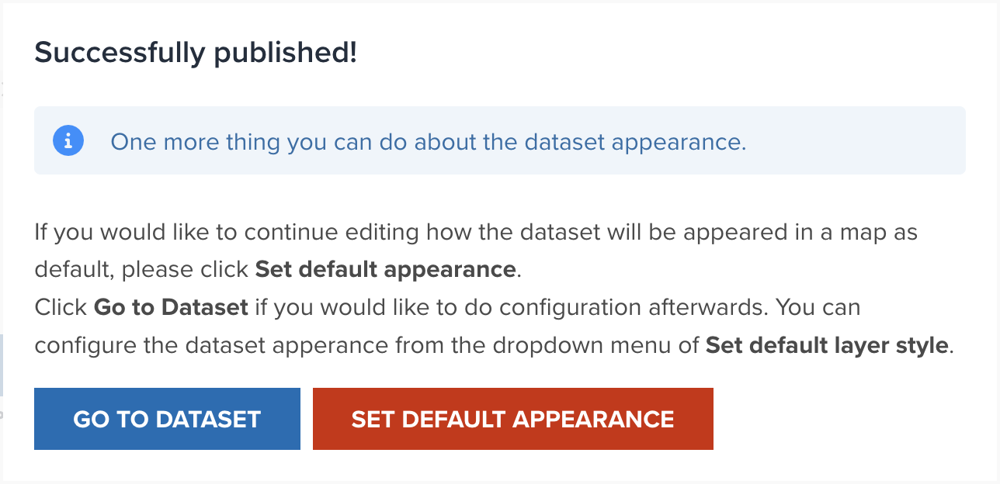{:style="width: 600px;"}

<!-- .element style="height: 200px" -->

--

- Go to dataset: If you want to go to this dataset page, please click this button.
- [Set default appearance](#register-default-appearance-optional): If you wish to continue setting default appearance of your data, please click this button. No worries, you can set default appearance anytime later.

--

If you click `Go to dataset`, you will be redirected to this newly created dataset page. The below figure is an example.

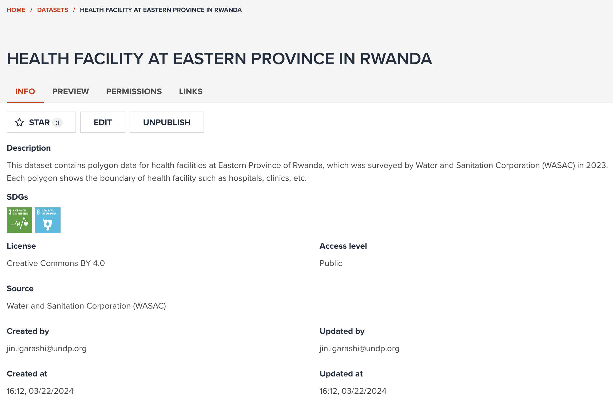{:style="width: 100%;"}

<!-- .element style="height: 500px" -->

---

## Register default appearance (optional)

--

When you published a dataset, you can move to default layer style setting page. Or you can also do default apearance settings from `Preview` tab of the dataset page.

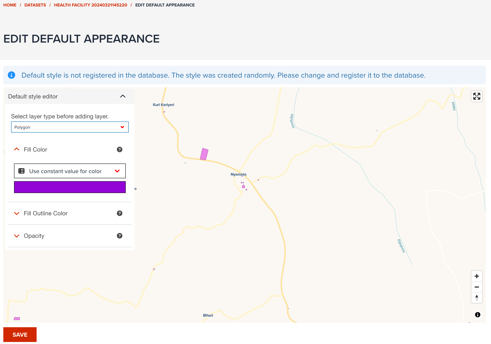{:style="width: 100%;"}

<!-- .element style="height: 500px" -->

--

You can save default layer style for each layer type (if vector) or band (if raster). This setting can be useful for other users to add your data with preconfigured appropriate appearance. Otherwise, every user have to do their own layer styling by yourselves.

Basic layer visualization is described in [Visualization](../visualization/index.md) section.

---

## Next step

In next section, we are going to learn how you can search published datasets in GeoHub in various ways.
