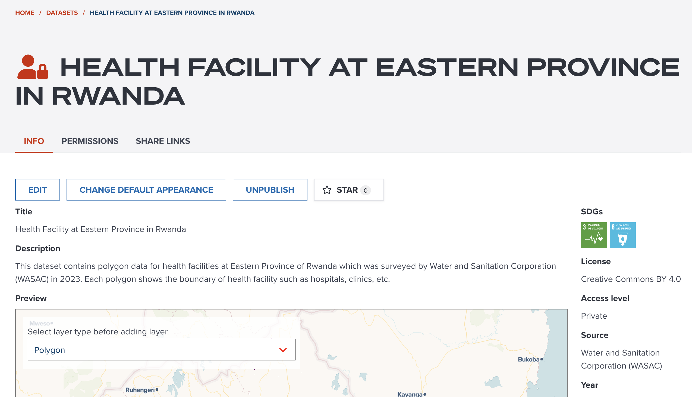

## Publish a dataset

In this section, we are going to learn how to publish an ingested dataset as an open data.

Firstly, please go to [datasets page](https://geohub.data.undp.org/data) and open `My Data` tab. In `My Data` tab, you will be able to manage all your uploaded datasets and ingested datasets at one place. The following figure shows how you can go to publish an ingested dataset. The procedures are:

1. Click `chevron` icon to expand an uploaded item
1. Check the status of ingested item. If status shows `Unpublished`, it is ready to publish!
1. Open menu for an ingested item, then click `Publish` menu.

<figure markdown="span">
  {:style="width: 600px;"}
  <figcaption>Go to publish page from an ingested dataset</figcaption>
</figure>

After clicking `Publish` menu, you will be redirected to a publish page as shown in the below figure.

<figure markdown="span">
  {:style="width: 600px;"}
  <figcaption>Overview of publish page</figcaption>
</figure>

In publish page, it consists of four to five tabs depending on dataset type either `raster` or `vector`. You may find tabs as follows:

- `GENERAL` tab: You can input general information for a dataset.
- `COVERAGE` tab: You can select data coverage either global or regional.
- `TOOLS` tab: If it is raster dataset, you maybe can register analytical tools to this dataset.
- `TAGS` tab: You can associate SDGs tags or any other additional tags to this dataset.
- `PREVIEW` tab: This tab provides you a simple preview of this dataset.

## Register metadata

Now, we are going to explain each item which you need to input for publishing. Let's begin.

### Input basic information

Basic information can be inputted under `GENERAL` tab.

The below figure shows an example inputs of general tab information.

<figure markdown="span">
  {:style="width: 100%;"}
  <figcaption>An example of general tab at publish page</figcaption>
</figure>

In `GENRAL` tab, it consists of the following five elements. All properties must be entered or selected appropriately.

- **Dataset name**:

Please write a concise title for this dataset. This title will be used for searching datasets.

- **Description**:

Please write description of this dataset in detail as much as possible. So, other users will read and understand what this dataset is. This field is also used for searching datasets.

- **License**:

Please select a data license. This is important whether you allow other users to use your data. About license, we will explain in [the next section](#what-license-is-appropriate).

- **Data providers**:

Please select at least a data provider. Providers selected here will be shown as attribution on maps. As default, `United Nations Development Programme` is entered. However, you can delete default value and search or create an organisation name from the dialog. You can select multiple providers as you wish.

- **Data accesibility**:

You can set accessibility for this dataset.

`Public` is selected as default, this means the dataset will be opened to everybody anonymously. Any unsigned users also can access to your data.
`Your organization name`, like `UNDP` depending on which UN agency you are from, you maybe can see your organization name here. If you select organizational accessibilty, your data will only be accessible by signed users within your organization.
`Your first name` is that you or specific users whom you gave permission can access to your dataset.

If you feel like this dataset is not yet ready to publish, you can select organizational or private accessibility. When you want to make it open to everybody, you can change accessibility to `Public` any time.

### What license is appropriate?

### Select data coverage

<figure markdown="span">
  {:style="width: 100%;"}
  <figcaption>An example of coverage tab at publish page</figcaption>
</figure>

### Select tags

<figure markdown="span">
  {:style="width: 100%;"}
  <figcaption>An example of tags tab at publish page</figcaption>
</figure>

- SDGs

- Optional tags

### Preview

Preview tab can help you check how your data looks like on a map. The style will be selected randomly in this stage, so the visualization might not look the best.

<figure markdown="span">
  {:style="width: 100%;"}
  <figcaption>An example of preview tab at publish page</figcaption>
</figure>

### Tools (Optional)

### Publish

Once you have entered all necessary information (check green tick icon at tabs), you can click `Publish` button.

You will be asked in the following dialog for next step.

<figure markdown="span">
  {:style="width: 600px;"}
  <figcaption>Publish completion dialog</figcaption>
</figure>

- Go to dataset: If you want to go to this dataset page, please click this button.
- Set default appearance: If you wish to continue setting default appearance of your data, please click this button. No worries, you can set default appearance anytime later.

If you click `Go to dataset`, you will be redirected to this newly created dataset page. The below figure is an example.

<figure markdown="span">
  {:style="width: 100%;"}
  <figcaption>Newly published dataset page</figcaption>
</figure>

## Register default appearance (optional)

## Next step

In next section, we are going to explore some of existing datasets at GeoHub.
