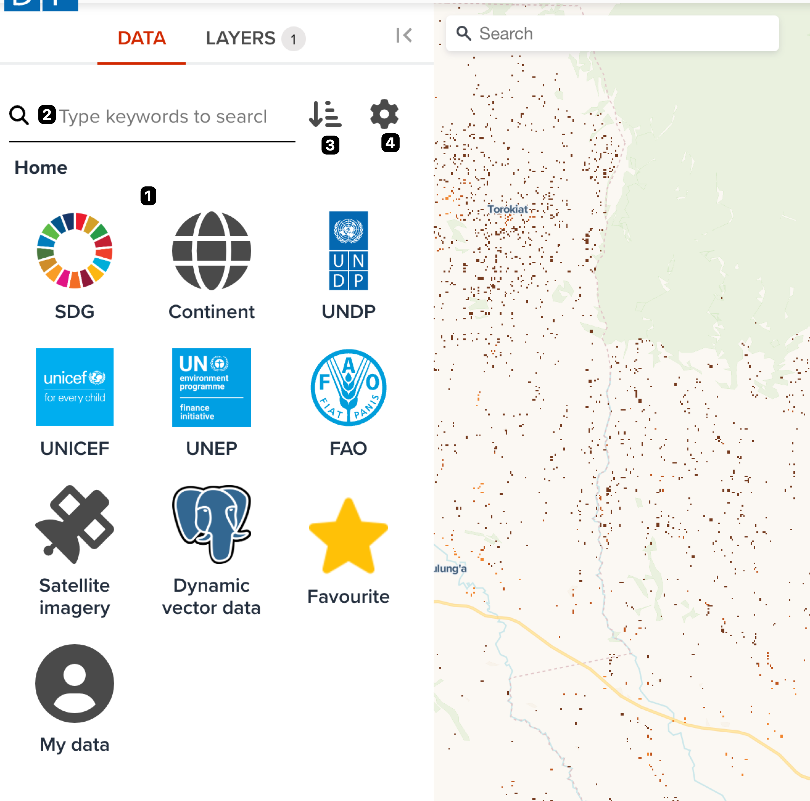
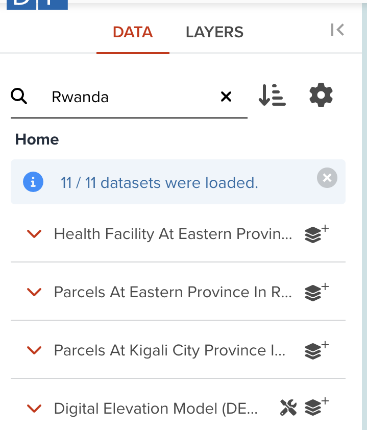

# Searching datasets on Map page

In the previous section, you learned how you can search datasets in the three view types. But you can also search the same datasets from **Data** tab of _Map_ page slightly differently.

---

## Open Map page

Please open _Map_ page from [here](https://geohub.data.undp.org/maps/edit) as new tab or new window. Then, select **Data** tab at the sidebar.

---

## How is the data arranged in the _Map_ page?

We follow a unique way to arrange our data sets! All the data sets within the UNDP GeoHub are arranged in "Buckets".

All data is also arranged under the Continenet bucket where data is devised by regions and countries based on availability of data.

<hidden>

</hidden>

---

## Elements of data tab

The major elements at **Data** tab on _Map_ page is shown the following figure.

{:style="width: 500px;"}

<!-- .element style="height: 400px" -->

--

The components on tab are as follows. Each number of description is corresponded to the number on the above figure.

1. **Bucket search area**: You can explore datasets from a bucket
2. **Keyword search**: It provides you to search in free keywords.
3. **Sorting order**: You can change the sorting order of search result.
4. **Search settings**: You can change some search settings such as **AND** search or **OR** search.

---

## Explore by special buckets

The first bucket is the **SDG** bucket which entails all data related to Sustainable Development Goals.

The second bucket is the **Satellite Imagery** which connects to all the satellite data sets from the third party data providers where the user can engage in further analysis.

The third bucket includes the **Dynamic Vector Data** which contains vector data for dynamic analytics.

--

With recent updates, data is also found under the major data provider buckets UNDP, UNICEF,UNEP and FAO.

You can also explore your favourite datasets from **Favourite** bucket or explore your own uploaded datasets from **My data** bucket.

---

### Explore from SDG category

Within the SDG bucket, the user can search all the updated and relevant data related to the Sustainable Development Goals and their performance.

--

Data is arranged by the relevant goal and by clicking on each of the SDG icons , the user is able to view all the data under that particular goal.

<hidden>

</hidden>

---

### Explore Dynamic Vector Data

Vector layers hosted by the UNDP with added features for speacial cases with further analytics are available under this bucket and it is a significant key feature of the GeoHub.
Data related to SDG indicators are represented as vector layers which is dynamic and arranged according to available years.

It also hosts administrative layers.

---

### Explore Satellite Imagery

Under this bucket the user can find searchable spatio temporal metadata describing Earth science datasets (called **STAC (Spatiao Temporal Asset Catalog)**) hosted by the third party data providers such as _Microsoft Planetary Computer_, _Earth Search_, _Maxar Open Data_ or _JAXA_ .This allows the user to load a range of data sets from satelites such as MODIS, Landsat, Copernicus and many more.

---

### Explore by some UN agencies

There are special buckets for specific UN agencies. You can find the following UN agencies icons.

- UNDP
- UNICEF
- UNEP
- FAO

You can explore datasets from these buckets.

---

### Search by keyword

Simply enter the name of the needed data set and the GeoHub will match the most relevant data set under a specific bucket. For example, by typing the word _sustainable_ and pressing the enter button generates the data sets which are tagged with the name _sustainable_ in their layer title, description and name.

--

The user can also enter an individual bucket of interest and type in the data they desire and then the search results will be limited to the extent of the datasets in that particular bucket. That means if you are in the bucket of **SDG1**, your typed keyword will filter datasets within **SDG1** bucket.

{:style="width: 300px;"}

<!-- .element style="height: 300px" -->

---

## Search Settings

By clicking on the "Settings”  icon will allow the user to find more search options

1. Match all words typed will render results based on the full string of words entered.
2. At least a word typed will render results based on at least one of the words of the string entered.

--

It also gives the option to be filtered by the Geospatial extent of the map view.This will enhance the specificity of available data for the users.

---

## Sort settings

Once the GeoHub generates the data sets that are requested, the user can arrange the data sets Alphabatically, Most and Less recent and Most favourite.
As the data sets appear on the website, the GeoHub generates a preview of the layer including its meta data.Then simply click the **Add layer** button to view the complete result.

---

## Next step

In next section, we are going to explore how to search satellite imagery in GeoHub.
