# Searching satellite datasets

---

GeoHub supports various satellite datasets from third party providers such as [Microsoft Planetary Computer](https://planetarycomputer.microsoft.com/catalog) and [Maxar Open Data Program](https://www.maxar.com/open-data) through [STAC (Spatio Temporal Asset Catalog)](https://stacindex.org/) API.

The full list of supported satellite data is available at Datasets page [here](https://geohub.data.undp.org/data?type=stac).

--

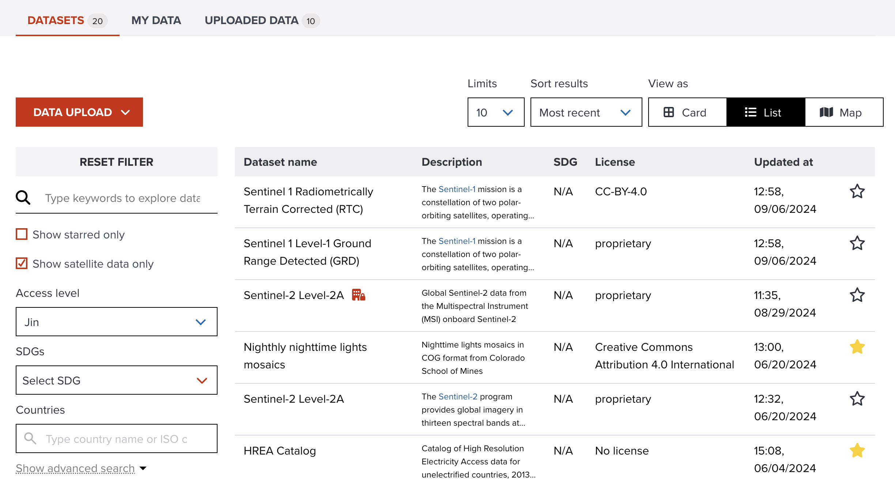

--

Selected satellite dataset page is shown when you click a dataset on the table.

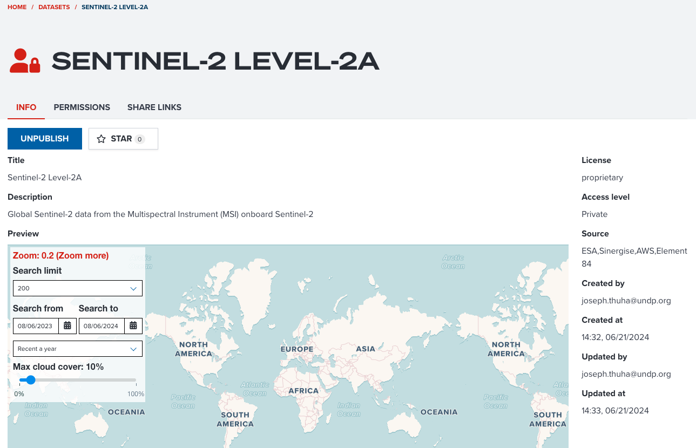

To search satellite imagery, go to **PREVIEW** tab.

---

## Types of satellite datasets

There are two types of satellite datasets either **STAC API** or **STAC Catalog**. The user interface to search datasets is slighly different depending on the type of satellite dataset.

---

### STAC API

Couple of satellite data collections from **Microsoft Planetary Computer** and **Earth Search** are datasets of **STAC API**. This offers more flexible ways to search satellite imagery such as searching by datetime or cloud cover rate. We take a collection of Sentinel 2 from Microsoft to show you how to search imagery.

--

#### Sentinel-2 (Microsoft Planetary Computer)

Please open [this link](https://geohub.data.undp.org/data/7f966680f33e3ada4e913da28e014109) to visit Sentinel 2 collection from Microsoft. When the page is opened, please move to **PREVIEW** tab.

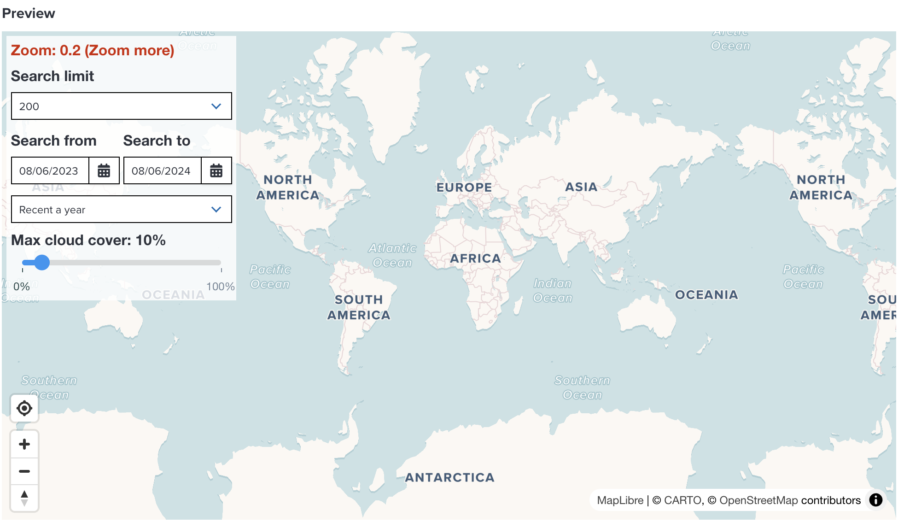

<!-- .element style="height: 500px" -->

<hidden>

!!! note

    To start searching imageries, you need to zoom in to at least zoom level 5.

</hidden>

--

After zooming in to more than zoom level 5, satellite items are being shown on the map.

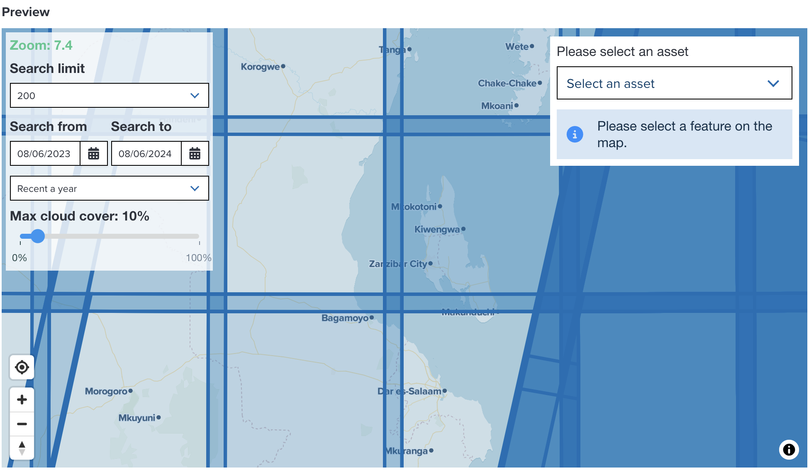

<!-- .element style="height: 500px" -->

--

Select an item on the map. Then, continue selecting an asset from the select box on the top-right of the map.

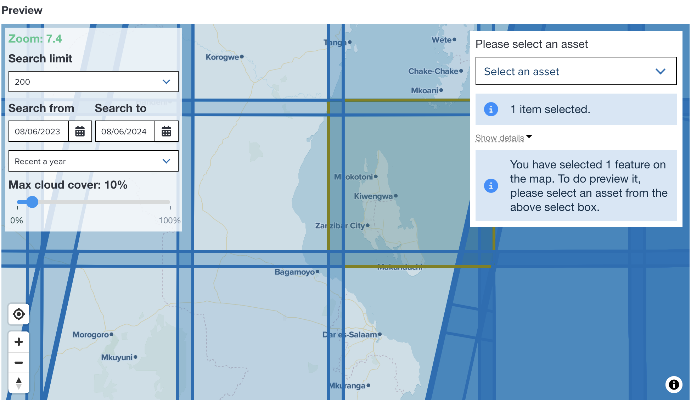

<!-- .element style="height: 400px" -->

In this example, an item covering Zanzibar is selected. Select `Band 5 - Vegetation red edge 1` for asset.

<hidden>

!!! note

    If you select multiple items on the map, GeoHub will make a mosaic by combining multiple satellite imagery. However, please note the performance of making a mosaic might be much slower than selecting a single item.

</hidden>

--

After selecting an asset, the preview map is shown under select box. If you wish to add it to map, click **Show it on map** button.

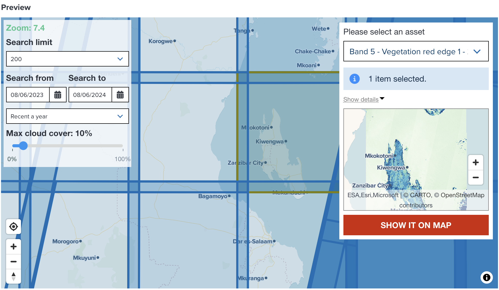

<!-- .element style="height: 600px" -->

--

Then, your selected satellite imagery will be added to Map page of GeoHub. You can follow the steps of visualization to make it look better.

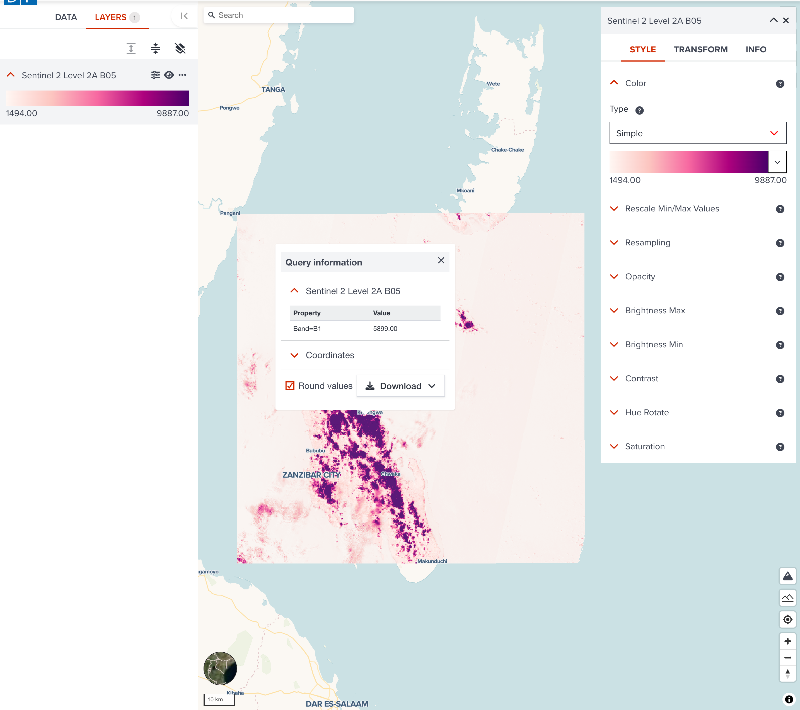

<!-- .element style="height: 600px" -->

---

### STAC Catalog

Unlike STAC API, satellite collections of STAC catalog is a static satellite imagery repository. It has less flexible to search satellite imagery. Here, we use Maxar Open Data Program catalog as an example to explore how you can search an imagery.

--

#### Maxar Open Data Program

Please open [this link](https://geohub.data.undp.org/data/e696b278429ed1ee0579e6257df1ca59) to visit Maxar Open Data catalog. When the page is opened, please move to **PREVIEW** tab.

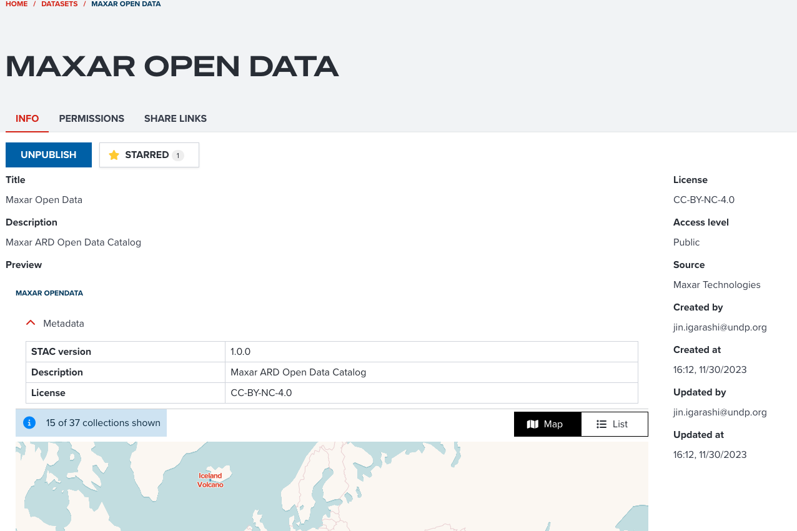

<!-- .element style="height: 500px" -->

--

There are **Map view** and **List view**. You can use your prefered view type to explore imageries. Here, we use **Map view** to explore them.

Please zoom to DRC Congo to select _Kalehe DRC Flooding 2023_ collection.

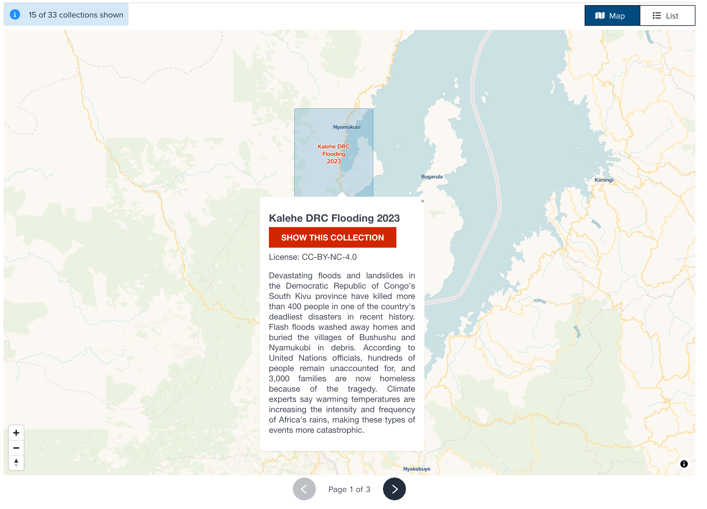

<!-- .element style="height: 500px" -->

--

Click **Show This Collection** button, it will be showing the next step. Select the collection in the right side (`10300100E57BC400`).

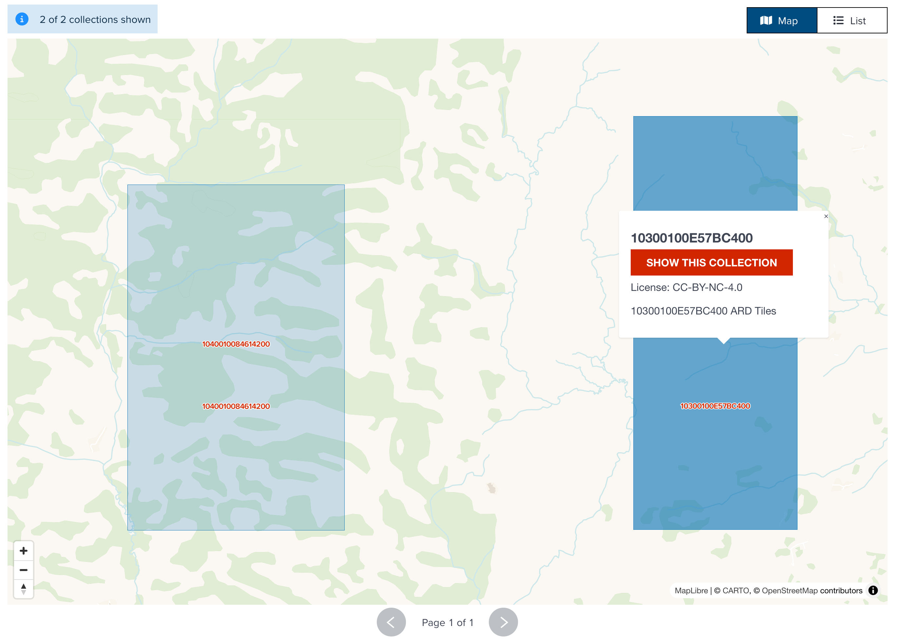

<!-- .element style="height: 500px" -->

--

In this STAC catalog, now you can select an satellite imagery (or multiple imageries as a mosaic). Select one of them, continue clicking **Show this item** button.

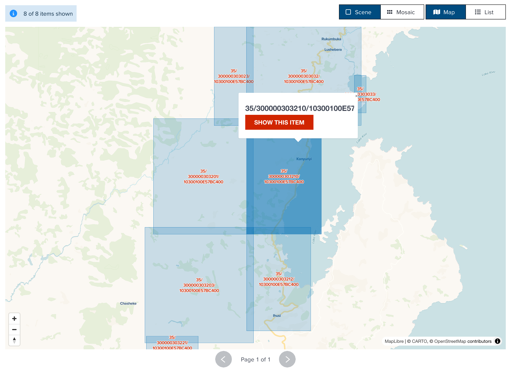

<!-- .element style="height: 500px" -->

<hidden>

!!! note

    How many collections or catalogs are nested is depending on the data provider's imeplementation. Some of STAC catalog might have 3 or 4 collections nested. You can continue selecting a colleciton or a catalog until you reach item level.

</hidden>

--

Now you can see a preview map for your selected item. If you wish to add it to map, click **Show it on map** button.

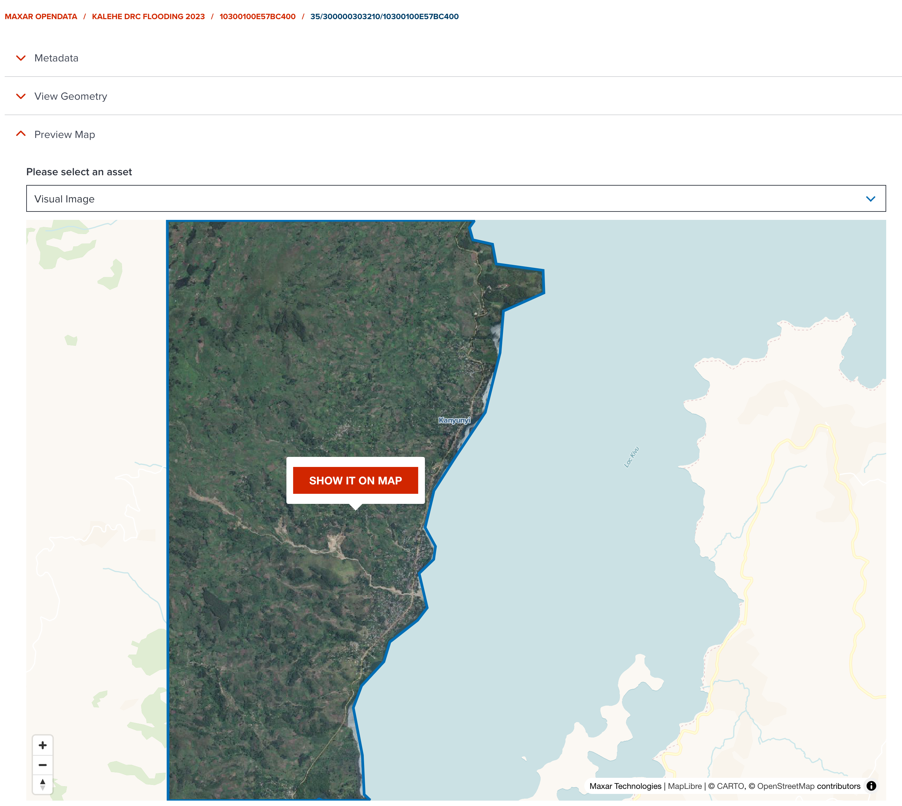

<!-- .element style="height: 500px" -->

<hidden>

!!! note

    If available assets contain the keyword of **Visual**, true color image asset will be selected automatically. Please select an asset per your preference.

</hidden>

--

You selected satellite imagery is now added to map page. You can do your own visualization.

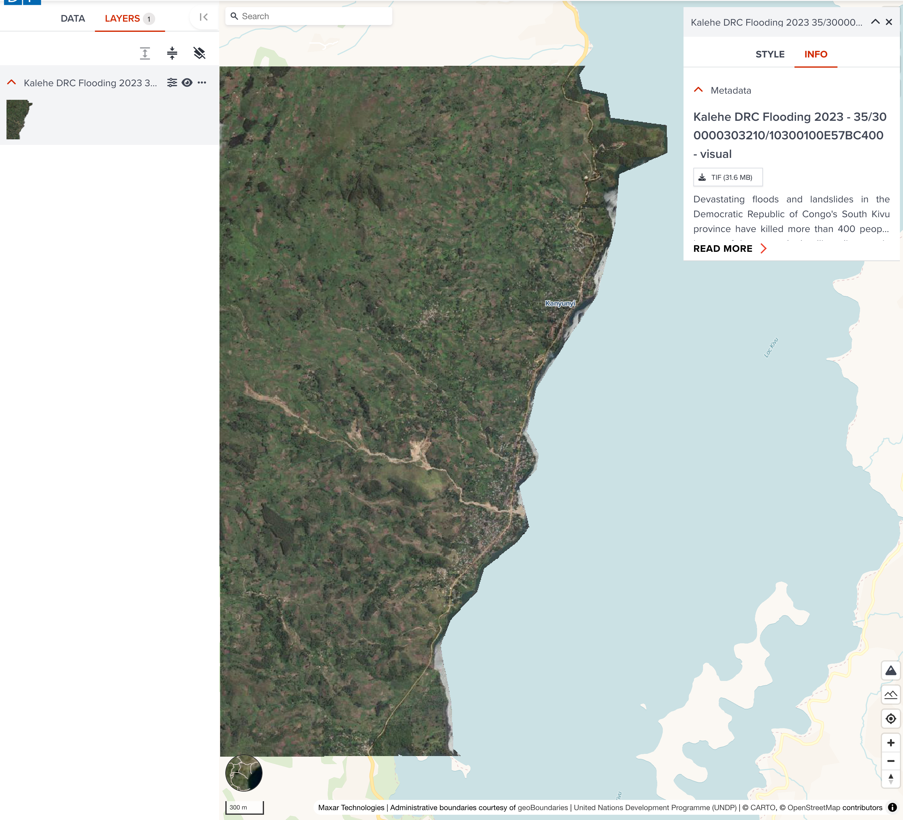

<!-- .element style="height: 500px" -->

---

## Search satellite imagery on Map page

There is an alternative way of searching satellite imagery on **DATA** tab of Map page.

Firstly, please open a blank map editor <hidden>by following [this instruction](../visualization/map_view.md).</hidden>

--

Click **Satellite Imagery** bucket in **Data** tab.

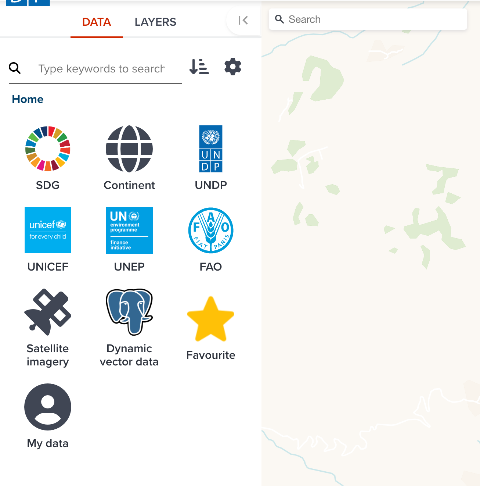{:style="width: 500px;"}

<!-- .element style="height: 500px" -->

--

Click <hidden>{:style="height: 24px;"} button in header or click</hidden> **Explore Satellite Data** button inside an accordion.

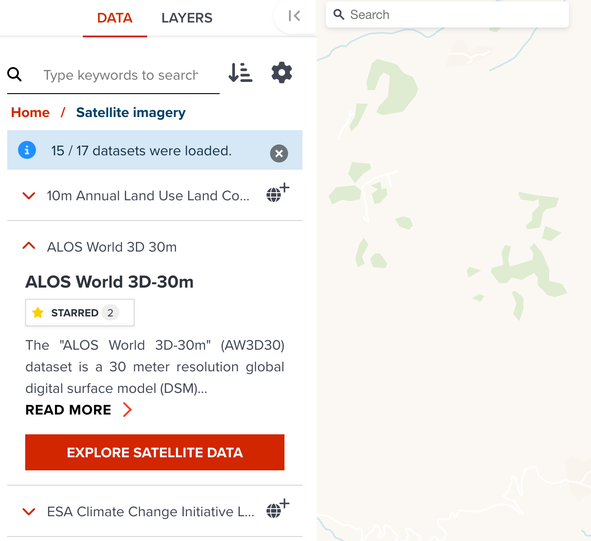{:style="width: 500px;"}

<!-- .element style="height: 500px" -->

--

The same STAC explorer either [API](#stac-api) or [Catalog](#stac-catalog) is shown as a popup.

<!-- .element style="height: 500px" -->

---

## Next step

In next section, we are going to explore some of existing datasets at GeoHub.
