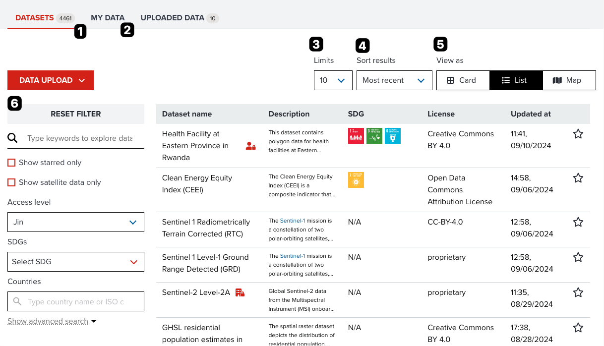
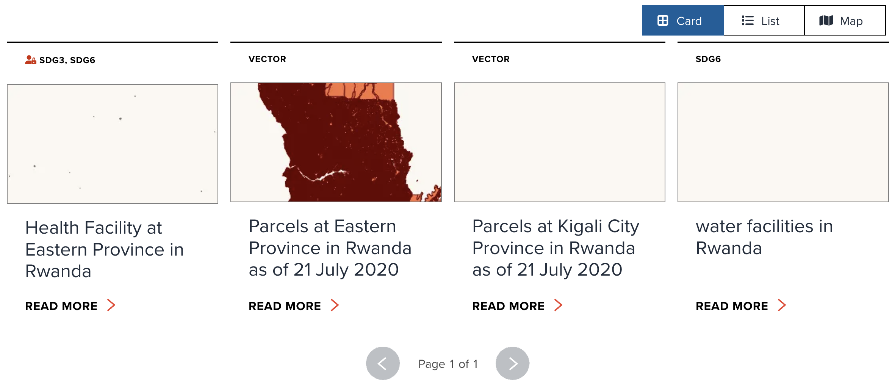
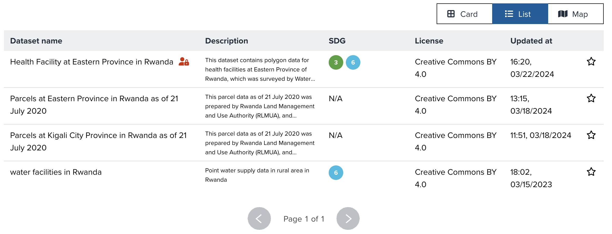
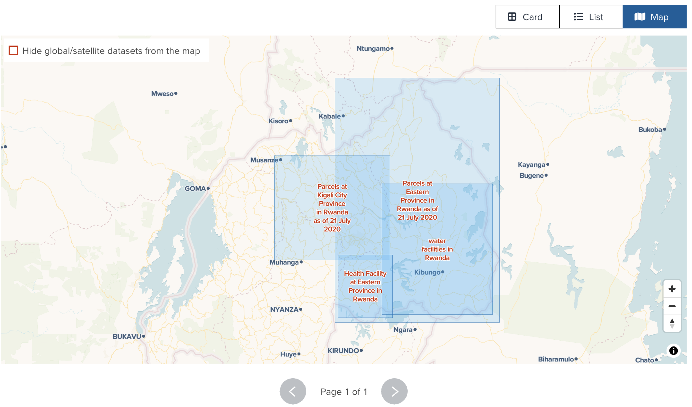

# Searching datasets from Datasets page

In this section, you will learn how to search datasets on _Datasets_ page.

---

## Open Datasets page

Firstly, please open _Datasets_ page from [here](https://geohub.data.undp.org/data) as new tab or new window.

Then, select **Datasets** tab if you signed in. If you do not sign in, tabs are not shown.

---

## Elements on _Datasets_ page

The major elements on _Datasets_ page is shown the following figure.

{:style="width: 100%;"}

<!-- .element style="height: 300px" -->

<hidden>

The components on dataset page are as follows. Each number of description is corresponded to the number on the above figure.

1. **Datasets** tab: Switch between datasets and my data. The number in brackets show the number of datasets on the result table.
2. **Text filter**: Type any keywords to search datasets
3. Show only your own datasets if enabled
4. Show only your favorite datasets if enabled
5. Show only satellite imagery datasets if enabled
6. Filter by selected SDGs
7. Filter by selected countries
8. Various tag filteration: At the top-right of the table, you can do advanced tag filtration or search settings.
9. Sorting order option:
10. The number of items per page
11. View type: Select a view type from _Card_, _List_ or _Map_
12. **Search result**: The result of datasets search is shown as **Card view** or **List view** or **Map view**.
13. Pagination is shown if the result has more than one page.

</hidden>

---

### Card view

When you select **Card** in the segment buttons of top-right of search result, the result will be represented as a **Card view**. Thie view type can be useful for you to check datasets with a preview image. The random layer style will be applied to a preview image if there is no default style saved.

{:style="width: 100%;"}

<!-- .element style="height: 300px" -->

---

### List view

When you select **List** in the segment buttons of top-right of search result, the result will be represented as a **List view**. This view type might be useful for you to explore some detailed metadata for each result quickly.

{:style="width: 100%;"}

<!-- .element style="height: 300px" -->

<hidden>

The following properties are shown as List view.

- Dataset name: the title of dataset
- Description: the description of dataset.
- SDG: The numbers of SDG goal will be shown if the dataset is linked to them.
- License: Data license is shown
- Updated at: the datetime when owner updated last time
- Star icon: The state of whether you add this dataset to your favourite. You can also click the icon to favourite from the list view directly.

If you click a row of the table, you can move to an individual dataset page for further actions.

</hidden>

---

### Map view

When you select **Map** in the segment buttons of top-right of search result, the result will be represented as a **Map view**. This view type can be helpful for you to explore datasets from geospatial locations.

{:style="width: 100%;"}

<!-- .element style="height: 300px" -->

--

A popup will be shown when you click a blue highlighted polygon to see the title and description of datasets. You can move to an individual data page from the link on a popup.

<hidden>

!!! note

    The most of datasets on GeoHub are global datasets, that means this **Map view** may not be very useful to search. In such case, you can tick the checkbox of _Hide global/satellite datasets from the map_ on the top-left corner of the map. Global datasets will be exluded from **Map view** if you do so.

</hidden>

---

## Explore by Tags

--

The Explore by tags option allows the user to filter their search even further.Each tag can be expanded to niche levels of filtering which allows the user to obtain the most specific data they require.

--

The option of selecting **Match all selected tags (AND search)** will allow the user to select multiple tags and obtain results for all or the user can select the **Match at least a tag selected (OR search)** will allow the search to generate results at least one of the tags used.

--

<hidden>

There is also the advance filtering options of searching results based on the following expandable options;

</hidden>

- Admin Level: Data sets devided based on Administrative boundaries can be filtered via this filter.
- Resolution : Based on the level of granularity of data sets it can be filtered via the resolution option.
- Year :Data sets can be filtered based on the year of data collection.
- SDG Topic :Assigned Sustainable Development Goal.

--

- Theme :Based on the assigned theme for the data set.
- Schema :Ability to filter data based on the database organization.
- Data Provider: Filter data sets by the source of data collection.
- GIS Server :Associated cloud service server which hosts data.

---

## Next step

In next section, we are going to learn how to search dataset at _Map_ page.
