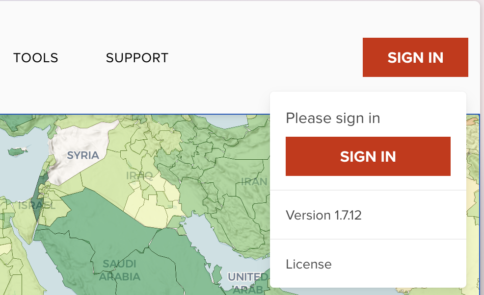
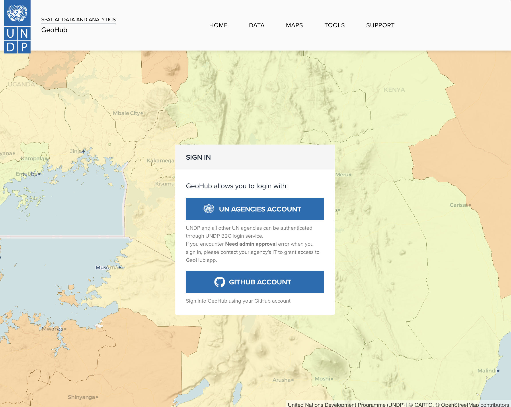
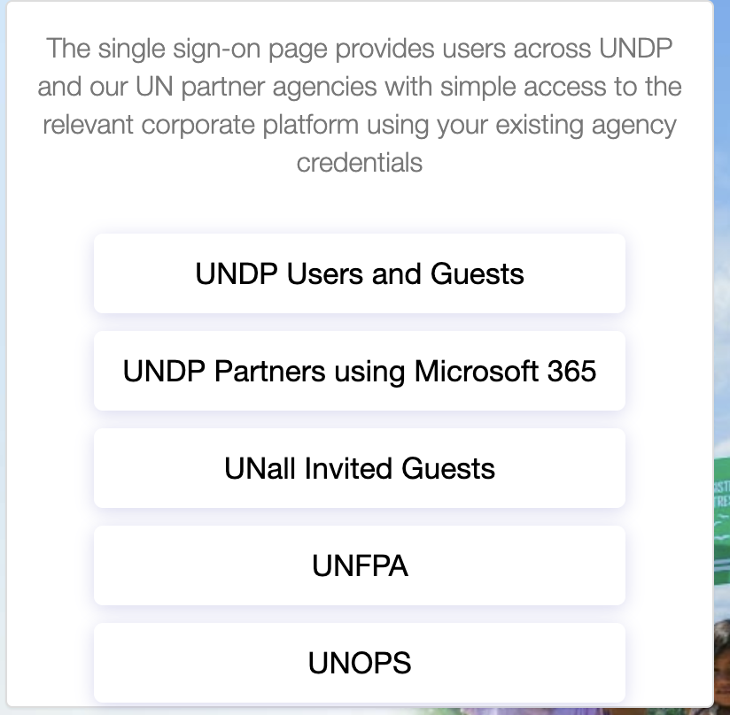
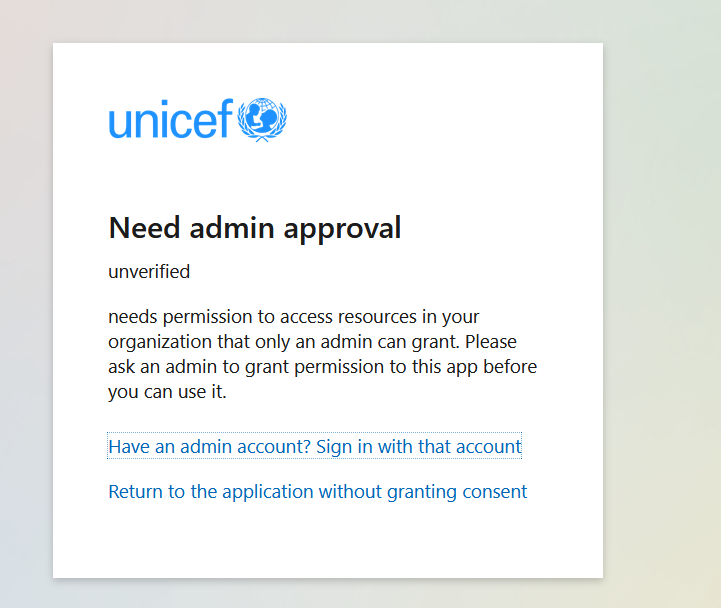
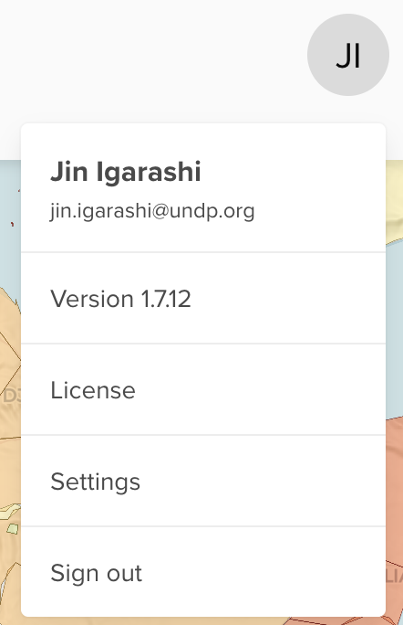

# Sign in to GeoHub

--

GeoHub can provide basic features to unsigned users, but you can sign in to GeoHub in order to use all amazing functionalities in GeoHub.

--

In the top-right of the window, you can find signin button which allows you to signin to GeoHub through dropdown menu.

{:style="width: 400px;"}

<!-- .element style="height: 400px" -->

--

Once you click **SIGN IN** button, it will be redirected to sign in page.

{:style="width: 500px;"}

<!-- .element style="height: 500px" -->

--

In this page, two ways of authentication are provided as follows:

- [UN Agencies B2C login services](#un-agencies-staff)
- [GitHub login services](#github-users)

---

## UN agencies staff

--

If you are from one of UN agencies, GeoHub offers B2C login services to allow staffs to login to GeoHub. Continue clicking **UN AGENCIES ACCOUNT** button, you will be redirected to B2C login page.

{:style="width: 500px;"}

<!-- .element style="height: 400px" -->

--

- **UNDP** users: Please click **UNDP Users and Guests** to proceed.
- **Other UN agencies** users: Please click **UNDP Partners using Microsoft 365** to proceed.
- **UNFPA** and **UNOPS** users: Please click your organization button to proceed

You will be redirected to your agency's login page, you may be asked to do two factors authentication. Once you succeed to login, you will be redirected to the previous page.

--

### Admin approval error

Some of UN agencies may require admin approval, and you may get the following error. Please contact your agency's IT admin to approve GeoHub app to allow to login through their Azure Active Directory.

{:style="width: 500px;"}

<!-- .element style="height: 400px" -->

---

## GitHub users

--

If you have an account in [GitHub](https://github.com/), you can sign in with your account. Continue clicking **GITHUB ACCOUNT** button to login through GitHub. You may need additional two factors authentication depending on your setting. Once signin is done, you will be redirected to the previous page.

---

## After signining in

--

Once you have signed in to GeoHub, you will be able to see your initials (UN users) or your profile image (GitHub users) at the top-right of window. Then, you will be able to sign out or going to customize some settings.

{:style="width: 200px;"}

<!-- .element style="height: 300px" -->

---

## Signout

--

You can log-out at any time by clicking on your user icon and selecting Sign Out (see the above screenshot).
