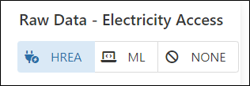
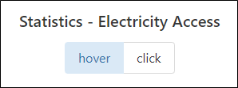

# What are the different functions within the Dashboard?

The user can select what they would like to visualize by selecting it under the “Raw Data Tab” featured on the upper left of the Dashboard.
Here there is the ability to switch between HREA raw data layer, Machine Learning Layer or display None.

The user has the capability to Overlay the (ADM) Administrative layer, Poverty layer or display None as needed.

Thirdly, the Dashboard also offers the ability to view statistics of each point on the map for the Population electrified according to the year of need ranging from 2012-2020.The user has the ability to interchange between “HOVER” or “CLICK” options to view these statistics.

Finally, the option of Statistics Download allows the user to download the statistics of the Dashboard on display with the format of liking at different Administrative levels.
