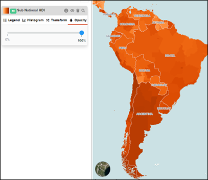
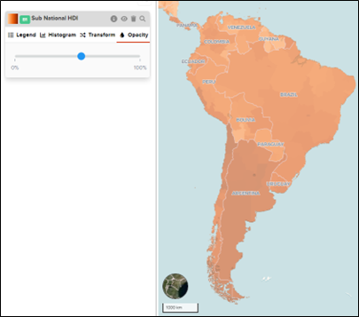

# How to change opacity?

The user can change the opacity of each layer to their liking by using the “Opacity” tab of each layer function tab. Users can overlay different layers with this functionality.

Use the “Opacity” tab and move the blue curser to your preferred percentage of opacity.

 
