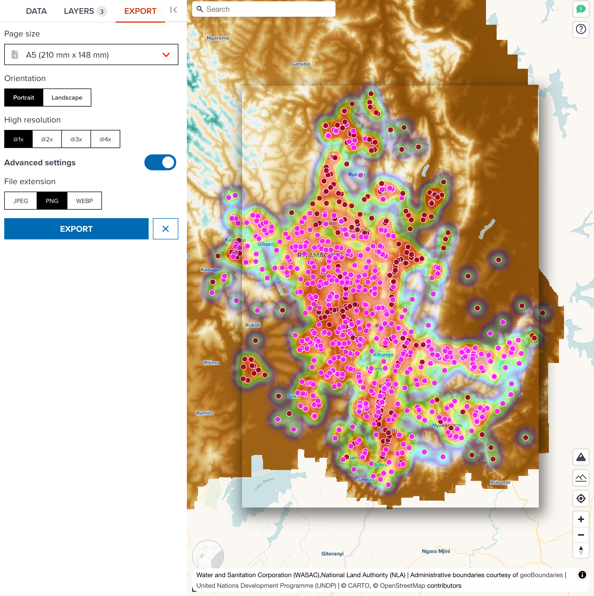
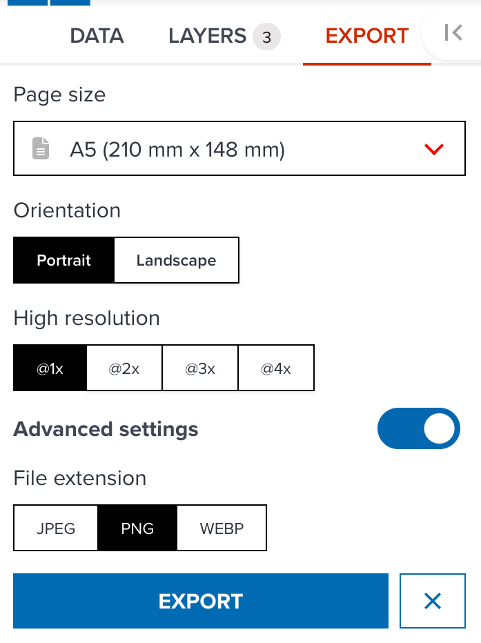
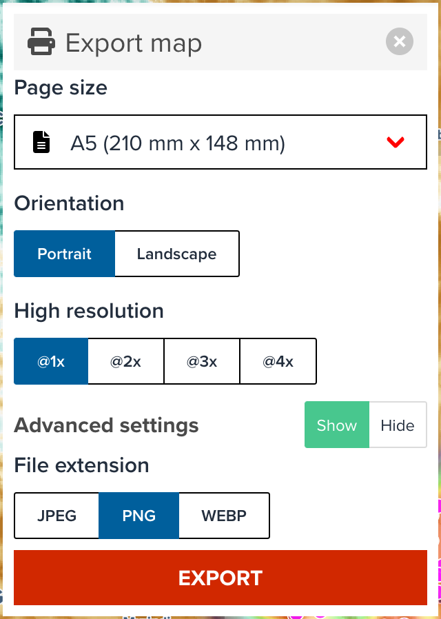

# Exporting map

---

## Map export control

Geohub provides a capability to export a map as _PNG_, _JPEG_ or _WEBP_ format on a map editor page. The export control can be accessed via {:style="width: 24px;"} button on a map editor.

--

After clicking the pring button, map export control will be shown in front of the map.

<!-- .element style="height: 400px" -->

--

In addition, this control overlays the boundary layer for page size which can help you know which geographical location is exported as an image. If you change a page size to different size, the size of bounding box on the map will be automatically adjusted.

---

### Page size

The tool provides the following predefined page sizes which are commonly used. You can choose a page size as you wish.

- A0 to A6
- B0 to B6
- Custom

<hidden>

!!! note

    If you select a large page size such as A0, A1, B0 and B1, exporting an image might be very slow. The page sizes smaller than A2 or B2 are recommended to use.

</hidden>

After selecting a page size, continue adjusting the bounding box location.

---

#### Page orientation

When you select a page size other than custom size, you can also choose page orientation either _Portrait_ or _Landscape_.

---

#### Custom size

Furthermore, you can also choose **Custom** size from dropdown menu. You will be asked to input _Width_ and _Height_ manually when **Custom** is selected.

---

### Resolution

High resolution image can also be exported from GeoHub. `@1x`, `@2x`, `@3x` and `@4x` are available. <hidden>`@1x` is default setting. The performance of exporting high resolution image such as `@3x` and `@4x` is relatively slow. `@1x` or `@2x` is recommended to use generally.</hidden>

---

### Export a map

Just click **EXPORT** button on the control once all settings are made! Please be patient for an image to be ready since your request will be sent to our static image api server to process the image.

---

### Advanced parameter

There are some options hidden as default, but you may find an interest to use these options to export an image. The below screenshot shows the full options of map export control.

{:style="width: 300px;"}

<!-- .element style="height: 300px" -->

--

#### File extension

The following file extensions are available currently.

- **JPEG**: jpeg is a compressed and standardized image format widely used.
- **PNG** (default): png is also a popular image format and it can retain alpha value (transparency) of an image.
- **WEBP**: a modern image format that provides superior lossless and lossy compression for images on the web. <hidden>Using WebP, webmasters and web developers can create smaller, richer images that make the web faster.</hidden>

<hidden>

!!! note

    Map export control uses GeoHub Static Image API. You might be interested in reading our API documentation [here](https://staticimage.undpgeohub.org/api).

</hidden>