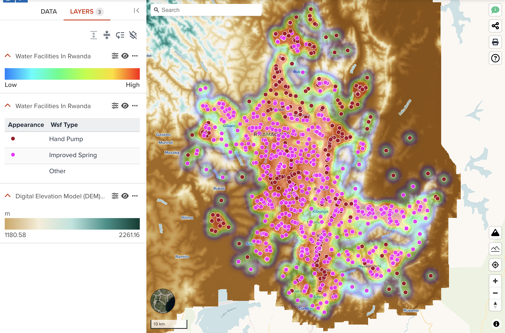
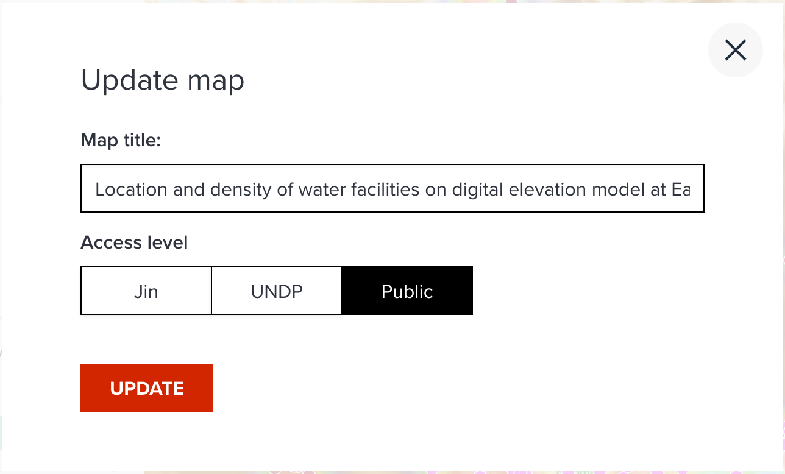
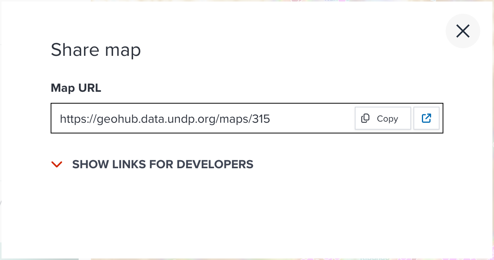

# Saving a map

---

## How to Save maps?

One of the great features of the GeoHub is the ability to save maps by applying the visualizations and analytics that the user desires after they have logged in.

---

### Requirements

To save a map requires at least a layer needs to be added into the map.

1.Selct a layer of choice at **Data** tab or **Datasets page** <hidden>by following the steps of the [search datasets](../data/search_datasets.md) section</hidden>, then clicking on the add layer button or the icon {:style="width: 24px;"} icon.

2.Go to the **Layers** tab where you can change the layer appearance by using the steps you have learned in the previous section.

--

<hidden>

!!! note

    As we have mentioned at the earlier sections, there are two types of datasets either **raster** or **vector**. The way of visualizing is slightly different. Please follow the steps of vector visualization [here](./visualize_vector.md) and raster visualization [here](./visualize_raster.md)

For example, the following figure is an example map which I made.

</hidden>

<!-- .element style="height: 500px" -->

<hidden>

I made a map by the following points.

</hidden>

--

- added **Digital Elevation Model (DEM) 10m resolution, Rwanda**. But I rescaled it by 1180 and 2261 because I want to make them clear in the area of interest.
- added **water facilities in Rwanda** data as a heatmap layer. I changed opacity to 30% to make DEM data visible together with heatmap.
- added **water facilities in Rwanda** data as a circle layer. I visualized circle color by **Wsf Type** property and adjusted color make them more visible.

--

Rwanda is known as a country of thousand of hills. Understanding how its landscape is quite important for policy making. This map now can show how water facilties were maped in the Eastern Province of Rwanda against elevations.
I renamed title to `Location and density of water facilities on digital elevation model at Eastern Province of Rwanda`

Now, it is ready to save your map.

---

### Steps to save a map

1.Click on the {:style="width: 24px;"} icon to **SHARE** or **UPDATE** the map.

2.A pop up box (shown in the below figure) opens with selections for renaming the map to your liking.

{:style="width: 400px;"}

<!-- .element style="height: 200px" -->

--

<hidden>

!!! note

    As default, it will show the first layer's title as a map name. But it is recommended for you to rename more precise and appealing map title. So, it will become easier for other users to search your map and understand the concept of your visualization. You can still rename this title anytime later.

</hidden>

3.Select the accessibility for map sharing as either only the user, UNDP email holder or Public.

<hidden>

!!! note

    Like the dataset accessiblity, you can also select an accesibility for your map. As default, **Your name (private map)** is selected. If you are from UN agencies, you may find your organization name like **UNDP** here. An organization name is selected, only signed in users in your organization can access to your map. If you feel like your map is ready to be published to anyone else, you can select **Public** accessiblity. The accessiblity can be changed anytime later.

</hidden>

4.Then click on the "Share" button to complete the process or cancel to restart. If you opened an existing map, the button name will become **UPDATE**.

--

5.The dialog will show an URL to share with your colleagues after you have clicked **SHARE** button as shown in the below figure. You can simply click **Copy** button to copy the URL to your clipboard to share it with your colleagues.

{:style="width: 400px;"}

<!-- .element style="height: 200px" -->

---

## Next step

In the next section, you are going to learn more about sharing a map. If you still open the dialog of **Update map** in GeoHub, click {:style="width: 24px;"}. This button will open your saved map as new tab. Then continue the next section.
