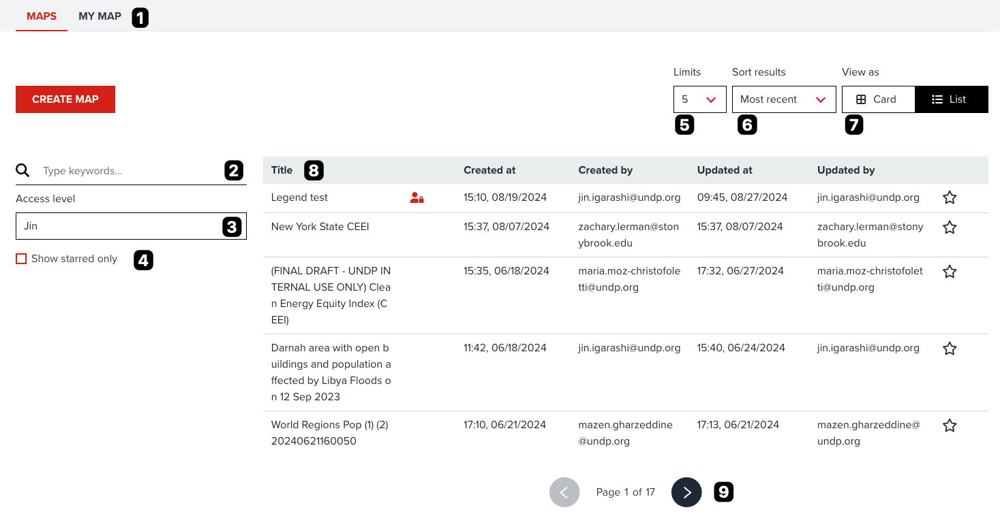
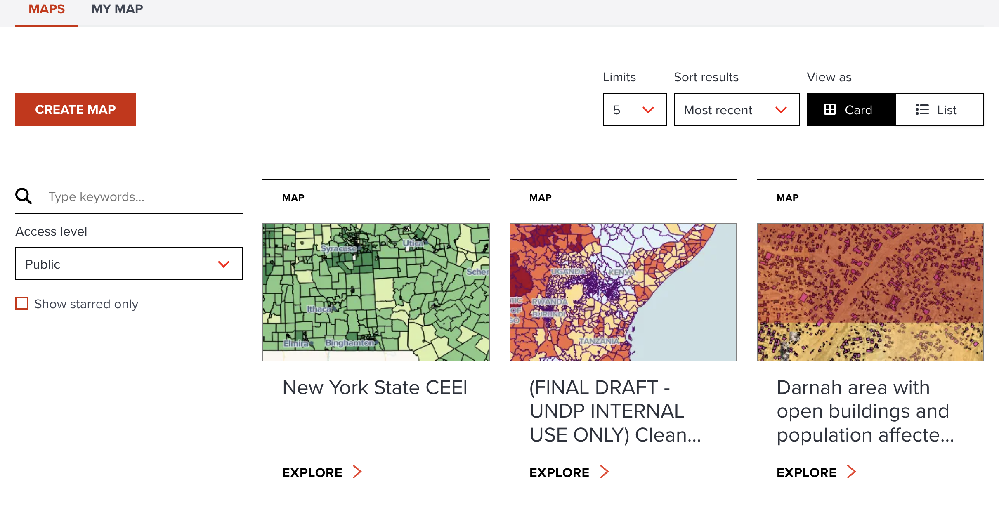
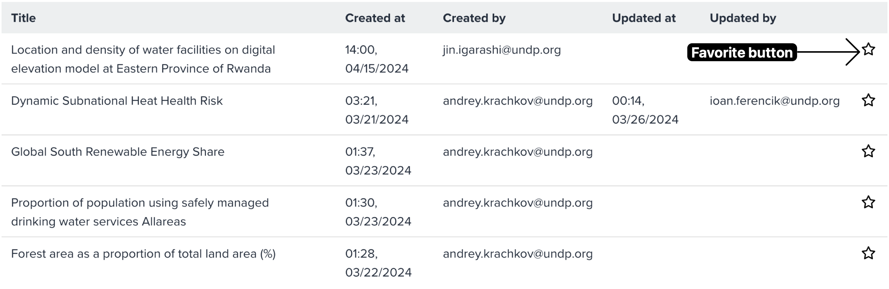

# Searching maps

--

Your saved maps and other users' maps are found under the Explore maps which is accesible via the **MAPS** menu in the header.
It will guide the user to all the maps saved by the user and it will also display the level of accessibility to these saved maps.
Based on accessibility, it is also possible to edit the saved maps.

--

<!-- .element style="height: 500px" -->

The core functionalities of exploring maps are as follows (each number is correspond to a number on the figure):

--

1.**Maps or My Map**: You can browse all maps under _MAPS_ tab. If you only want to browse what you created, select _My MAP_ tab.

2.**Search maps**: You can type any keywords to search existing maps. It search maps that match the map title by keywords.

--

3.**Access Level filtering**: As default, your name is selected. If your name is selected, all maps that can be accessed by you will be visible. If your organization name is selected, only maps within shared in your organization will be shown in the list. If public is selected, private maps will not be shown.

--

4.**Show favourite maps**: You can also only show your favourite maps by toggling **Star** checkbox.

--

5.**Number of maps per page**: You can choose the number of maps per page from this dropdown menu. You can select it as maximum 100 maps per page. Showing many maps per page can be useful to explore existing maps effectively. However, more maps are shown in a page, slower performance can be caused depending on your internet condition and machine spec.

--

6.**Sorting**: You can also choose sorting preference by selecting this dropdown menu. You can select eithr **Most recent**, **Less recent**, **Most favourite**, **A to Z** and **Z to A**.

--

7.**Card view** or **List view**: You can choose a view type listing maps in either **Card view** or **List view**. Default is **Card view** that can provide you a preview image with title to explore. **List view** provides you more detailed information such as _Title_, _Created date and user_, _Updated date and user_, _favourite state_ and _access level icon_.

--

8.**Maps table**: Maps will be listed in this section per your searching preferences.

9.**Pagination**: If more than a page of maps are matched, you can go to next or previous page to explore further maps.

--

As default, maps are shown in card view, but if you want to explore maps quickly without a preview image, switching to a list view might be useful. <hidden>The list view can looks like the below screenshot. It provides all metadata information (title, access level, created and updated users/datetime) in a table.</hidden>

<!-- .element style="height: 400px" -->

---

## Adding a map to your favourite

When you find an interesting map, you can also add it to your favourite for future easy access.

Adding favroute can be done at **INFO** tab of a map portal (see [here](./share_map.md#info-tab)) or by clicking **Star** button on the table in list view (see the below screenshot).

<!-- .element style="height: 300px" -->

---

## Next step

In the next section, we are going to explore how you can export a map as an image format for your works.
