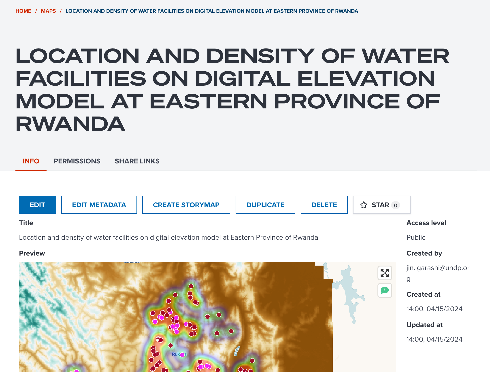
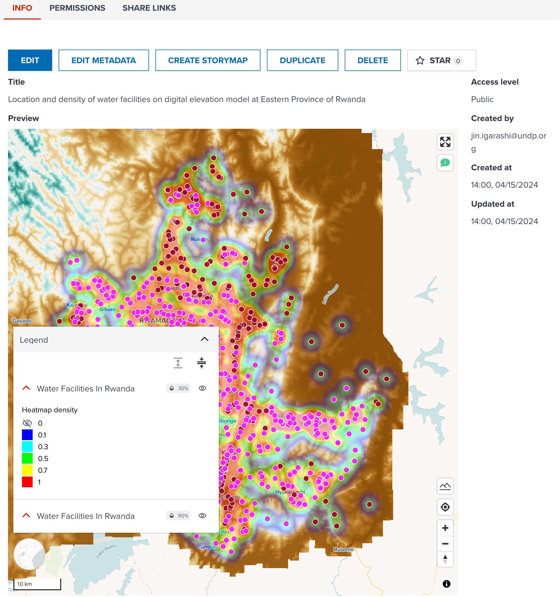
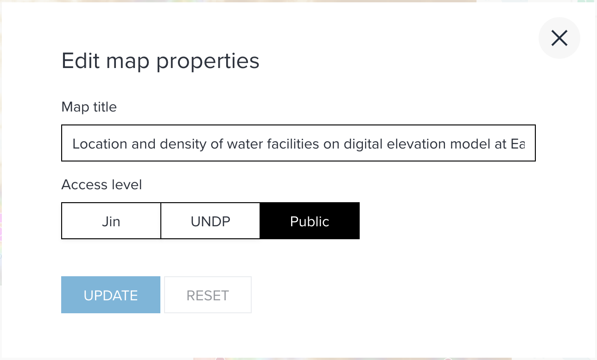
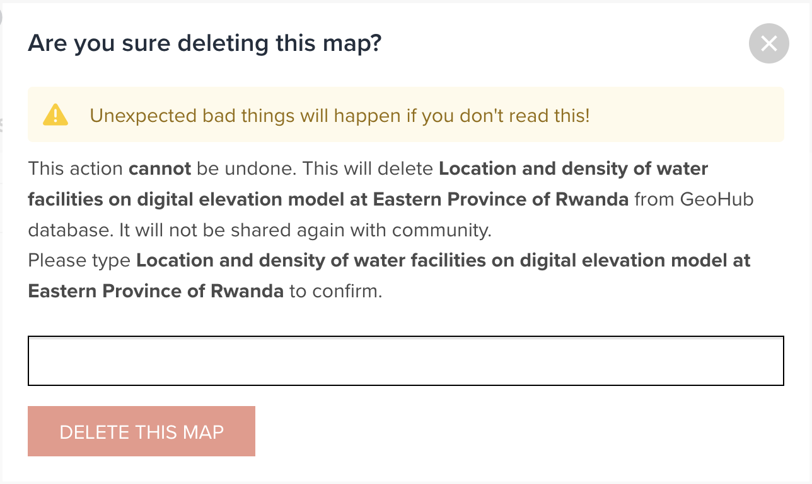
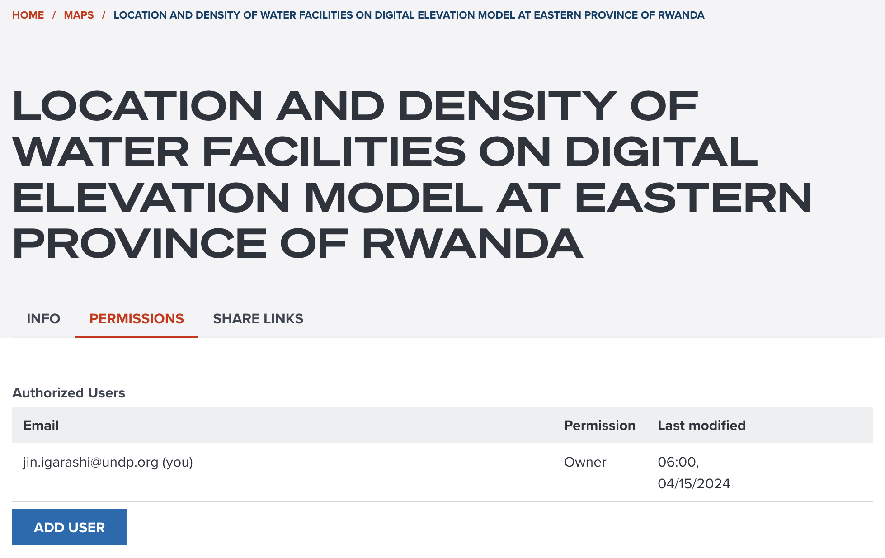
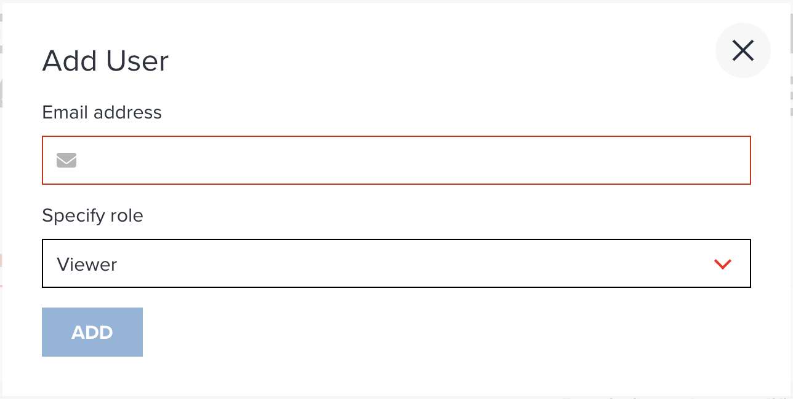
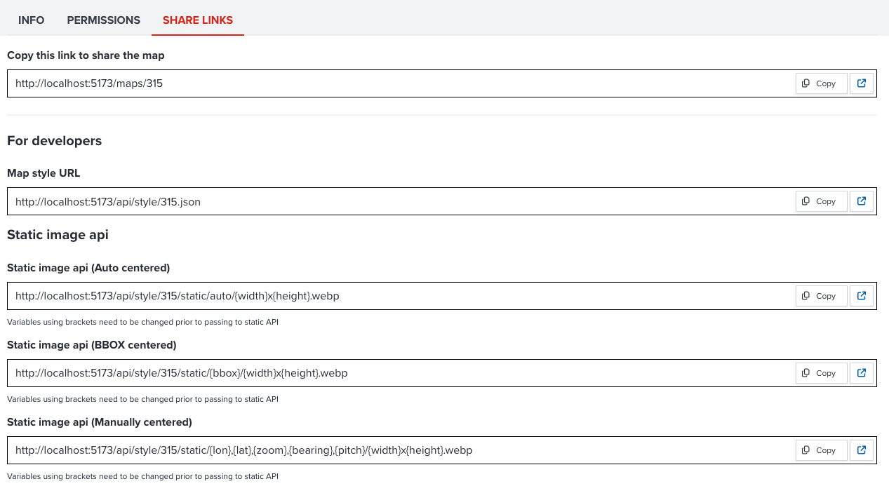

# Sharing a map

--

Now, you should be able to see your map's portal as shown in the below figure if you have clicked {:style="width: 24px;"} button in the previous section.

<!-- .element style="height: 400px" -->

--

A map portal consists of several tabs:

- **INFO** tab: It gives you metadata information and some operation menus.
- **PREVIEW** tab: it is selected as default. It provides you a preview of a map.
- **PERMISSION** tab: Only **Viewer** and **Editor** and **Owner** can see it.
- **LINKS** tab: It provides you some useful links to share.

Furthermore, there is an **OPEN** button next to the title of the map. If it is clicked, map editor will be opened for this saved map.

<hidden>

!!! note

    If you are **Owner** or **Editor** of the map, you can change and update layer visualization in map editor page. If you are **Viewer**, you still can change layer appearance for other users' map, but you cannot update it on the database. However, you can save an existing map as a new map instead.

</hidden>

---

### INFO tab

**INFO** tab provides you some metadata information and operation menus for a map.

<!-- .element style="height: 300px" -->

--

The following operations can be done according to your permission of a map.

- **STAR** button: It is available for signed users. You can add the map to your favourite.
- **EDIT** button: It is available for **Editor** and **Owner**. You can change layer title and access level from a dialog shown in the below figure.

{:style="width: 400px;"}

<!-- .element style="height: 200px" -->

--

- **DELETE** button: It is available for **Owner** only. You can delete a map from here. You need to type map title in the dialog to prevent any accidental deletion as shown in the below.

{:style="width: 400px;"}

<!-- .element style="height: 200px" -->

---

### PREVIEW tab

A readonly map is shown under **PREVIEW** tab with a simple legend for each layer and map query tool. If you wish to change layer appearance, click **OPEN** button to continue.

---

### PERMISSION tab

This permission tab gives you more controls of accessibility of a map. When you make a map for the first time, you only can see your name in the table.

<!-- .element style="height: 300px" -->

--

However, you can add a permission to other users if you wish. This permission can be important when you select an accesiblity of **Private** or **Organization**. So, other users will be able to access your private map once they will be given a permission.

--

The types of permissions are as follows:

- **Viewer**: a viewer can access to a private or organizational map. But the viewer cannot edit a map.
- **Editor**: an editor can have all permissions of a viewer. Also, the editor can edit a map which they have edit permission.
- **Owner**: an owner can have all permissions of an editor. Also, the owner can delete an own map.

--

When you click **ADD USER** button, a dialog (shown in the below screenshot) will be shown.

{:style="width: 400px;"}

<!-- .element style="height: 200px" -->

--

You need to input other users' email address and select a permission. If users have already signed up to GeoHub, other users' email address will be shown by autocomplete.

<hidden>

!!! note

    If you are **Viewer** of this map, you only give **Viewer** permission to other users.  
    If you are **Editor** of this map, you can give a permission either **Viewer** or **Editor** to other users.  
    Owner can give any permission to users.

</hidden>

---

### LINKS tab

Links tab provides you some useful links for sharing and developing.

<!-- .element style="height: 400px" -->

--

#### Link to share

The first link shown in the tab is an unique URL for the map. You can copy the URL from here and share it with your colleagues. If the map is private or organizational access level, users only can access to hte map after signing in.

--

#### Links for developers and advanced users

There are some links available you may find interest if you are a developer or advanced GIS user.

---

## Next step

Now, you know the key functionalities of a map portal and how to share it with your colleagues. Continue to learn how to search other users' maps in the next section.
