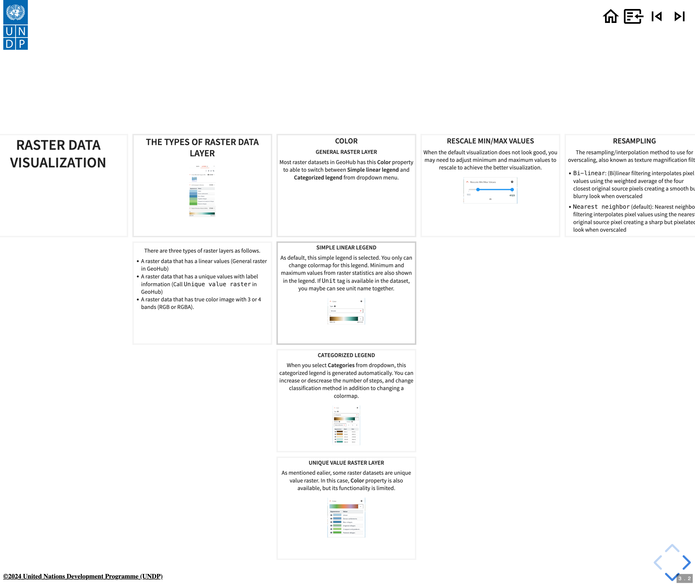

# Operations on slides

## Navigations across different page slides

In the top-right of a slide, you can find the following buttons for the navigation across different pages.

{:style="width: 200px;"}

The above screenshot's buttons from the left hand side are as follows:

- **Home**: It goes to the landing page of documentation website.
- **Go back**: It is back to the web page mode from the slide mode for the current page.
- **Skip to the previous**: Skip the current page slides to the previous page's slides
- **Skip to the next**: Skip the current page slides to the next page's slides

## Navigations within a page slides

The controls at the bottom-right of a page slide provides you some navigation functionality within a page slides.

{:style="width: 200px;"}

- Right arrow `>` key or left arrow `<` key on your keyboard to move slides horizontally.
- Up/Down arrow on your keyboard to move slides vertically if chevron-top or chevron-bottom buttons are shown.
- `ESC` key to show the overview of slides. You can move slides by using arrow keys on the keyboard, or press `ESC` key again to go back to the normal slide.
- Press `F` key to switch to full screen mode. Press `ESC` on full screen mode to back to the normal slide mode.

