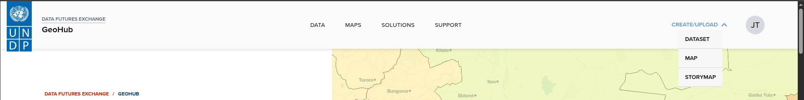
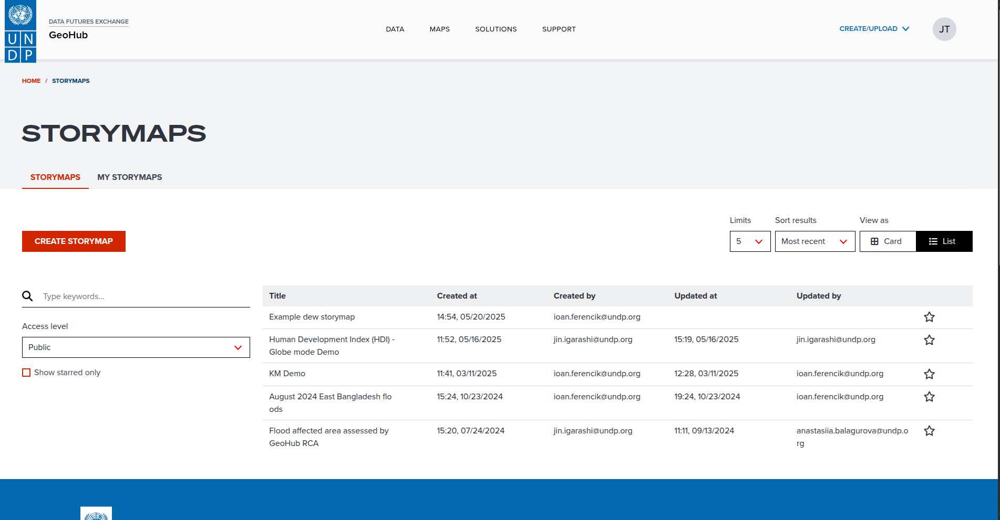
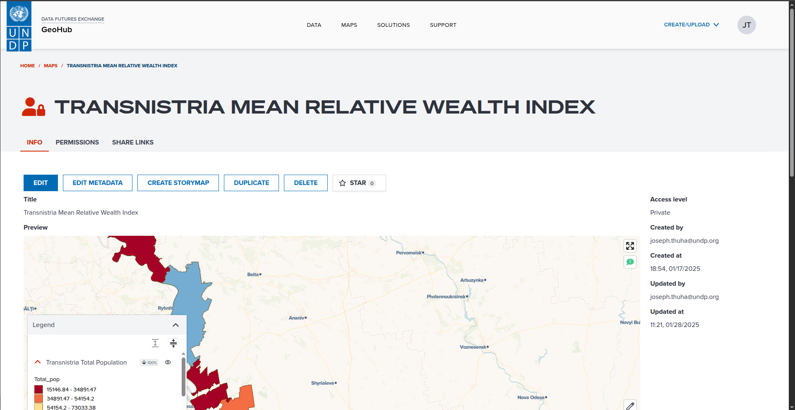
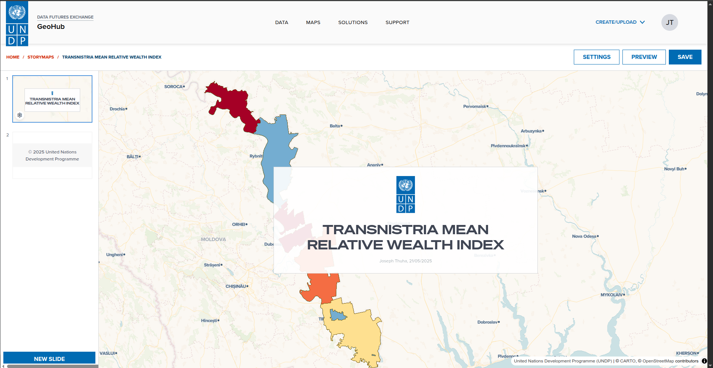
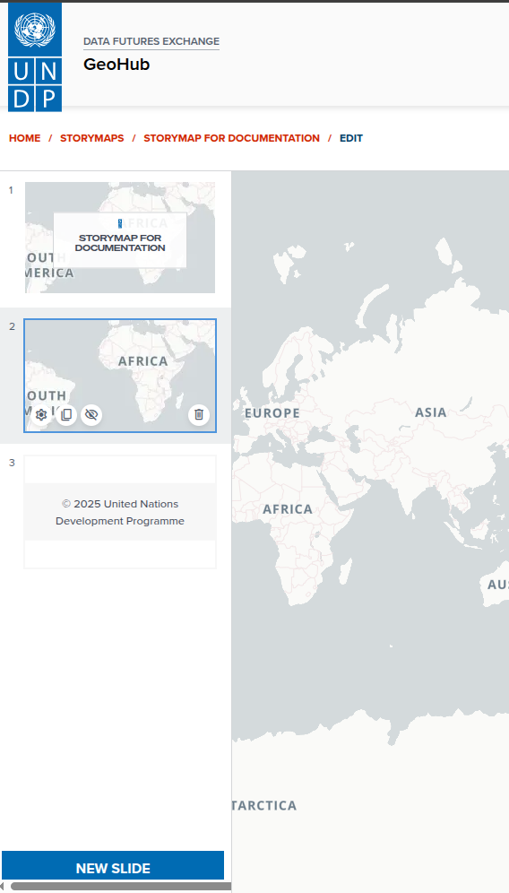
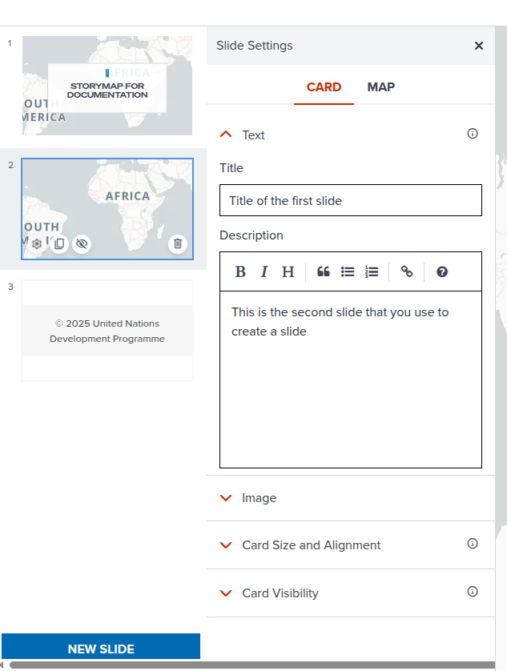
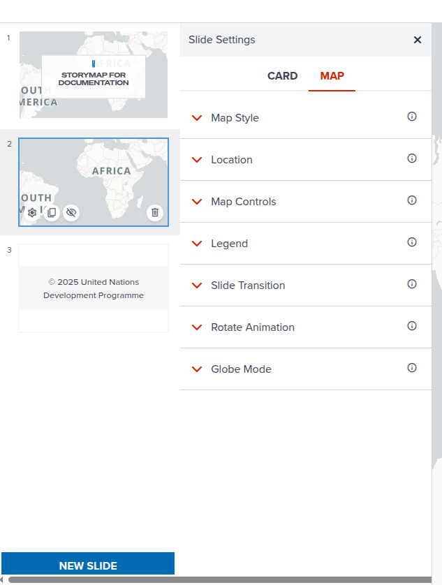
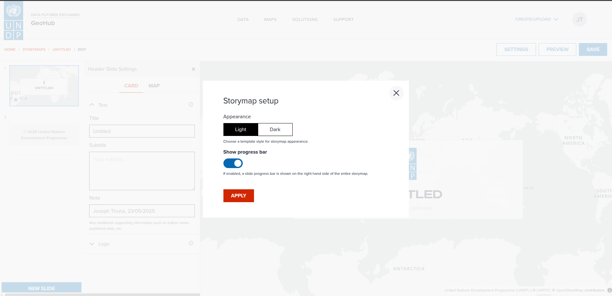
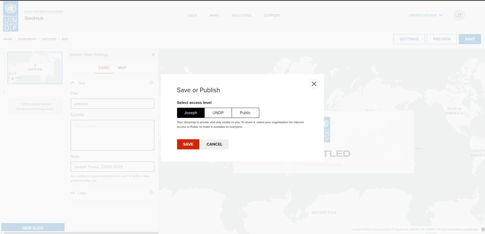

# Creating a storymap

Geohub provides a capability to create a storymap which is a collection of slides that can be used to tell a story about a map. A storymap can be created from a saved map or from scratch. In this section, we are going to learn how to create a storymap.

---

## Creat a blank storymap
A blank storymap can be created from the following pages:

---

### From the top bar menu

From the top bar menu, click on the **Create/Upload** button and select **STORYMAP** from the dropdown menu. This will open the storymap builder with a blank slide.

---

### From the storymap search page

To access the storymap page, click on the **SOLUTIONS** button on the top bar menu and select **STORYMAPS** from the dropdown menu. This will open the storymap search page. From the storymap search page, click on the **CREATE STORYMAP** button on the top right corner of the page. This will open the storymap builder with a blank slide.

---

---

## Create a storymap from a saved map

A storymap can be created from a saved map. To do this, follow the steps below:

1. Open the maps page by clicking on the **MAPS** button on the top bar menu. This will open the maps page.

---

2. From the maps page, select the map that you want to use to create a storymap. This will open the map detail page.

---

3. From the map detail page, click on the **Create Storymap** button on the top left corner of the page. This will open the storymap builder with the selected map as the first slide, and the map title as the slide title.

---

---

4. You can add more slides to the storymap by clicking on the **New Slide** button on the bottom left corner of the page. This will open a new blank slide.

---

---

## Elements of storymap builder

---

### Slide mini preview

The slide mini preview is located on the left side of the storymap builder. It shows a list of slides in the storymap. You can click on a slide to edit it. The slide mini preview has the following elements/buttons:

---

---

#### 1. Settings button (⚙️)

The setting button is located on the bottom right corner of the slide mini preview slide. On clicking the setting button, a slide settings panel will be opened. The slide settings panel has the following elements:

---

 - Card and Map Tabs

When the user clicks on the **CARD** tab, the card settings will be shown. This is where the user can edit the Title of the slide, the description, the image to show on the slide, alignment and visibility of the slide.
In the description, formatting options are available for bold, italic text and headings. Users can also add hyperlinks, quotes, ordered and unordered lists.

---

---

When the user clicks on the **MAP** tab, the map settings will be shown. This is where the user can edit the map settings such as the map style, location, legend visibility, globe mode, animation, etc.

---

---

#### 2. Duplicate button (⧉)

The duplicate button is located on the bottom left corner of the slide mini preview slide, next to the settings (⚙️) button. On clicking the duplicate button, a new slide will be created with the same settings as the selected slide.

---

#### 3. Visibility button (👁️)

The visibility button is located on the bottom left corner of the slide mini preview slide, next to the duplicate (⧉) button. On clicking the visibility button, the selected slide will be hidden from the storymap. The visibility button will be changed to a show (👁️) button. On clicking the show button, the selected slide will be shown in the storymap.

---

#### 4. Delete button (🗑️)

The delete button is located on the bottom left corner of the slide mini preview slide, next to the visibility (👁️) button. On clicking the delete button, the selected slide will be deleted from the storymap.

---

### Slide settings

The following is an explanation of the slide settings in detail.

---

In the **CARD** tab, there are four accordion sections:

- **Text**: This is where the user can edit the title and desctiption of the slide. The title will be shown on the slide as a heading. The description can be formatted with bold, italic text and headings. Users can also add hyperlinks, quotes, ordered and unordered lists.

---

- **Image**: This is where the user can upload the image to show on the slide. The image will be shown on the slide.

---

- **Card Size and Alignment**: This is where the user can edit the card size and alignment of the slide. The card size can be set to small, medium or large. The alignment can be set to left, center or right.

---

- **Card Visibility**: This is where the user can edit the visibility of the slide. The visibility can be set to show or hide. If the visibility is set to hide, the slide will not be shown in the storymap.

---

### Storymap preview

The **PREVIEW** button is located at the right top corner of the page. On clicking the preview button, the page switches to the preview mode. The preview mode shows the storymap as it will be shown to the users.

---

### Settings

The **SETTINGS** button is located at the right top corner of the page. On clicking the settings button, a settings panel will be opened. The settings panel has the following elements:

---

- Appearance
This is where the user can edit the appearance of the storymap. The appearance can be set to light or dark mode. The light mode will show the storymap with a white background and black text. The dark mode will show the storymap with a black background and white text.

---

- Show progress bar

This is where the user can edit the visibility of the progress bar. The progress bar will show the progress of the storymap as the user scrolls down the page. The progress bar can be set to show or hide.

---

- Apply Button

For the settings to be applied, the user needs to click on the **APPLY** button. The apply button is located at the bottom of the settings panel. On clicking the apply button, the settings will be applied to the storymap.

---

### Save

The **SAVE** button is located at the right top corner of the page. On clicking the save button, the save modal is opened and contains the following elements.

- Access Level Switcher

For this access level switcher, users can choose between three access levels: Public, Private and Organization. The public access level will make the storymap visible to everyone. The private access level will make the storymap visible only to the user. The organization access level will make the storymap visible only to the users in the organization.

---

- Save Button

The save button is located at the bottom of the save modal. On clicking the save button, the storymap will be saved with the selected access level.

---

- Cancel Button

The cancel button is located at the bottom of the save modal. On clicking the cancel button, the save modal will be closed and the storymap will not be saved.

---

---

## Next step

In the next section, we are going to learn how to edit storymap contents step by step.
