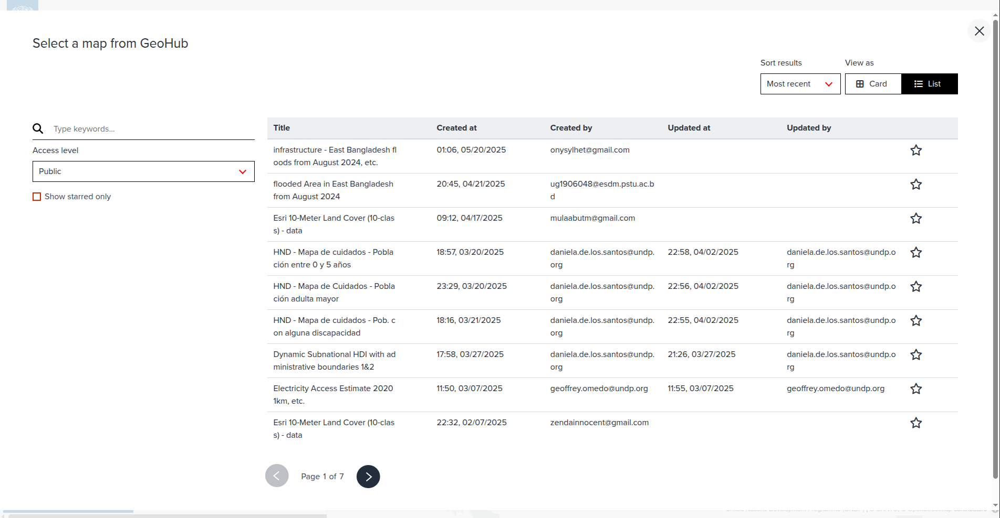
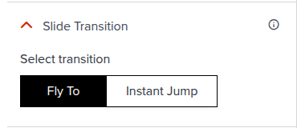

# Chapter slide

---

## Properties of chapter settings

---

### Card tab

#### Text

The text of the chapter slide is as follows:
    - Title: The title of the chapter.
    - Description: The description of the chapter. This is where the user describes the information intended to be shown in the chapter.

The text should be written in markdown format. Please read more about [markdown](https://www.markdownguide.org/basic-syntax/) to learn how to format the text. The text can be formatted with bold, italic text and headings. Users can also add hyperlinks, quotes, ordered and unordered lists.

---

---

#### Image

The image to display in the chapter slide. You can drag and drop an image or click to upload an image.

---

---

#### Card Size and Alignment

This defines where the story text will be shown on the slide. Size can either be Default or Full Width. Alignment can be either Left, Center or Right.

---

#### Card Visibility

This defines whether the chapter slide will be shown or hidden in the storymap. If the visibility is set to hide, the chapter slide will not be shown in the storymap.

---

### Map tab

#### Map Style

The map style of the chapter. You can choose from the different basemap options available in GeoHub, or start from an already existing map listed in the maps page.

---

##### How to select a map style from GeoHub existing maps

---

1. In the Map Style Accordion, switch to the GeoHub Map from the Empty Map tab

---

2. Click on the **GEOHUB MAP CATALOG** button to open the map catalog. This will open a modal with the maps page. From this page, you can search for a map style or select a map style from the list of maps available in GeoHub.
When you click on a map style, the map style will be selected and the modal will be closed. The selected map style will be shown in the current slide being edited.

---

---

#### Location

The location of the map. You can search for a location or move the pin on the map to the desired location.
You can also use the slider to set the bearing and pitch of the map.

---

After setting the location, you should click on the **APPLY TO SLIDE** button to save the location. The location will be saved in the chapter slide settings.
To reset the location, you can click on the **RESET** button. The location will be reset to the default location.

---

---

#### Map Controls

When the toggle is enabled, the map controls will be shown on the map for the chapter. The map controls include the following:
    - Zoom
    - Compass
User can also set the position of the map controls. The position can be either:
    - Top Left
    - Top Right
    - Bottom Left
    - Bottom Right

---

#### Legend

This is a toggle to enable or disable the legend. If enabled, the legend will be shown on the map for the chapter.

---

#### Slide Transition

This is a toggle to enable or disable the slide transition. If enabled, the slide transition on the map will be shown when the user navigates to the next slide. The slide transition can be set to one of the following:
    - Fly To Animation
    - Instant Jump Animation

---

#### Rotate Animation

This is a toggle to enable or disable the rotate animation. If enabled, the rotate animation will be shown on the map for the chapter.

---

#### Globe mode

This is a toggle to enable or disable the globe mode. If enabled, the map of this chapter will be displayed in 3D Globe mode.

There are two options for the globe mode:
    - **Globe Mode**: The map will be displayed in 3D Globe mode.
    - **Mercator Mode**: The map will be displayed in 2D Mercator mode.

---

## Next step

In the next section, we are going to learn how you can set your own footer texts.
