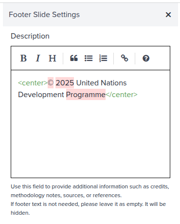

# Storymap Footer

---

The storymaps footer is used to provide additional information such as credits, copyright, and references. The footer is displayed at the bottom of the storymap.

---

---

## Next step

In the next section, we are going to learn how you can search existing storymaps in GeoHub.
