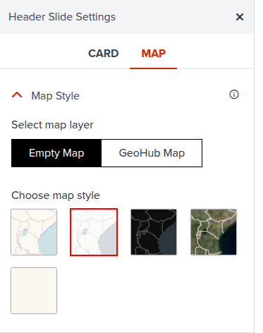

# Storymap header

When you create a new storymap, the header slide is automatically created. The header is the first thing that users see when they open your storymap.

---

## Properties

### Card tab

#### Text

The text of the header slide is as follows:

Title: The title of the storymap.

Subtitle: The subtitle of the storymap

Note: The note of the storymap—this is where you can add text such as the author, date, or any other information you want to include.

---

#### Logo

The logo to display in the header slide. You can upload a logo image or use a URL to an image.
By default, the logo is set to the UNDP logo. You can change it to your own logo.

---

### Map tab

#### Map Style

The default map style of the storymap. You can choose from the different basemap options available in GeoHub, or start from an already existing map listed in the maps page.

---

#### Location

The location of the map. Yoy can search for a location or move the pin on the map to the desired location.
You can also set the bearing and pitch of the map.

---

#### Globe mode

This is a toggle to enable or disable the globe mode. If enabled, the default map will be displayed in 3D Globe mode.

---

## Next step

In the next section, we are going to explore how you can edit main contents after configuring header.
