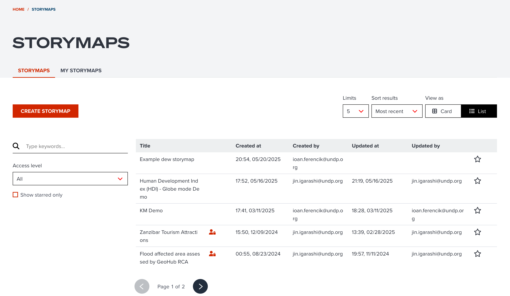
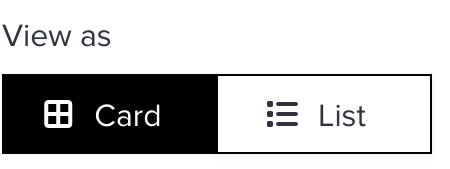
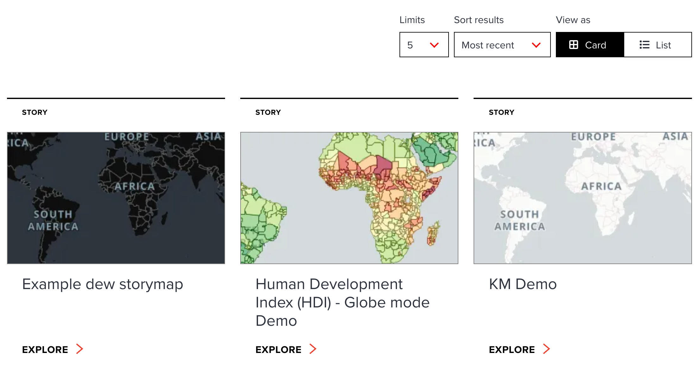
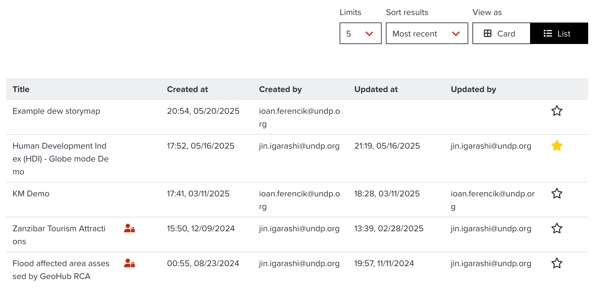
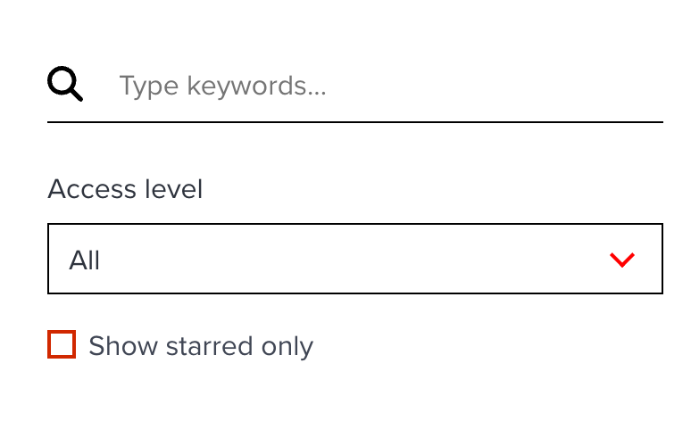
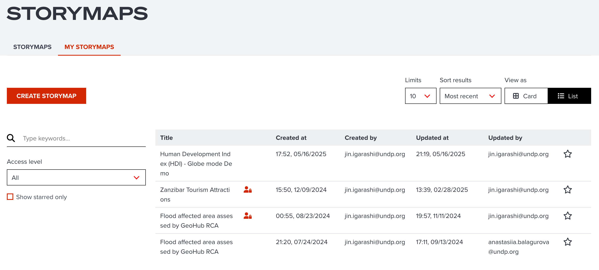
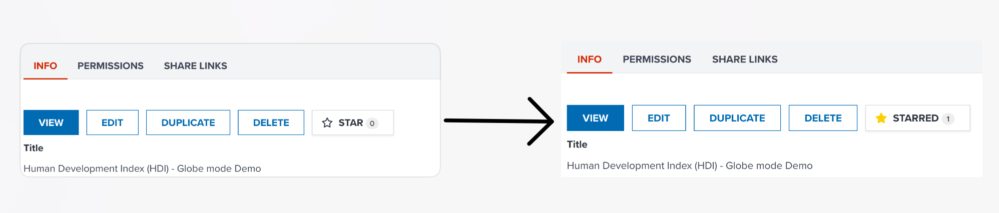

# Searching storymaps

--

Storymaps created by other users can be searched at GeoHub. This section explains how you can search existing storymaps in various ways.

<!-- .element style="height: 400px" -->

--

The above figure illustrates the overview of storymap search window. It consists of two tabs:

<hidden>

| Tab                  | Description                              | Signed User | Unsigned User |
| -------------------- | ---------------------------------------- | ----------- | ------------- |
| **Storymaps tab**    | Show all publicly accessible stories     | ✅          | ✅            |
| **My storymaps tab** | Show only stories owned by a signed user | ✅          | ❌            |

</hidden>

---

## Storymaps tab

--

Both signed and unsigned users can see this storymaps tab contents. Users can search and explore all publicly available storymaps or stories which signed user has permission to access.

---

### View type

--

Both **Card view** and **List view** can be switched by segment buttons on the top-right of contents.

<!-- .element style="height: 60px" -->

--

- Card view

Card view consists of a preview image and story map title. It may help you identify a storymap from visual.

<!-- .element style="height: 400px" -->

<hidden>

!!! note

    A card preview image is generated from primary style definition set at storymap header. The preview image may not be different from actual looks.

</hidden>

--

- List view

List view is a table having the list of storymaps. Each record of a table consists of **Titile**, **Created at**, **Created by**, **Updated at**, **Updated by**, and the **state of favourite**. It may help you search storymaps from metadata in the list view.

--

<!-- .element style="height: 400px" -->

---

## Filtering search results

The page offers three ways to filter results of storymaps: by keywords, by starred and by access level.

<!-- .element style="height: 300px" -->

--

### Search by keywords

Keyword searching is available. If you type any keywords, stories which contains typed words in title and description of storymap header will be shown as the result.

--

### Filter by starred

You can also filter storymaps only for your favourite ones by ticking _Show starred only_ checkbox.

--

### Filter by access level

Like datasets and maps, storymaps also offer data accessibility either private, organization or public. As default, it shows all access levels unless you select your preferred access level.

---

## My storymaps tab

**My storymaps** tab is only available for signed user. The result is filtered by the ownership of signed user. You only can see your created storymaps or stories which you have permission to access.

<!-- .element style="height: 400px" -->

--

The elements of **My storymaps** tab contents is the same with regular **Storymaps** tab.

---

## Add a storymap to favourite

If you find a favourite storymap, you can add it to your favourite list.

<!-- .element style="height: 200px" -->

--

After you open a storymap page, you can find **STAR** button under **INFO** tab. Simply click the button to add it to your favourites. If you click the button again, it will be removed from favourites.

<hidden>

!!! note

    Favourite feature is only available for signed users.

</hidden>

---

## Next step

In the next section, we are going to learn how to share your storymap with your peers.
