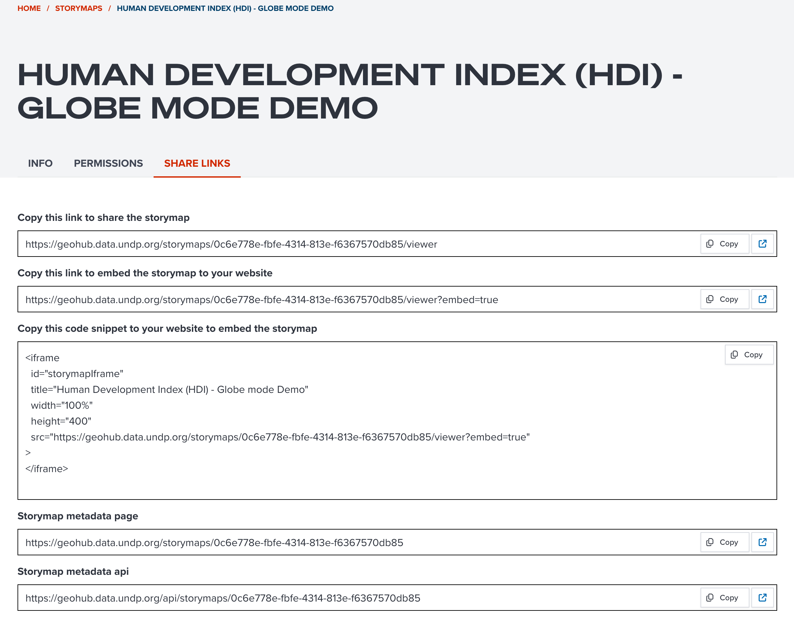

# Sharing a storymap

--

After creating a storymap in GeoHub, it can be shared with other people by the following ways:

- Share URL
- Embed a storymap in a website

---

## Open a storymap page


<!-- .element style="height: 400px" -->

--

Firstly, open a storymap page, then click **SHARE LINKS** tab which has all necessary links for the storymap.

---

## Share a URL

--

You can copy the first link _Copy this link to share the storymap_ by clicking **COPY** button to your clip board.

--

Then, you can just simply copy and paste to email, SNS, Whatsapp, etc for sharing the storymap to your colleagues and friends.



<!-- .element style="height: 400px" -->

---

## Embed storymap in your website

--

However, you might want to embed your storymap in your website in some circumstances.

In the **SHARE LINKS** tab, you can copy a URL from _Copy this link to embed the storymap to your website_ to your clipboard.

--

This URL has an optional parameter of **?embed=true** which can show a storymap without UNDP header and footer.

```js
https://geohub.data.undp.org/storymaps/0c6e778e-fbfe-4314-813e-f6367570db85/viewer?embed=true
```

--

This mode can be suitable for embeding on a website.

You can use this URL with **iframe** to embed the storymap to your website.

--

The below code snippet is an example of how to use **iframe** tag.

```html
<iframe
  id="storymapIframe"
  title="Human Development Index (HDI) - Globe mode Demo"
  width="100%"
  height="400"
  src="https://geohub.data.undp.org/storymaps/0c6e778e-fbfe-4314-813e-f6367570db85/viewer?embed=true"
>
</iframe>
```

The **iframe** code snippet is also available to copy from _Copy this code snippet to your website to embed the storymap_ under **SHARE LINK** tab.

--

Embed storymap can look like the below demo.

<iframe
  id="storymapIframe"
  title="Human Development Index (HDI) - Globe mode Demo"
  width="100%"
  height="400"
  src="https://geohub.data.undp.org/storymaps/0c6e778e-fbfe-4314-813e-f6367570db85/viewer?embed=true"
>
</iframe>

--

Please also refer the official documentation of **iframe** at [mdn web docs](https://developer.mozilla.org/en-US/docs/Web/HTML/Reference/Elements/iframe).
