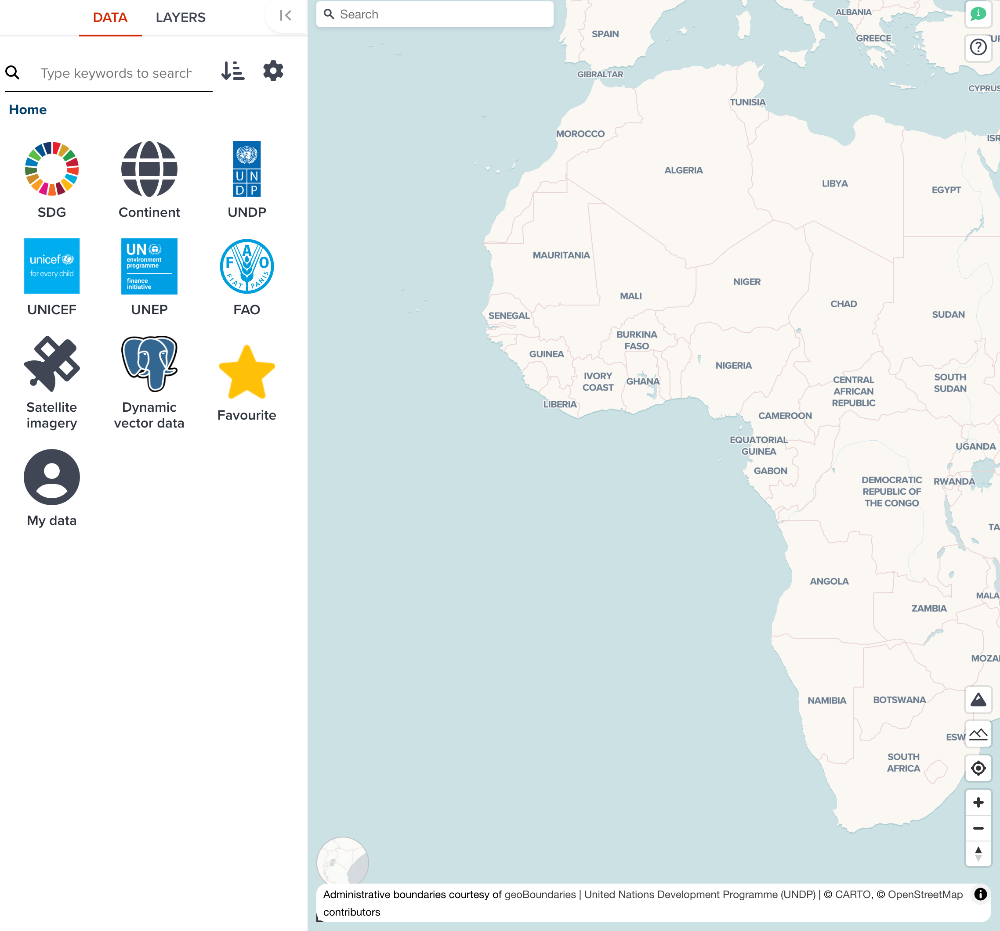
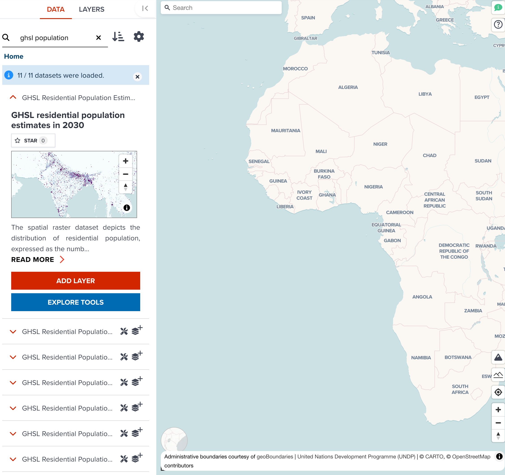
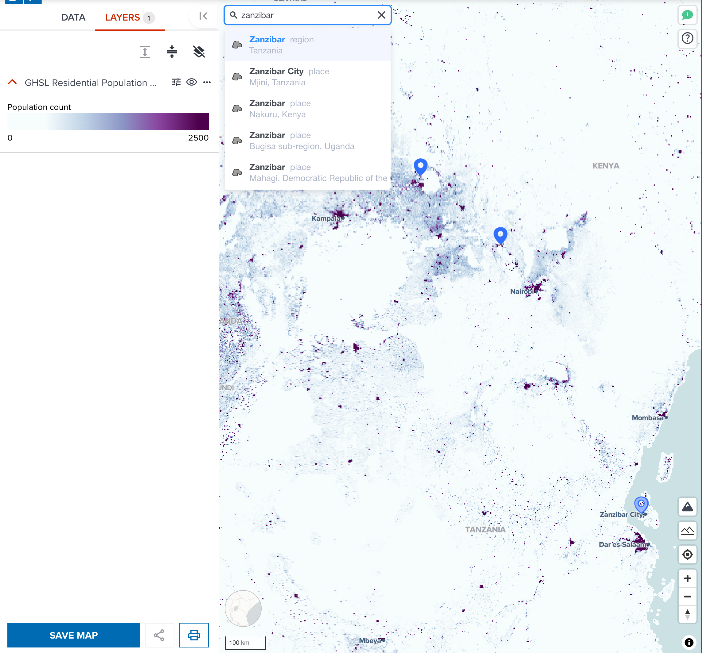
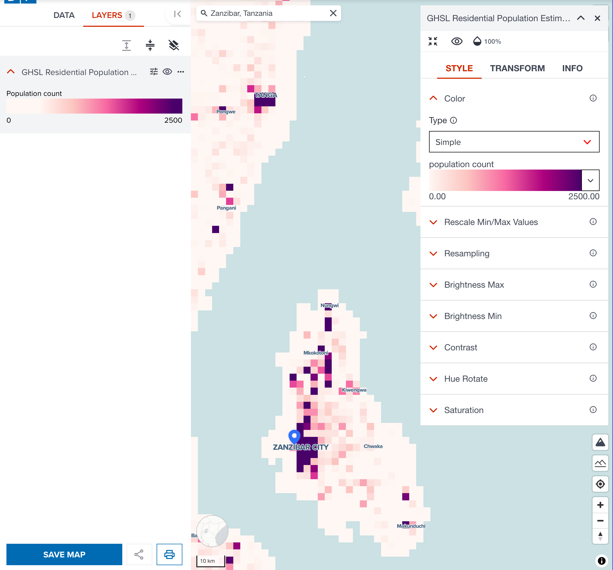
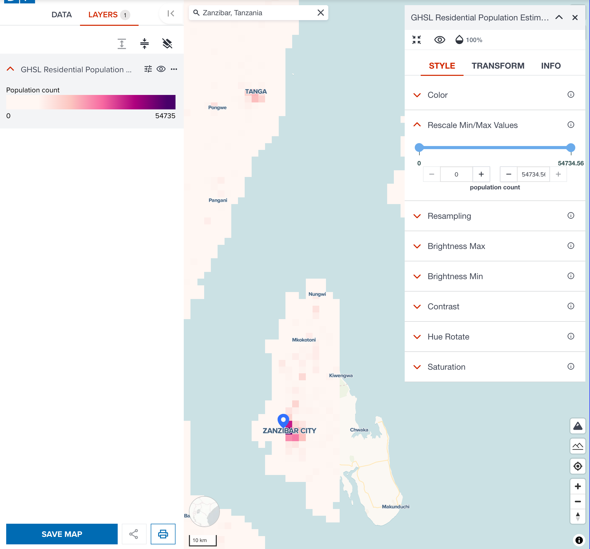
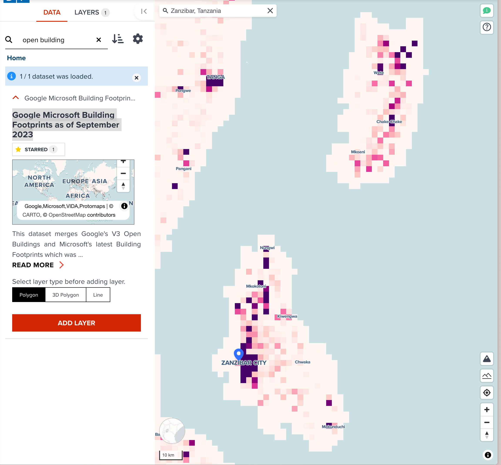
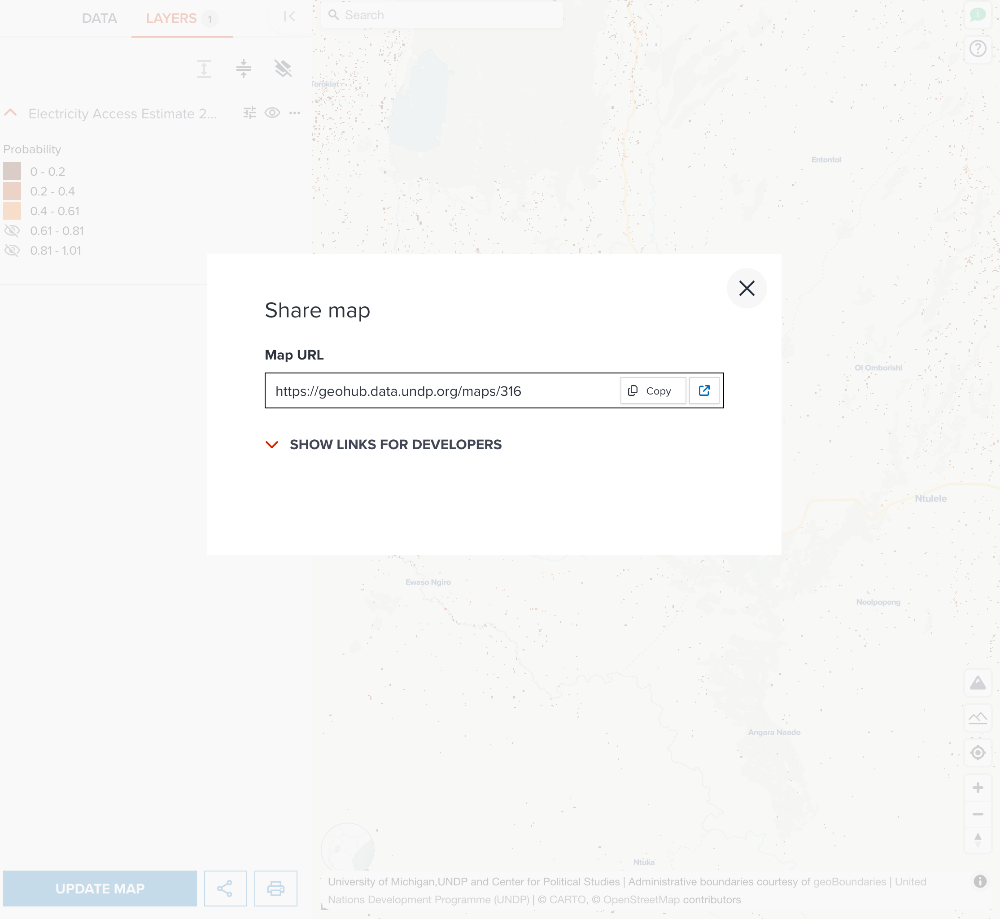

# Hands-on exercise

In this exercise, we are going to create a map with a dataset from GeoHub. Let's begin.

---

## Open a blank map page

To create your own map to visualize, open a new blank map editor in GeoHub.

<hidden>

See the steps at [Open a map editor](./map_view.md#open-a-map-editor-for-new-map)

</hidden>

<!-- .element style="height: 400px" -->

---

## Add a dataset to map

Then, search a dataset named `Electricity access estimate 2020` under _SDG 7_ at **Data** tab. <hidden>See how to do it at [Searching datasets on Map page](../data/search_datasets_on_map.md).</hidden>

<!-- .element style="height: 400px" -->

--

Once you found the dataset, click **ADD LAYER** button to add it to map. It will be shown under **LAYERS** tab.

There is a geolocation search tool at the top-left of the map. Search your interested place and zoom it. Here, I search `Narok` for my map.

--

<!-- .element style="height: 500px" -->

---

## Change layer style

This is a raster dataset, <hidden>please follow the steps of [Color](./visualize_raster.md#color) section,</hidden> change a colormap to suitable one. For my map, I change a colormap to one of sequential colormaps.

<!-- .element style="height: 400px" -->

--

As default, sequential colormap is that the more higher value is, the more dark color is. But we want to focus on where there is less electricity around this city. 

<hidden>

So, I ticked **Reverse colors** checkbox on colormap picker. Now, the more dark color area, the more houses and buildings has less electricity. 

Now you can see the outskirts of Narok town has some area where has less electrified.

</hidden>

We can also make two categories (0.61 to 0.81 and 0.81 to 1.01) invisible. The result should be like the below screenshot.

--

<!-- .element style="height: 500px" -->

You can close editing panel now.

---

## Save a map

Now, we can save a public map. Follow the steps of [saving a map](./save_map.md), save your map to GeoHub. Rename title to more precise name, and change access level to Public. Then click **SHARE** button.

--

<!-- .element style="height: 500px" -->

---

## Share a URL with your colleague

Once your map is saved, a unique map URL is shown on the share dialog as shown in the below screenshot.

--

<!-- .element style="height: 500px" -->

Copy the URL and open it as new tab. Also, share it with one of your colleagues to look at it each other.

---

## Extra challenge

This map now has a electricity esitimate layer for a particular area of interest. For extra challenge, you can search any other datasets in addition to the data layer we have created. Try to overlay other layers to make a beautiful map. Once you have made changes, make sure saving your new map.
