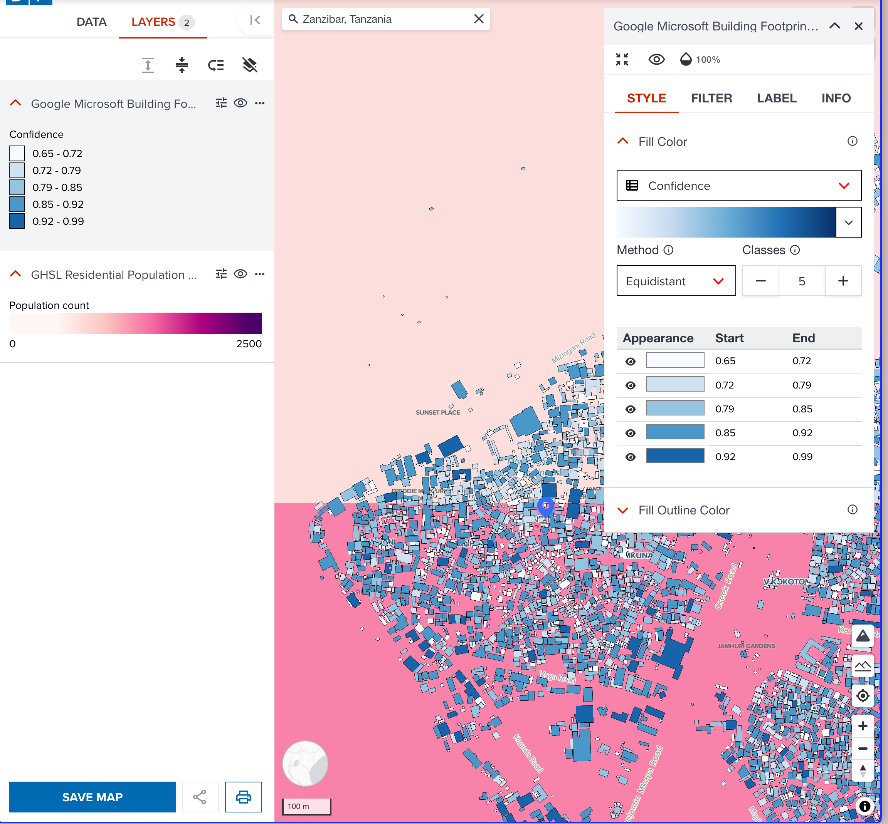
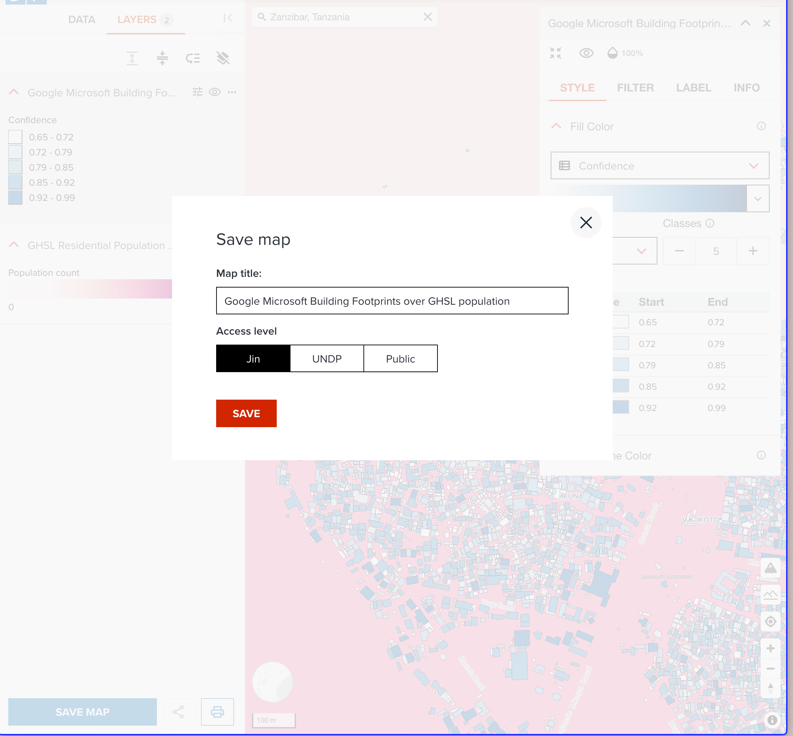
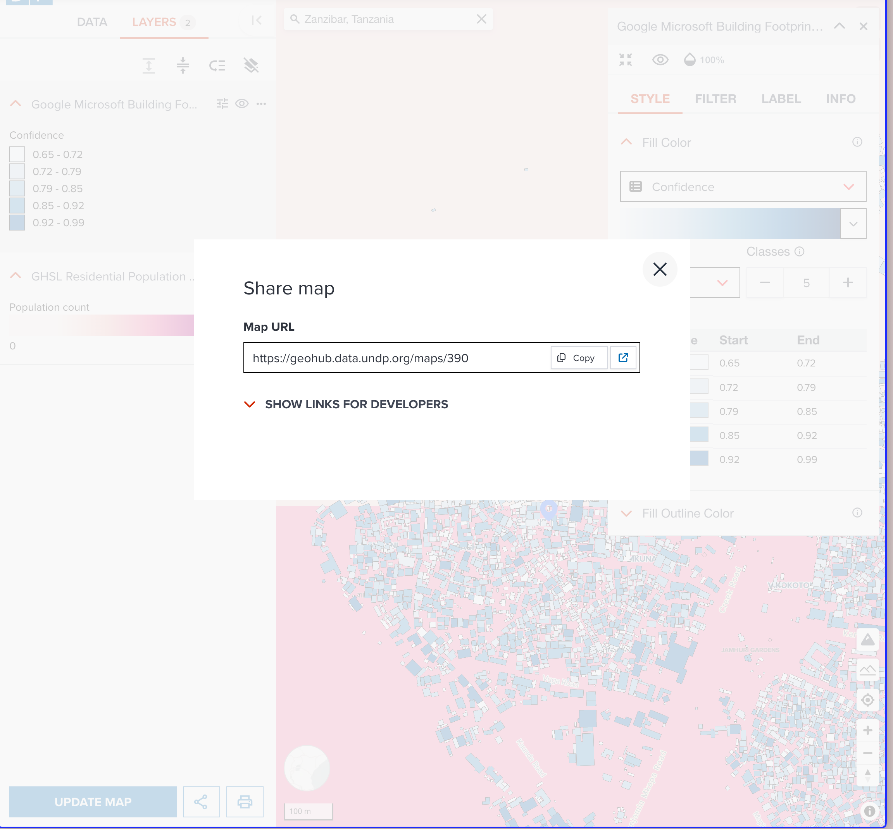
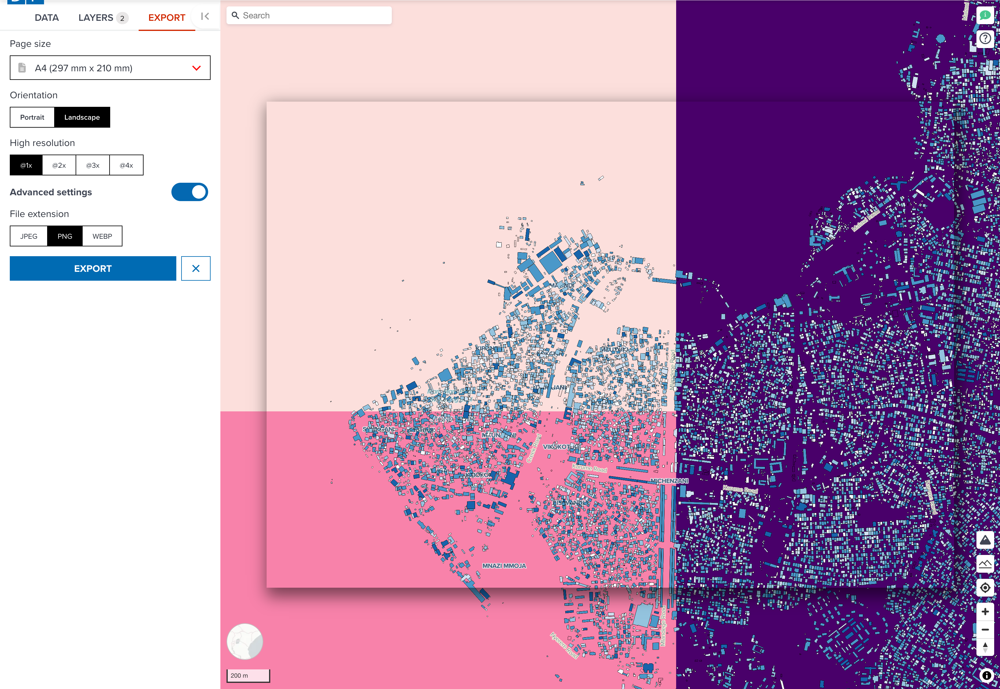

# Hands-on exercise

Visualizing raster and vector datasets to save and share with other users.

---

## Open a blank map page

To create your own map to visualize, open a new blank map editor in GeoHub from [here](https://geohub.data.undp.org/maps).

<hidden>

See the steps at [Open a map editor](./map_view.md#open-a-map-editor-for-new-map)

</hidden>

<!-- .element style="height: 400px" -->

---

## Add datasets to map

---

### Add a raster dataset

Then, search a dataset named `GHSL residential population estimates in 2030` under **Data** tab. <hidden>See how to do it at [Searching datasets on Map page](../data/search_datasets_on_map.md).</hidden>

<!-- .element style="height: 400px" -->

--

Once you found the dataset, click **ADD LAYER** button to add it to map. It will be shown under **LAYERS** tab.

There is a geolocation search tool at the top-left of the map. Search your interested place and zoom it. Here, I search `Zanzibar, Tanzania` for my map.

--

<!-- .element style="height: 500px" -->

--

This is a raster dataset, <hidden>please follow the steps of [Color](./visualize_raster.md#color) section,</hidden> change a colormap to suitable one, and keep visualization type as simple.

<!-- .element style="height: 400px" -->

--

As default, GeoHub tries to optimise visualization for highly skewed dataset by rescaling minimum and maximum values. This dataset seems visualizing well at Zanzibar area. However, you may need to change raster rescale values if the visualization is not what you desire.

--

<!-- .element style="height: 400px" -->

You can close editing panel for this layer now.

---

### Add a vector dataset

In the next, we are going to add a polygon layer from Microsoft/Google Open building. Go to **DATA** tab in side bar, search **Google Microsoft Building Footprints as of September 2023** dataset.

<!-- .element style="height: 400px" -->

--

Click **Add layer** to add this dataset to the map. Here, I select **Polygon** as a layer type for making 2D map. After adding it, map scale was changed to global again because it is global dataset. Zooming to Zanzibar again.

<!-- .element style="height: 400px" -->

--

Let's change a little bit visualization for building data. Open building data has a field called `confidence` how AI was confident to generate this building data.

--

Change color to categorised, and select `Confidence` field.

<!-- .element style="height: 400px" -->

---

## Save a map

Now, we can save a public map. Follow the steps of [saving a map](../sharing/save_map.md), save your map to GeoHub. Rename title to more precise name, and change access level to Public. Then click **SAVE** button.

--

<!-- .element style="height: 500px" -->

---

## Share a map with other colleagues

Once your map is saved, a unique map URL is shown on the share dialog as shown in the below screenshot.

--

<!-- .element style="height: 500px" -->

Copy the URL and open it as new tab. Also, share it with one of your colleagues to look at it each other.

---

## Export an image of your map

Alternative to share a URL of map, you can also export a map image from your visualized map by clicking **Print** button under **LAYERS** tab.

--

<!-- .element style="height: 400px" -->

You can change paper size and orientation, and other parameters to export a map image. <hidden>You can know more about exporting at [Exporting map](../sharing/export_map.md) section.</hidden>

---

## Extra challenge

This map now has open buildings vector data over GHSL 2030 population dataset for a particular area of interest. For extra challenge, you can search any other datasets in addition to the data layer we have created.

--

There is a cool dataset called [Zanzibar Tourism Attractions](https://geohub.data.undp.org/data/4ca2ead25b5903e8e1c7897f8f3bae38). You can try to add this point data to your map. Check [Point visualization](./visualize_vector_point.md) page about how to visualize a point dataset.
