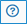

## What are the additional features on the Header?

1. Open/ Close sidebar: In order to expand the view, the user can hide the side bar using the  icon.

2. Explore shared maps : Takes the user to a new page where they can view shared maps  icon.

3. GeoHub Dashboards: GeoHub Dashboards offer the user the ability to view main analytics conducted by the GeoHub team using the  icon.

4. User Guide :To learn how to use the GeoHub, click on the  icon.

5. Manage my datasets: To upload new datasets in to the GeoHub via the  icon which is enabled for authenticated users.

 

