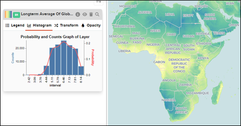
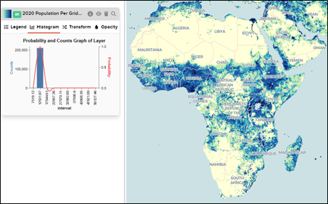

# How to work with Histograms?

GeoHub offers the user to display their data set’s statistical information using a histogram which enables the user to determine skewness and kurtosis of the data set.

The first example displays the histogram for the Long-term Average Of Direct Normal Irradiation data set with a normal distribution and the second example is from the highly sked data set for the Population Density of 2020.

