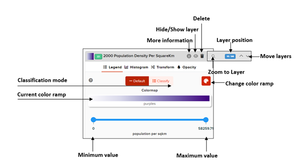

# What are the features of the Layer Tab?

The user can add or remove a layer of their choice by the following steps.

1. As the data sets appear on the website, the GeoHub generates a preview of the layer including its meta data. Then simply click the "Add layer" button to view the complete result.

2. The user can also simply click on the  icon as shown to add desired layers.

3. Click on the “Layers” tab for more features for layers.

4. By hovering and clicking on the  icon will allow the user to view important meta data related to the layer.By further clicking on the "Read more" arrow will allow the user to also download the layer.

The user has the option to improve the layer view by checking the options available under the “Layer” tab. Under the layer tab, it will display all the layers the user had selected, and one can improve the layer view through the following options.

1.  View/Hide layer: By using the  icon, the user can view or hide the chosen layer.

2.  Delete layer: By using icon, the user can delete the layer from view.

3.  Show options: This button  is expandable, and it allows the user view other features.

    i.Zoom to layer: The user can use the  icon to view the layer of interest amongst other selected layers.

    ii.Layer up/down: These arrow keys  will allow the user to move their layer of choice up and down the list of layers.

 
