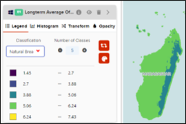
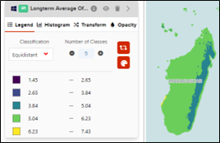
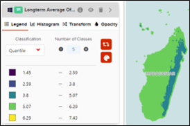
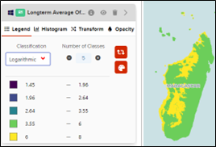
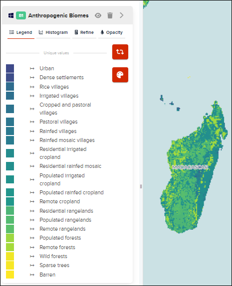
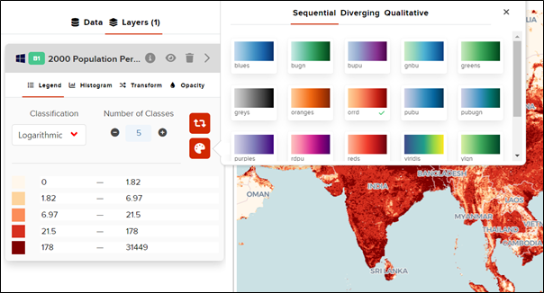
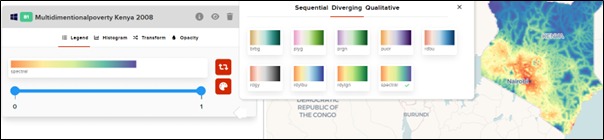
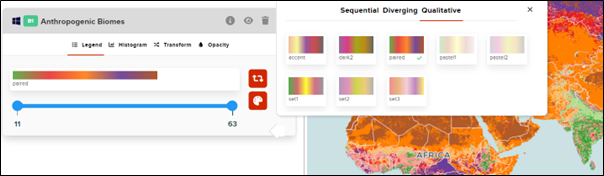

# How to access the legend for each layer?

GeoHub offers the user the ability to interchange between legends based on the classification which best suit the data.

Raster data can be classified based on the following four options.

**Natural breaks**: With natural breaks classification (Jenks) Natural Breaks Jenks, classes are based on natural groupings inherent in the data. Class breaks are created in a way that best groups similar values together and maximizes the differences between classes. The features are divided into classes whose boundaries are set where there are relatively big differences in the data values.

**Equidistant**: Use equal interval Equal Interval to divide the range of attribute values into equal-sized subranges. This allows you to specify the number of intervals, and the class breaks based on the value range are automatically determined. For example, if you specify three classes for a field whose values range from 0 to 300, three classes with ranges of 0–100, 101–200, and 201–300 are created.

**Quantile**: In a quantile classification Quantile Class, each class contains an equal number of features. A quantile classification is well suited to linearly distributed data. Quantile assigns the same number of data values to each class. There are no empty classes or classes with too few or too many values

**Logarithmic**: Logarithmic transformation of the data has been recommended by the literature in the case of highly skewed distributions such as those commonly found in information science. The purpose of the transformation is to make the data conform to the lognormal law of error for inferential purposes.

**Data sets with unique values**: Geo Hub also has the capability to display datasets with categorical data based on unique values. Our Anthropogenic Biomes layer is a great example for it.

# How to change the color ramp?

GeoHub offers the user to enhance their visualization even further with the ability to change to the color ramp they prefer and suitable to display the data. It offers the user to select from three panels containing 10-17 color ramps of their choice.

**Sequential color schemes**: Sequential data classes are logically arranged from high to low, and this stepped sequence of categories should be represented by sequential lightness steps. Low data values are usually represented by light colors and high values represented by dark colors. Transitions between hues may be used in a sequential scheme, but the light-to-dark progression should dominate the scheme. Terrain slope categories or population densities, for example, are well represented by sequential color schemes. The following example from the Population density map for 2000 can clearly represented using this type of color scheme.

**Diverging color schemes**: Diverging/diverging schemes are the only two-variable schemes that depart from the idea of a direct overlay of the component one-variable schemes. Place a different moderately dark hue at each of the four corners of the legend. These four hues represent categories that are extremes for both variables. Place a very light or white color at the center of the legend, creating an appropriately light color for the class that contains the critical value or midpoint of both variables. The remaining colors are lighter than the corners, because they contain the midpoint of one of the two variables, and they are transitional hues that lie between their adjacent hues. The color circle is essentially stretched around the perimeter of the legend and lightness adjusted in response to critical values within the data ranges of both variables.
For instance, the 2008 Multidimensional poverty Index for Kenya can be visualized well using this color ramp.

**Qualitative color schemes**: Qualitative schemes use differences in hue to represent nominal differences, or differences in kind. The lightness of the hues used for qualitative categories should be similar but not equal. Assign the lightest, darkest, and most saturated hues in the scheme to categories that want emphasis on the map. This is suitable to represent categorical data such as land use cover such as the following example of Anthropogenic biomes.

