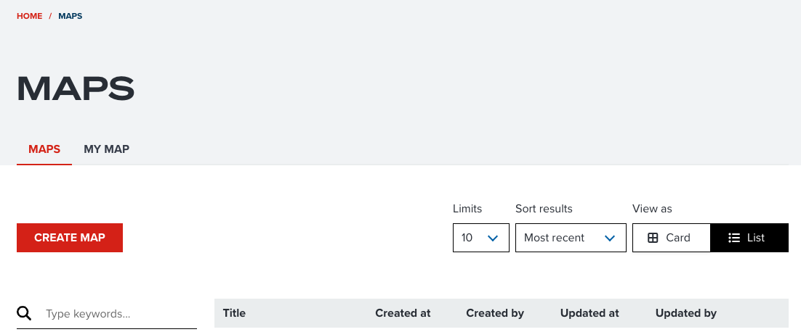
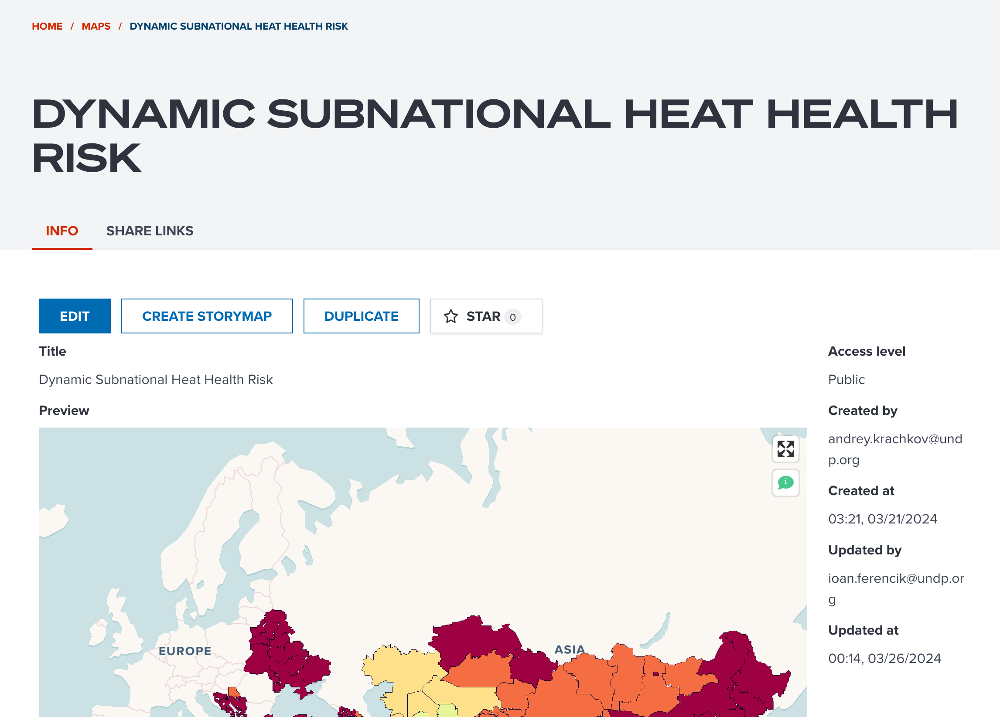

# Open a map editor

This section introduces how you can visualize geospatial datasets at Map edit page on GeoHub.

To visualize datasets on GeoHub, there are two ways to open a map editor:

- [Open a map editor for new map](#open-a-map-editor-for-new-map)
- [Open a map editor for existing map](#open-a-map-editor-for-existing-map)

---

## Open a map editor for new map

You can visualize datasets from a blank map from _Maps_ page.

Firstly, click [this link](https://geohub.data.undp.org/maps) to open _Maps_ portal page. You will see _Maps_ page as shown in the below figure.

--

<!-- .element style="height: 300px" -->

Then, simply click **NEW MAP** button, it will be redirected to a blank map editor. Then, search a dataset from **DATA** tab to add a data to the map by following [Searching datasets on Map page](../data/search_datasets_on_map.md).

---

## Open a map editor for existing map

---

### Select an existing map

Another way to open a map editor is to edit an existing map that was already configured by other users.

The following figure shows overview of Maps page if you open it from [this link](https://geohub.data.undp.org/maps).

--

<!-- .element style="height: 500px" -->

<hidden>

Each number on the figure is collesponded to each bullet point.

1. **Search maps**: You can type any keywords to search existing maps. It search maps that match the map title by keywords.
2. **Access Level filtering**: As default, your name is selected. If your name is selected, all maps that can be accessed by you will be visible. If your organization name is selected, only maps within shared in your organization will be shown in the list. If public is selected, private maps will not be shown.
3. **Show favourite maps**: You can also only show your favourite maps by toggling **Star** button.
4. **Sorting**: You can also choose sorting preference by selecting this dropdown menu. You can select eithr **Most recent**, **Less recent**, **Most favourite**, **A to Z** and **Z to A**.
5. **Number of maps per page**: You can choose the number of maps per page from this dropdown menu. You can select it as maximum 100 maps per page. Showing many maps per page can be useful to explore existing maps effectively. However, more maps are shown in a page, slower performance can be caused depending on your internet condition and machine spec.
6. **Card view** or **List view**: You can choose a view type listing maps in either **Card view** or **List view**. Default is **Card view** that can provide you a preview image with title to explore. **List view** provides you more detailed information such as _Title_, _Created date and user_, _Updated date and user_, _favourite state_ and _access level icon_.
7. **Maps table**: Maps will be listed in this section per your searching preferences.
8. **Pagination**: If more than a page of maps are matched, you can go to next or previous page to explore further maps.

</hidden>

<hidden>

!!! note

    Your searching preference will be kept in URL of this page. That means you can share Maps URL with your colleagues after searching maps.

</hidden>

Once you find an existing map, please click it, you will be redirected to an independent map page.

---

### Open an existing map editor

The following figure is an example of _Dynamic subnational heat health index_ map.

<!-- .element style="height: 500px" -->

--

This map page consits of three or four tabs

- **INFO** tab: You can see some metadata for the map. Also, you can add this map to your favourite folder from this tab.
- **PREVIEW** tab: As default, this tab is selected. You can explore the map without any editing functionalities.
- **PERMISSION** tab: If you are owner or editor or viewer of the map, you will be able to see this tab.
- **LINKS** tab: This tab provides you some useful links, particularly for GIS developersa and advanced users.

--

Here, you can simply click **OPEN** button to open a map editor for your selected exiting map.

--

## Key components on map view

GeoHub is designed to allow for a user-friendly experience with increased accessibility functionality! You can further improve your map view with the following tips.

--

<!-- .element style="height: 500px" -->

To pan the map, use your mouse to drag the portion of the map you would like to view into the middle of the screen.

<hidden>

In the below, each component on map view is explained per number corresponded to the above figure.

1. Map Query: The following icon allows to access more information of a particular point of interest.It turns green once enabled .

2. Map sharing tool: You can save and share a map by using this tool. How to share a map will be explained at later section of this tutorial.

3. Map exporting tool: By clicking print icon button, you can export current map view as an image either **PNG**, **JPEG** or **WEBP**.

4. HELP tool: When you show a map page for the first time, it will be shown automatically. Once you have done all tour guides, it will be never shown again unless you click this help button.

5. Geolocation search: Type any place name such as country, city or any landmark name. You can zoom into your searched location. This is using geocoding service from [Maptiler](https://cloud.maptiler.com).

6. Change base map: By clicking on the icon you can interchange between the Bing Aerial view or the Carto view.

7. Hillshade: The user can use the “Hillshade”  icon to create a realistic view of terrain. Once enabled, the icon turns green .

8. Enable Terrain: In order to view a three-dimensional surface from a two-dimensional display, the user can enable the terrain view using the  icon.

9. Geolocation tool: It will be zooming to your current location of a device using GeoHub.

10. Zoom in/out: To zoom in or out to a place of interest you may use the  icons as displayed on the upper right of the map. To reset the bearing to the North, you can use the  icon on the upper right corner.

</hidden>

---

## Next step

Now, you know how to use a map view on GeoHub. You are going to learn how to visualize a dataset from next section.
