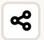

# How do I adjust the map view?

GeoHub is designed to allow for a user-friendly experience with increased accessibility functionality! You can further improve your map view with the following tips.

1.  Divider: You can enlarge the size of the map view by expanding/contracting the slider.

2.  Pan the map: Use your mouse to drag the portion of the map you would like to view into the middle of the screen.

3.  Zoom in/out: To zoom in or out to a place of interest you may use the  icons as displayed on the upper right of the map.

4.  Resetting the bearing: To reset the bearing to north, you can use the  icon on the upper right corner.

5.  Change base map: By clicking on the icon you can interchange between the Bing Aerial view or the Carto view.

6.  Hillshade: The user can use the “Hillshade”  icon to create a realistic view of terrain. Once enabled, the icon turns green .

7.  Enable Terrain: In order to view a three-dimensional surface from a two-dimensional display, the user can enable the terrain view using the  icon.

8.  Map Query: To obtain more knowledge on the layers of choice, you may use the following icon  which allows access to more information of a particular point of interest as the second dialog box opens. It turns green once enabled .

## Additional features

1. Print: To save map layers in a preferable format use the  icon.

2. Hide layer panel: In order to expand the view, the user can hide the layer panel using the  icon.

3. GeoHub Dashboards: GeoHub Dashboards offer the user the ability to view main projects conducted by the GeoHub team using the  icon.

4. User Guide :To learn how to use the GeoHub  icon.

5. Share : Allows the user to share layers and data via a sharable URL via the  icon.

 

