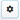

# How do I search data within the GeoHub?

## Search Tab

Using the “Search tab”, simply enter the name of the needed data set and the GeoHub will match the most relevant data set under a specific bucket. For example, by typing the word "sustainable" and pressing the enter button generates the data sets which are tagged with the name "sustainable" in their layer title, description and name.

The user can also enter an individual bucket of interest and type in the data they desire and then the search results will be limited to the extent of the datasets in that particular bucket.

## Search Settings

By clicking on the "Settings”  icon will allow the user to find more search options

1. Match all words typed will render results based on the full string of words entered.
2. At least a word typed will render results based on at least one of the words of the string entered.

It also gives the option to be filtered by the Geospatial extent of the map view.This will enhance the specificity of available data for the users.

## Explore by Tags

The Explore by tags option allows the user to filter their search even further.Each tag can be expanded to niche levels of filtering which allows the user to obtain the most specific data they require.
The option of selecting "Match all selected tags" will allow the user to select multiple tags and obtain results for all or the user can select the "Match at least a tag selected" will allow the search to generate results at least one of the tags used.
There is also the advance filtering options of searching results based on the following expandable options;

1. Region : Data sets which are tagged with a spatial location can be filtered via this filter.
2. Admin Level: Data sets devided based on Administrative boundaries can be filtered via this filter.
3. Resolution : Based on the level of granularity of data sets it can be filtered via the resolution option.
4. Year :Data sets can be filtered based on the year of data collection.
5. Key word : Based on the assigned key word to the data set according to the key representation.
6. SDG Topic :Assigned Sustainable Development Goal.
7. Theme :Based on the assigned theme for the data set.
8. Schema :Ability to filter data based on the database organization.
9. Data Provider: Filter data sets by the source of data collection.
10. GIS Server :Associated cloud service server which hosts data.

## Sort settings

Once the GeoHub generates the data sets that are requested, the user can arrange the data sets Alphabatically, Most and Less recent and Most favourite.
As the data sets appear on the website, the GeoHub generates a preview of the layer including its meta data.Then simply click the "Add layer" button to view the complete result.

