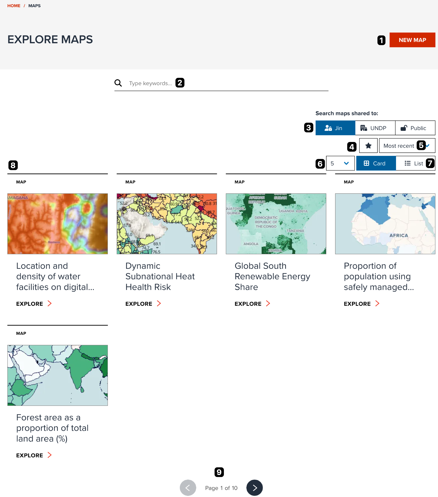
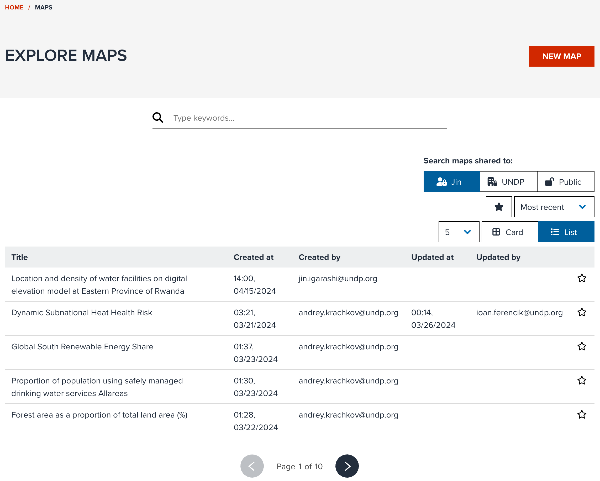
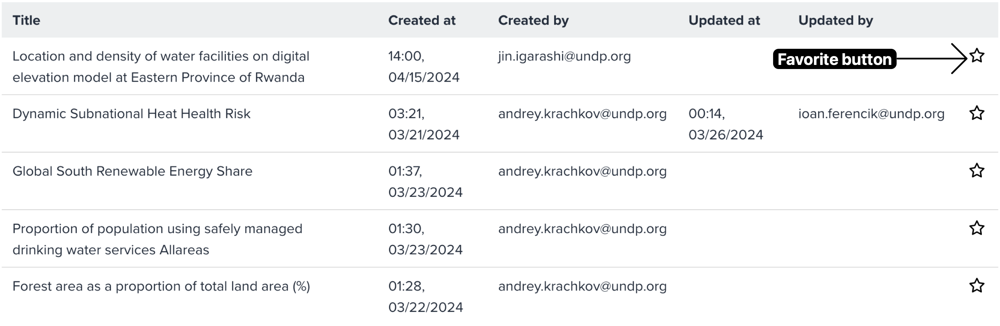

## Searching maps

Your saved maps and other users' maps are found under the Explore maps which is accesible via the **MAPS** menu in the header.
It will guide the user to all the maps saved by the user and it will also display the level of accessibility to these saved maps.
Based on accessibility, it is also possible to edit the saved maps.

<figure markdown="span">
  
  <figcaption>Explore maps in Card view</figcaption>
</figure>

The core functionalities of exploring maps are as follows (each number is correspond to a number on the figure):

1. **NEW MAP** button: Open map editor page for making a new map
2. Search maps by keywords. Maps matched to title are shown in the list.
3. Filter by access level: You can filter maps by access level.
4. Filter by favourite: If filter is enabled, only show your favourite maps.
5. Sort maps: You can sort by _Most recent_, _Less recent_, _Most favourite_, _A to Z_ or _Z to A_.
6. The number of maps per page: You can select the maximum number of maps per page from the list.
7. View type: You can select it from either _Card_ or _List_. _Card_ is default.
8. Search result of maps
9. Pagination

As default, maps are shown in card view, but if you want to explore maps quickly without a preview image, switching to a list view might be useful. The list view can looks like the below screenshot. It provides all metadata information (title, access level, created and updated users/datetime) in a table.

<figure markdown="span">
  
  <figcaption>Explore maps in List view</figcaption>
</figure>

## Adding a map to your favourite

When you find an interesting map, you can also add it to your favourite for future easy access.

Adding favroute can be done at **INFO** tab of a map portal (see [here](./share_map.md#info-tab)) or by clicking **Star** button on the table in list view (see the below screenshot).

<figure markdown="span">
  
  <figcaption>Favourite button in List view</figcaption>
</figure>

## Next step

Now, you know the basic features of GeoHub how you can search a dataset and visualize it, and share a map with others. In the next section, you can follow a practical exercise to deepen your knowledge on GeoHub.
